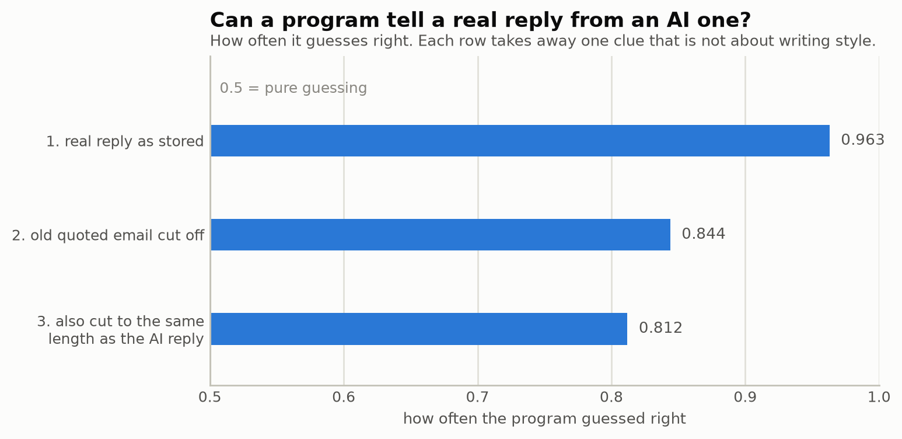
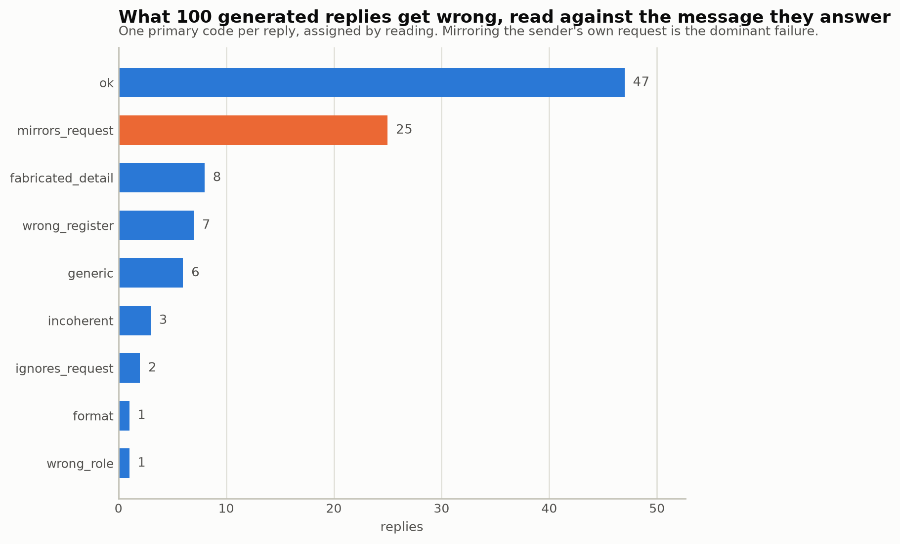
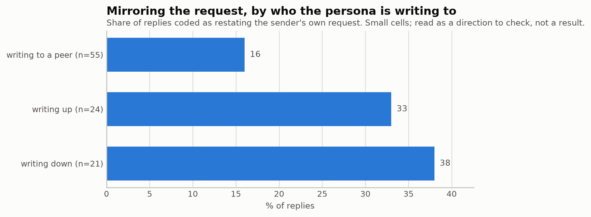
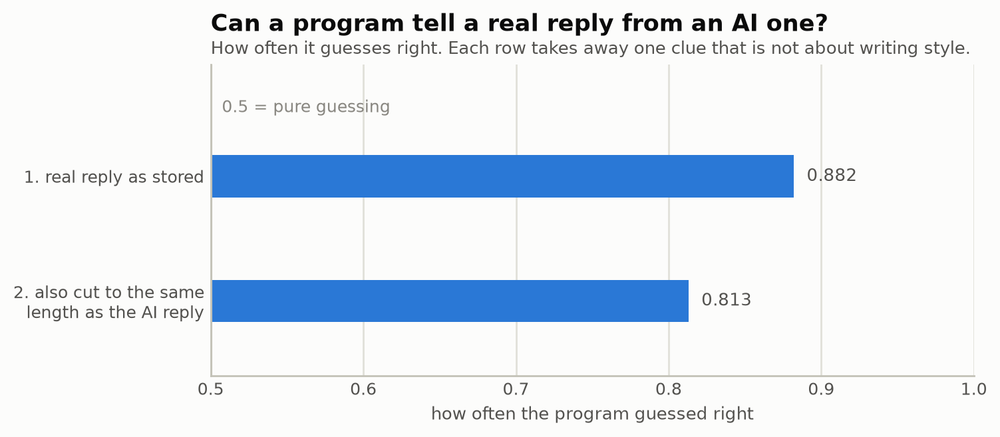
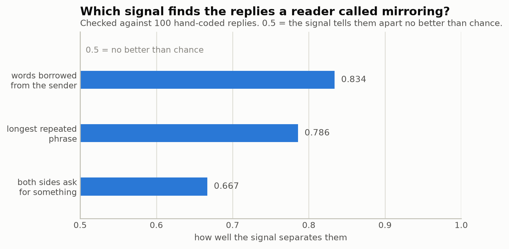
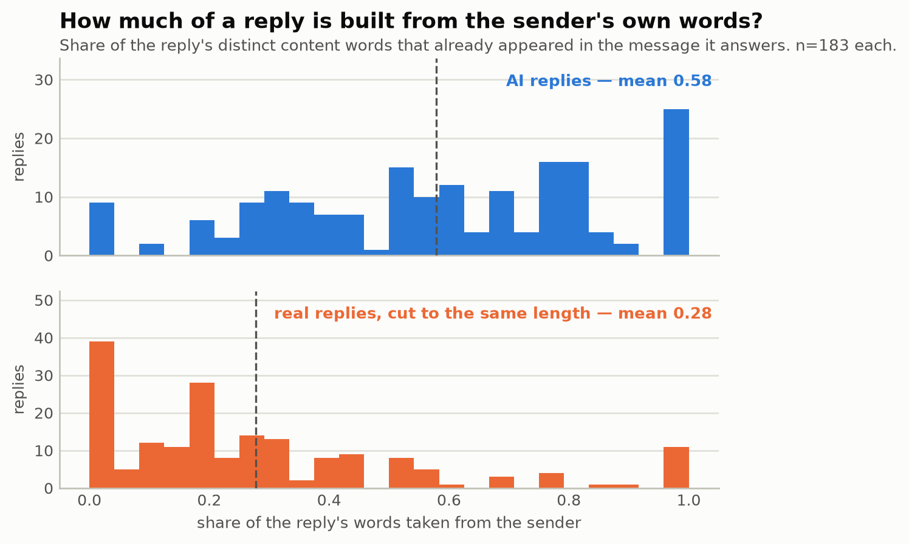
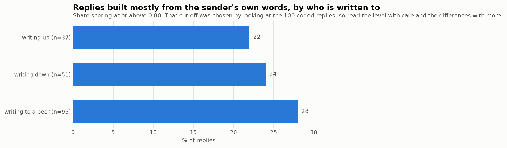

# Thesis Progress Log

A plain-language record of what has been built and found so far. Written for
you to read, not for a computer to run. Updated after each work session.

- **Code and data live in:** WSL (Linux environment on your Windows machine),
  pushed to GitHub at https://github.com/eunai9/llm-org-comm-thesis
- **Research plan (Exposé) lives in:** your OneDrive Thesis folder, unchanged

---

## Status at a glance

| Stage | Status |
|---|---|
| Project setup (coding environment, GitHub) | Done |
| Download and clean the Enron email dataset | Done |
| Figure out *who* sent each email (identity) | Done |
| Look up each person's job title / rank | Done |
| Reconstruct email conversation threads | Done |
| Measure "power" expressed in each email's writing style | Done (see note below) |
| Draw the samples the simulator and judge will use | Done |
| Plumbing for talking to the AI models (cost, caching) | Done |
| Build the AI agent simulator | Done, except a second *paid* provider |
| Half-price bulk submission (batching) | Done |
| Give each persona a "memory" of recent context | Done |
| Two working demos (terminal + browser), runnable by anyone | Done |
| Build the AI judge (scoring rubric and pipeline) | Done, on the free path |
| Statistics that compare real vs. AI-written emails | Done, on the free path |
| AI replies to a real email, compared to the real reply | Done — 183 pairs on the rebuilt corpus, see section 38 |
| Does the judge favour its own kind of AI? (Q3) | Re-run against the rebuilt corpus — headline result weaker, one item now significant, see section 41 |
| Does hierarchy shape what gets written? (Q1) | Re-run against the rebuilt corpus — mostly still null, one contrast now borderline, see section 39 |
| Validation pass: embedding map, 100 replies read by hand | Done — see section 35 |
| Measure the mirroring failure automatically | Done — see section 42 |
| Fix the mirroring failure by instructing the persona | Tried and did not work — phrasing moved, behavior did not, see section 43 |
| Quoted text left inside "cleaned" message bodies | **Fixed in code and rebuilt — see section 37** |
| Get API keys / decide on budget | **Decided: staying free — see note below** |

---

## A few terms, explained once

- **Corpus** — the whole email dataset (all 500k+ Enron emails).
- **Deduplicate / dedup** — remove copies of the same email. The Enron export
  saved one copy of each email for every folder it appeared in (for example,
  once in the sender's "Sent" folder, once in each recipient's "Inbox"). So
  the raw file count is higher than the real number of emails.
- **Unit test** — a small automatic check. It checks one thing the code
  should do. With many of these, mistakes get caught right away, instead of
  showing up later in your results.
- **Coverage** — the percentage of emails we can actually use, after we
  apply a filter (for example, "we know who sent it").
- **Power score** — one number per email. It tries to measure how much
  authority the writer's language shows — for example, giving direct
  instructions instead of hedging, or getting fast replies instead of slow
  ones.
- **Construct validity** — whether a measurement really measures what it
  claims to measure. For the power score, the check is: do people in more
  senior roles score higher? If not, the score is not measuring what it was
  built to measure, whatever else it might be picking up.

---

## Why results in this log sometimes get re-run

Several sections below re-run a pilot and replace its numbers. This is on
purpose, and it helps to understand why once, instead of being surprised
each time it happens.

Every AI reply is saved in a cache, so it never has to be paid for or
generated twice. The cache is keyed on **the exact prompt text sent to the
model**. This is the right choice: it means a real change to the prompt can
never quietly return an old, stale reply.

The result: anything that feeds into that prompt text makes every cached
reply for that prompt go stale when it changes. Persona statistics do this
(a persona's "typical length" and writing habits are written into its
prompt), and so does scenario wording. So a fix to how a *corpus statistic*
is computed — even though it looks far from the simulator — correctly forces
every affected reply to be made again. This has happened twice: the tone
redesign (section 17) and the persona-statistics fix (section 31).

Re-running costs nothing, since everything runs on the local model. The cost
is that older results describe a pipeline that no longer exists. They have
to be re-run before they can be used. When that happens, it is stated
plainly — the numbers are never swapped quietly.

---

## What's been done

### 1. Project setup (Aug 7–8)

Set up a proper software project, so the work is organized, testable, and
backed up:

- Created a Python coding environment in WSL (a Linux system that runs
  alongside Windows — better suited for this kind of data work).
- Created a GitHub repository (`llm-org-comm-thesis`, private at first, now
  public) as an off-machine backup and version history — every change is
  recorded and can be recovered.
- Set up automatic code-quality checks (formatting, type-checking, and the
  unit tests mentioned above). These run before any change counts as "done."

### 2. Downloading the Enron email dataset (Aug 8)

- Downloaded the **official** Enron email archive (published by Carnegie
  Mellon University in 2015), not a copy from another source. This is the
  version other researchers cite, so the data source is easy to justify.
- Checked that the download was not corrupted (compared its digital
  fingerprint to the one CMU published).
- **Result:** 150 people's mailboxes, 517,401 individual email files, 2.6 GB.

### 3. Cleaning and parsing the emails (Aug 8)

Wrote code that reads each raw email file and pulls out the useful parts:
who sent it, who received it, when, the subject, and the actual written text
(with quoted reply chains and email signatures removed, since those are not
the sender's own words).

**Two real bugs were found and fixed while testing this against the actual
data** (not just made-up test examples):

1. **Duplicate removal was not working.** The system Enron used to export
   these emails gave every *copy* of a file its own unique ID. So the
   "official" ID could not be used to tell that two files were the same
   email. This let duplicates slip through unnoticed. Fixed by comparing the
   actual email content instead of relying on the ID.
2. **The program would have crashed partway through** on emails with
   certain non-English characters (accented names, etc.) in the
   sender/recipient fields. Fixed, with a permanent check added so this
   cannot happen again.

**Result after cleaning:**

| | |
|---|---:|
| Raw files | 517,401 |
| **Actual unique emails** | **254,359** |
| (i.e., the raw count was ~2x too high) | |
| Emails that turned out to be empty forwards (no real content) | 16,686 |

⚠️ **Important for your writing:** always cite **254,359** as the number of
emails in this study, not 517,401 — that raw number counts each email about
twice.

### 4. Figuring out who sent each email (Aug 9)

An email address alone does not tell you *who* a person is or what job they
had — and the same person often used more than one address. So the next
step was matching addresses to real people, using each of the 150 mailbox
owners' own "Sent" folder as the anchor (in other words, "whichever address
this person sends *from* is their address").

Found and fixed one more bug here: one real employee's email address
contained an apostrophe (`paul.y'barbo@enron.com`), which broke a database
query that did not expect this kind of punctuation. Fixed, and it will not
happen again.

**Result — this is the key number for your Q1 (hierarchy) analysis:**

- 191 person-addresses identified across 146 of the 150 mailboxes
- Of the emails usable for analysis (right length, right date range,
  internal senders), **44.8% come from a person we can identify.** This was
  expected to land between 25–45%, so 44.8% means the hierarchy analysis
  (Q1) is on solid ground.

---

### 5. Grouping emails into conversations (Aug 9)

To study how people talk to each other, we need to know which emails are
replies to which — that is, group them into conversations.

Normally email carries hidden technical labels that make this easy. **This
dataset has none of them** (the Enron export removed them — I checked all
254,359 emails, and not one has them). So instead, emails are grouped when
all three of these are true:

1. they have the same subject line (ignoring "Re:" and "Fw:"),
2. at least two of the same people are involved, and
3. they happened within 30 days of each other.

The rules are strict on purpose. Wrongly joining two unrelated conversations
is much worse for this project than splitting one real conversation into
two, because these conversations get shown to the AI as examples — and a
bad example produces a bad result.

**One thing worth knowing:** a large share of what first looked like
"conversations" turned out to be automated mail — daily newsletters and
system alerts that always share a subject line. The biggest was 251 emails,
all from one sender, over four months ("Williams Energy News Live"). These
are not conversations at all, so the code now finds and marks them
separately.

**Results:**

| | |
|---|---:|
| Real conversations found | 18,467 |
| Of those, with 3+ emails (best for AI examples) | 8,959 |
| Automated newsletters/alerts, correctly excluded | 14,532 |
| Emails that were one-offs, not part of any conversation | 157,993 |

8,959 usable conversations is far more than the ~200 this project needs, so
there is plenty to choose from.

⚠️ **Still to do here:** this method uses matching, not exact labels, so it
can make mistakes. I generated a sample of 50 conversations for someone to
check by hand (`data/interim/threads_review_sample.txt`). That accuracy
number should go in your thesis as a stated limit.

---

### 6. Job titles and seniority ranking (Aug 9)

This finishes a blocked piece: knowing not just *who* sent an email, but
their **job title and seniority level**, so hierarchy can actually be
compared.

**Both of the two sources we agreed on turned out to be dead links** — I
checked carefully (see the sourcing conversation for details), and neither
could be found anymore. Instead of giving up, I kept searching and found a
**live, working alternative**: a 156-person employee list (name, department,
job title, and a Junior/Senior label) published by a statistics professor
who has done formal research on this exact dataset, with a real academic
citation. Full details of what was tried, and why it was swapped, are in
`data/external/SOURCES.md`.

**How the matching works:** Enron's own email system named each person's
mailbox folder in a very consistent way — surname plus first initial (for
example, Sally Beck → `beck-s`). So instead of guessing who's who from names
in email headers (which is error-prone), the code rebuilds that exact
folder-naming pattern from the employee list's names, and matches it
directly against the real mailbox folder names. This is exact, not
approximate.

**I also built a job-title-to-seniority-rank table by hand** — 36 distinct
titles found in the employee list ("VP Trading", "Mgr Trading", "Director",
etc.), each given a rank from 1 (entry-level) to 6 (President/CEO). This was
done **before** looking at any result, so the ranking could not be shaped,
even by accident, to produce a nicer answer. This table is saved in the
project (`data/external/title_to_rank.csv`) and can go straight into a
thesis appendix.

**Results:**

| | |
|---|---:|
| Employees in the source list | 156 |
| Successfully matched to a mailbox | 129 (82.7%) |
| **Eligible emails with a known sender title/rank** | **47,567 / 117,794 (40.4%)** |

The 27 unmatched people fall into clear groups:
- A few are genuinely two different people who share a surname and first
  initial (for example, two people named "Dean, C..."), correctly left
  unmatched instead of guessed at
- A few appear in the employee list but never sent an email that made it
  into the usable dataset
- A very small number are one-off naming quirks (for example, someone who
  went by their middle name, or a two-word surname the automatic pattern did
  not expect) — noted, not hand-fixed, since chasing 3–4 individual people
  with special-case code is not worth the added complexity

**A nice sanity check:** the by-hand rank table was checked against the
employee list's own Junior/Senior label afterward. They agree **completely**
— every rank category (Manager, Director, VP, etc.) lines up with exactly
one of Junior or Senior, with zero contradictions. That is good independent
evidence the ranking is sound.

⚠️ **40.4% is now the real, final number for how much of the dataset can be
used in the hierarchy analysis (Q1).** This is a bit lower than the 44.8%
mentioned before, because now the bar is "we know their exact job title,"
not just "we know who they are." Both are healthy numbers for this kind of
study.

---

### 7. The power score (Aug 10)

This is the measurement Q1 (the hierarchy question) depends on most: a
per-email score meant to capture how much authority a person's writing
shows. It combines two kinds of signal, both built and frozen *before*
either was run against real results:

- **Writing-style signal** — how often someone gives direct instructions
  versus hedges ("maybe", "perhaps"), defers ("if it's not too much
  trouble"), or makes personal commitments ("I'll take care of it").
  Measured with a natural-language-processing tool (spaCy), run over every
  one of the 237,627 usable emails. ⚠️ **Superseded — see section 37:** a
  corpus-cleaning bug meant this undercounted how many messages were
  actually empty; the corrected figure is 233,282.
- **Behavioral signal** — how central someone is in the email network, how
  often they start conversations versus get the last word, and whether
  people reply to them faster than they reply to others.

**This step ran into serious engineering trouble before it worked.** One
email in the dataset — not a real message, more like a 1.7-million-character
block of pasted text — was large enough to overwhelm the text-processing
tool's memory and crashed the environment outright, twice, before the cause
was found. The fix excludes the 46 emails in the whole dataset (0.02%) that
are too long to plausibly be real correspondence. After that, the real run
finished cleanly in about 77 minutes. A second, unrelated crash turned out
to be a Windows setting problem (too much memory reserved for the Linux
environment, leaving Windows itself unable to breathe), and was fixed
separately. Both fixes are saved in the code, so this will not happen again.

**The result — reported honestly, exactly as planned in advance:**

| Seniority rank | Mean power score | Emails |
|---|---:|---:|
| 1 — Junior employee | **+0.088** | 27,467 |
| 2 — Manager | −0.044 | 10,906 |
| 3 — Director | −0.025 | 17,729 |
| 4 — Vice President | +0.003 | 18,092 |
| 5 — Managing Director | −0.010 | 6,703 |
| 6 — President / CEO | +0.016 | 3,796 |

**The score does not track seniority.** If it worked as hoped, the numbers
would climb steadily from rank 1 to rank 6. Instead, junior employees score
highest, executives are barely above zero, and the statistical correlation
between rank and score is close to flat (slightly negative: Spearman's ρ =
−0.065 — for reference, 0 means no relationship at all).

This was flagged as a real possibility from the start, on purpose, so there
would be no temptation to quietly adjust the formula until it "worked." The
formula stays exactly as originally frozen. **This is now a real,
reportable finding for the thesis** — either the writing-style/network idea
of "power" needs revisiting for this dataset, or (more likely, and worth
checking next) the two parts that make up this score need to be looked at
separately, not just as one combined number, and compared against the
upcoming AI-judged labels as a second opinion.

---

### 8. Sampling: drawing the three sets everything downstream uses (Aug 14)

Before you looked at options for revising the power score, you asked what
the next step would be if you simply left it as-is for now. This section is
that next step. It does not depend on how the power-score question
eventually gets resolved.

Everything from here on — the AI simulator, the AI judge, the labelling —
needs fixed sets of real emails to work with. These are drawn **once**, with
one random seed, so every later result traces back to the same starting
point. Three sets, drawn from the 47,567 emails that pass every filter
(real correspondence, reasonable length, sender's job title known, inside
the study window):

| Sample | What it's for | Drawn |
|---|---|---:|
| S_label | Emails an AI will label (purpose, tone, etc.) to check the power score and train further labelling | 3,000 / 3,000 |
| S_shots | Real email threads the simulator will be prompted with, to write realistic replies | 200 / 200 |
| S_real_eval | The *actual* real replies inside those same 200 threads, so a real reply and an AI-written reply can be judged side by side, answering the exact same message | 302 / 400 |

**S_real_eval came up short of the target (302, not 400) — reported
honestly rather than padded.** There simply are not 400 real replies inside
emails that also pass every other filter; some of the 200 threads only had
one or two eligible replies. This does not threaten anything downstream —
it just means slightly fewer real-vs-AI paired comparisons later.

**A performance problem, caught and fixed before it could happen again:**
the first real run of this step took **47 minutes**, which was surprising
for something that should be quick. The cause was a common, easy-to-miss
inefficiency — checking each of the ~18,000 real conversation threads one at
a time, in a slow way, instead of all at once. Rewritten to check them all
in one step, the exact same result now takes **under one second**. Worth
mentioning only because it would have made re-running this step later (say,
after a small config change) a half-hour tax for no reason.

---

### 9. Plumbing for talking to the AI models (Aug 15)

Phase 3 (the AI simulator) starts here. Before any AI can be asked to write
an email, there needs to be a reliable, cheap, and *reproducible* way to
talk to it. That layer is now built and tested.

Three pieces, each solving a specific problem:

**Cost control.** Every call is priced before it is made, checked against a
budget limit, and recorded afterward in a plain spreadsheet file you can
open and read. If a planned run would cost more than the set limit, it
refuses to start, instead of discovering the overspend afterward. Prices are
deliberately set to the *standard* rates, not the discounted promotional
ones that expire at the end of August — a budget warning that fires a
little early is useful; one that fires too late is not.

**A permanent archive of every AI response.** This is the most important
piece, and it matters for your thesis, not just for speed. **AI responses
are not repeatable** — asking the same question twice can give different
answers, and the model we use has no "randomness setting" to lock down. So
exact regeneration is genuinely impossible, and claiming otherwise in the
write-up would be false. What *is* possible is saving every response
permanently, so that:

- Re-running the analysis in January costs **nothing** and gives identical
  results.
- The whole thing can run with no internet at all — which also means a
  reviewer could check your work without needing their own API key.
- The archive can be published with the thesis, so "we archived all N
  responses" is something a reader can check, not just take on faith.

The archive is filed by a fingerprint of the **exact text** sent to the AI.
This detail matters: if it were filed by "which template was used" instead,
then editing a prompt's wording without renaming it would quietly return
answers generated under the *old* wording — producing an analysis of
prompts that were never actually sent. Filing by exact text makes that
mistake impossible.

**Guardrails against three costly mistakes.** The model we use rejects the
"creativity dial" (temperature) outright — the exposé had planned to use it,
so this is now a stated limit, not a mid-experiment surprise. It also has a
minimum prompt length below which the cost-saving cache silently does
nothing, and that minimum *differs between models*. And its "thinking" time
counts against the same budget as its visible answer, so a budget sized for
the answer alone cuts the answer short. All three are now written into the
code and covered by tests, so they fail loudly when the code is built,
instead of quietly during a paid run.

**One thing verified, not assumed:** the archive's fingerprints are exactly
the same across separate program runs. Python deliberately randomizes some
internal hashing between runs, so this was worth testing rather than
trusting — if it were not stable, the January re-run would miss every saved
response and quietly re-bill the whole project.

---

### 10. The simulator itself (Aug 15–17)

This is the machine that writes the simulated emails. Five parts:

**The personas.** Ten role archetypes — five seniority levels across two
departments (Trading and Legal). They are **never named after real Enron
people**, for two reasons that both matter. The obvious one is ethics: these
are real people's real messages. The less obvious one is that today's AI
models have memorized large parts of this famous dataset, so an AI asked to
write "as Jeff Skilling" might simply be *recalling* him rather than
*simulating* a role — which would quietly break the whole fidelity question
(Q2). Instead, each persona is a statistical summary of how people at that
level actually wrote.

⚠️ **A problem found and fixed along the way:** summarizing a group does not
automatically anonymize it. Four of the ten role groups turned out to
contain only one or two real people — so the "archetype" would effectively
have *been* that one person, bringing back exactly the problem the approach
was meant to avoid. The code now requires at least three people behind every
persona, and falls back to a broader average when a group is too small.
Which four personas this affected is recorded and reported, not hidden.

⚠️ **A limitation worth stating in the thesis:** at the most senior level,
both departments fell back to the same broader average, so those two
personas differ only by their *label*. A "department effect" measured at
that level would be measuring nothing real. The code detects and flags this
automatically.

**The scenarios.** 144 made-up workplace situations (six task types × three
directions × two stakes levels × four tones — see entries 17 and 18 below
for the tone dimension and the sixth task type). They contain no Enron
content at all — they are written from scratch. Real emails enter the study
separately, as the `S_shots` stimuli.

**Memory.** Each persona carries a small "memory" of recent working life,
following the standard published method for AI agents. It is retrieved once
per persona and reused across scenarios — cheaper, and a cleaner comparison,
since two scenarios that differ only in stakes cannot accidentally differ in
what the persona happened to remember.

**The prompt.** Carefully ordered so the expensive, unchanging part can be
cached and reused. Getting this order wrong would not produce an error — it
would just quietly raise the bill.

**The runner.** Walks through the whole experiment, checks the archive
before paying for anything, records where every result came from, and
refuses to start a real run from uncommitted code (so every future number
traces back to exact code).

**Three bugs caught by tests before any money was involved**, all silent
ones:

1. **Repeats collapsed into one.** The design asks the AI the same question
   five times, to measure how much its answers *vary*. Because the question
   is identical each time, the archive was returning the first answer all
   five times — so measured variation would have been exactly zero, and the
   "diversity" finding would have described the filing system, not the AI.
2. **The bulk-submission ID limit.** Our descriptive labels run to 70
   characters; the bulk API accepts shorter ones. This would have failed
   only at the moment a large paid submission was accepted.
3. **Stub test runs were being billed** at real prices in the cost log — the
   file the thesis's total-cost figure is summed from.

---

### 11. Running it for free, before spending anything (Aug 15–17)

You asked whether the prototype could be tested without paying. It can, and
it now runs three ways:

| Mode | Cost | The text is… |
|---|---|---|
| `--offline` | free | fake (fill-in-the-blank templates) |
| `--local llama3.2:3b` | free | **really generated**, by a small AI on your own PC |
| *(default)* | paid | generated by the top-tier models the thesis names |

The middle option is the useful one. A small open AI model now runs locally
on your machine (installed without needing administrator rights), so
prompts can be tested on real generated text before any money is spent.

**Safeguards, so free output can never be mistaken for a result:** locally
generated emails are stamped `local/…` in the results file, flagged in the
run record, and excluded from the cost calculation. This matters beyond
quality — the thesis names *specific* AI models, so a small model on a
laptop cannot stand in for one in a results table, however good it looks.

**It immediately earned its keep.** The first real local run showed the AI
opening emails with the literal word *"decline."* — nobody writes an email
that starts with a category label. The instruction wording was at fault,
not the model. After the fix, measured on the same twelve emails: emails
starting with a decision word went from **4 out of 12 to 0 out of 12**.

**Deliberately not fixed yet:** the generated emails are much shorter than
the persona's target, and the stated decision sometimes does not match the
email's content. These are most likely limits of the small local model, not
faults in the prompt — over-tuning the prompt against a weak model risks
making it *worse* for the real one. Worth rechecking once a real key exists.

---

### 12. Two ways to actually see it working (Aug 19)

Up to this point, the only way to look at a generated reply was to read a
data file with code. That is fine for analysis, but wrong for a demo. Two
proper demos now exist, both free, both showing the exact same underlying
behavior:

- **A terminal version** (`python -m thesis.sim.demo`) — pick a role and a
  scenario from a menu, see the reply printed nicely.
- **A browser version** (`python -m thesis.sim.webdemo`) — the same thing,
  as an actual web page with dropdowns, easier to read and easier to show
  someone else on the same screen. This is what you asked for as a "web
  demo" — confirmed as a **local-only** page (nothing reachable from outside
  your own machine), since a page reachable from the internet would need
  real hosting and cost money, which is not what you wanted.

**Two real problems, caught by actually testing rather than assuming it
worked:**
- The web page's server seemed unreachable on the first attempt — this
  turned out to be an unrelated quirk in how the background process was
  started, not a real networking problem. Confirmed by restarting it
  correctly.
- A generation request then timed out with no trace of it on the server —
  meaning it never actually arrived. Traced to the *test script itself* (a
  Windows PowerShell quirk), not the actual page — your real browser does
  not have this problem, confirmed by testing the same request successfully
  through a different path.

**A third real gap, found by trying to hand this to someone else:** neither
demo could actually run on a different computer, because this project
deliberately never uploads the processed email dataset (~270MB) to GitHub.
Fixed by freezing the real, computed numbers into a small file that *is*
uploaded (`data/external/personas_snapshot.json`), so anyone with the code —
your supervisor included — gets the real numbers without needing the
dataset itself. A written guide, **`RUNNING_THE_DEMO.md`**, walks through
the whole setup from scratch. It was tested twice on a completely clean
checkout before being trusted — the first attempt caught a real missing
step in my own instructions, which was fixed and checked again before being
finalized.

---

### 13. Giving each persona a memory (Aug 21)

One piece of the simulator had existed in code but never actually worked:
each role was supposed to carry a small memory of "recent context" that
shapes how it writes, but nothing had ever generated that content. Every
reply you have seen in either demo, until now, was written with an empty
memory.

That is now fixed. For each of the 10 roles, the AI was asked to invent 15
small, plausible things that might have happened recently in that kind of
job (never naming real people or real events), and then to summarize a few
general "tendencies" from those — the same two-layer memory design used in
well-known published AI-agent research. Retrieval (deciding which few
memories are most relevant to a given reply) already existed and had
already been tested; what was missing was only the step that invents the
memories in the first place.

**Measured, not assumed working:** pulled an actual generated reply and
confirmed the memory content really appears in what gets sent to the AI,
then ran real replies end to end to confirm nothing broke. The AI did not
always produce a full set of summarized tendencies — it fell short on some
roles — and that shortfall is reported as-is, not padded, the same approach
used for every other honest gap in this project so far.

⚠️ **One caveat to remember later:** this memory content was invented by the
small, free local AI model — fine for testing and demos, but the actual
thesis results should have memory generated by the *same*, real AI model
used for the main experiment. Mixing a weak model's invented memories into
a strong model's writing would be a real, confusing side effect, not just a
style choice — worth revisiting once a real key exists.

---

### 14. Starting the AI judge — the part that scores the emails (Aug 21)

The judge (the part that scores how good each email is) is now under
construction, using the same approach that worked for the simulator: build
it fully, test it for free, run it for real later, if that ever happens.

**One real limitation, stated plainly rather than glossed over.** The
research design calls for the judge to always be a *different* AI model
family than the one that wrote the email — this is what lets the study
detect whether a model is quietly biased toward favoring its own writing.
That specific comparison genuinely cannot be done on the free path.
Everything else about the judge — the actual scoring questions, how a
question is asked, how the scoring pipeline runs — does not need that
comparison to be built and tested.

**What's built:** six scoring questions, in two groups (does this sound
like the right person for the role, and separately, is it well-written),
each scored 1–5 with a required short quote justifying the score.
Importantly, the judge is never told whether it is looking at a real email
or an AI-written one — that blindness is what will make the eventual
real-vs-AI comparison trustworthy, instead of something the judge could
shortcut by just recognizing which is which. Three different phrasings of
the same six questions were also built, because how *consistent* the judge
is when the same question is worded differently is itself worth measuring,
not something to skip over.

**Verified live, for free:** ran it against two made-up example emails —
one professional, one deliberately unprofessional — using the free local
model. It correctly scored the unprofessional one low on every dimension,
and the professional one reasonably, confirming the mechanism works before
any money is involved.

---

### 15. Can the AI tell a real email from an AI-written one? (Aug 21–22)

Two more pieces, finishing the judge and starting to make sense of its
output.

**A second, separate way of asking the judge to look at an email:** instead
of scoring it on the six questions, just ask "does this look real, or
written for a study?" on a 1–5 scale. This is deliberately a *different*
request from the six-question scoring, not an extra seventh question bolted
on — asking the judge to hunt for signs of fakery in the same breath as
asking it to judge quality risked contaminating the quality scores
themselves.

**The statistics that actually compare real vs. AI-written emails.** Four
of them, matching the research plan exactly:
- Is there a real difference in how the two are scored? (a standard
  significance test)
- Can we *positively* say they're similar, rather than just failing to find
  a difference? (a stricter, more honest framing your own plan specifically
  called for)
- Can the judge itself tell them apart, directly?
- Can a much simpler, non-AI method (just counting which words appear) tell
  them apart?

⚠️ **Two of the four need a kind of data this project can't produce yet** —
a real email and an AI-written reply to the *exact same* incoming message,
so the comparison is not muddied by comparing different situations. That
pairing needs a simulator capability (answering a real email directly,
instead of a made-up scenario) that had not been built yet. Those two
statistics are built and thoroughly tested on made-up example numbers,
ready for when that data exists.

**The other two ran on real data already collected:** the judge's own guess
at telling real from AI-written scored barely better than a coin flip
(which matches what you'd hope to see — it means the AI-written emails are
hard to spot). The simple word-counting method, by contrast, told them
apart *perfectly* — but with only 5 real Enron emails and 5 emails about
made-up scenarios, that is almost certainly because the topics discussed
are just obviously different, not a real finding about writing quality.
Worth knowing, not worth reading much into yet.

---

### 16. Comparing an AI reply to the actual real reply, on the same email (Aug 22)

Until now, the AI simulator only ever answered made-up practice situations.
This section teaches it to answer a **real** email — the exact same one a
real Enron employee actually replied to — so the AI's reply and the real
person's reply can be compared head to head, on identical footing. This is
what the "statistics that compare real vs. AI-written emails" (section 15)
were actually waiting for: without this, they had nothing genuinely matched
to compare, only different topics being compared to each other.

Of the 200 real conversations sampled earlier for this purpose, 190 replies
turned out usable (133 distinct conversations; some conversations had more
than one real person reply, and each of those is now its own comparison).
The rest are skipped for the same reason a handful of roles were already
left out of the simulator entirely — either the real replier's seniority
was the single most senior tier (deliberately excluded from the start, to
avoid the AI "recognizing" a real famous person), or their department was
not one of the two modeled (Trading or Legal).

**Two real bugs, caught before they could quietly produce wrong numbers:**
one conversation with two different real repliers was at first being
tracked as if it were only one comparison, silently losing the second; and
an identifier was being shortened in a way that — very rarely, but possibly
— could make two different comparisons look like the same one. Both fixed
and checked.

**Ran the whole thing for real, for the first time:** generated 6 AI
replies to real emails, compared each against the real person's actual
reply, and ran the statistics. The result is a good, concrete example of
exactly why two different statistical tests are used side by side: the
simpler test found "no clear difference" on every dimension — which sounds
like good news — but the stricter test (the one that requires *positive*
evidence of similarity, not just an absence of a detected difference)
correctly refused to call them equivalent on any dimension. On two of the
six ("does the reply actually engage with this specific situation" and "is
disagreement handled well"), the real gap was more than double what the
stricter test would accept. With only 6 examples and the smallest free AI
model, this is not a real finding yet — but it is the pipeline working
correctly end to end for the first time, and it already gives a preview of
the kind of honest, non-oversold result this project is built to produce.

---

### 17. Adding tone as a fourth dimension of the scenario grid (Aug 23, corrected Aug 24)

The scenario grid gained a fourth factor: **tone** of the message a persona
receives. Four levels: Deferential, Warm, Neutral, Assertive. Each task type
now has four hand-written versions of the same underlying request, one per
tone — same request, different voice. "Neutral" is each task type's
plainest phrasing; the other three rephrase it in a different voice. The
persona is never told how to respond — it only ever sees a stimulus already
written in one of these four voices, and replies however it naturally
would. This tests whether the tone of an incoming message shapes the reply,
on top of who it is from.

**This was wrong the first time.** The version built and reported on Aug 23
instead gave the *persona* an explicit instruction ("Write in a deferential
tone: downplay your own authority...") on top of a fixed, tone-less
incoming message — testing instruction-following, not whether an incoming
message's tone shapes a reply. A pilot run under that version even reported
a real "tone dominates hierarchy" finding, which does not carry over: it
was answering a different, less interesting question. Caught while
re-explaining the design, and corrected the same day — the fix rewrote
every incoming message into four tone variants and removed the instruction
sentence entirely. No pilot has been rerun against the corrected version
yet.

**Naming note (unaffected by the correction):** the fourth level was
originally going to be "Aggressive." Renamed to "Assertive" — real business
email in this corpus almost never reaches outright hostility, so an
"aggressive" condition would have tested how far the AI can be pushed into
an unrealistic register, not a genuine organizational behavior.

**What this cost:** the scenario grid was 30 situations (5 task types × 3
directions × 2 stakes); adding 4 tones makes it 120. To keep the total
number of AI replies generated from growing 4x along with it, the number of
repeated draws per situation (needed to tell a real effect apart from the
AI's own randomness — see the terms section at the top) was cut from 5 to
2, the lowest number that still lets that distinction be made at all. Net
effect: total generations go from 3,000 to 4,800 — a real increase, but far
short of the 12,000 a straight 4x would have been.

---

### 18. A sixth task type: confirming details (Aug 23)

Added one more situation to the scenario grid: **confirm_details** —
someone checking that a plan already in motion is still on track ("just
confirming we're still moving forward with the numbers from last week's
call, right?"), which only needs a quick yes/no, not a real decision. This
fills a gap the other five did not cover: `approve_or_decline` already
carries risk and a real choice, `request_information` asks for new data,
but nothing tested the lightweight, low-effort acknowledgment end of
workplace email.

Task types are now 6 instead of 5, so the scenario grid grows from 120 to
144 situations (6 × 3 directions × 2 stakes × 4 tones), and total AI-reply
generations from 4,800 to 5,760.

---

### 19. A mixed-model crash that only shows up when a persona effect is genuinely zero (Aug 24)

While generating the (since-superseded) 240-reply direction × tone pilot,
the Q1 mixed model crashed partway through with a numerical error
(`LinAlgError: Singular matrix`), not a Python bug. The cause: for
`hedge_rate`, persona genuinely explains close to none of the variance —
the same thing the very first Q1 pilot already found, where its estimated
persona effect was already close to 0. Statistics software fits that "zero"
by searching for the best value of a number that cannot go below zero, and
right at that lower boundary, the default search method's internal math can
divide by (numerically) zero. Two other search methods that don't rely on
that math (Powell, Nelder-Mead) handle it fine, so the model now tries the
default first and automatically falls back to those if it fails — a
one-line change in practice, checked with a test that reproduces the exact
zero-effect situation and confirms it no longer crashes.

---

### 20. Rerunning the Q1 pilot with the corrected tone design (Aug 24)

With section 17's fix in place, reran the same 240-reply pilot (10 personas
× 3 directions × 4 incoming-message tones × 2 fixed task types). Because
the incoming messages themselves changed, every reply was freshly
generated, not served from cache. The result flips completely from the
flawed version:

- **Direction still matters, and now replicates the very first Q1 pilot
  almost exactly:** replying down uses more direct/imperative language than
  replying to a peer (+0.23, p<0.001), and replying up shows a smaller but
  still significant bump (+0.14, p=0.046).
- **The tone of the incoming message has no detectable effect** on either
  imperative language or hedging (all p > 0.2) — a real persona replies
  roughly the same way whether the request it received was phrased
  politely or bluntly.

So the honest reading is the opposite of what the flawed run suggested:
hierarchy shapes the reply; the tone of what prompted it does not, at least
on these two features. One pattern worth a second look later, not yet
tested statistically: replies to an assertively-phrased message while
writing up skewed heavily toward "accept" (12 of 20), while
warmly-phrased messages while writing down skewed toward "defer"/"decline"
— plausible, but at n≈20 per cell not something to lean on.

Same standing caveats as every pilot so far: one small local model
(llama3.2:3b), not the full 144-scenario grid, exploratory rather than
thesis-grade.

---

### 21. Renaming "style" to "tone" (Aug 24)

The incoming-message factor from sections 17 and 20 was called `style`,
which turned out to collide in name (though not in meaning) with an
existing, unrelated idea: each persona already carries its own
corpus-derived writing style (`PersonaStyle` — how often it hedges, gives
direct instructions, etc., see section 10). Renamed the scenario factor to
`tone` throughout the code, tests, and both demos, so the two ideas can't
be confused with each other again. No behavior changed.

---

### 22. A real interaction model: does hierarchy's effect depend on incoming tone? (Aug 24)

Section 20's two separate models could each only say "direction matters"
and "tone doesn't" on their own — neither could say whether tone's null
effect held everywhere, or whether hierarchy's effect changed shape
depending on the tone of message that triggered it. Added
`fit_interaction_model` to `analysis/hierarchy.py`: one mixed model with
both factors and their product (`outcome ~ direction * tone`), so the
interaction itself gets a coefficient and a p-value instead of being
invisible to two separate models. Tested the same way as the rest of this
module — synthetic data with a known effect placed at exactly one
(direction, tone) combination, confirming it shows up in the interaction
term and does not leak into either main effect.

Run against the same 240-reply pilot from section 20 (free — every response
was already cached, so this needed no new AI calls):

- **Direction's effect on `imperative_ratio` replicates again**, this time
  measured specifically at neutral incoming tone: writing up +0.35
  (p=0.010), writing down +0.325 (p=0.016) — closely matching both earlier
  pilots.
- **No interaction term reaches significance for `imperative_ratio`**,
  though two are suggestive (writing up in response to a deferential or an
  assertive message, both p≈0.07-0.08) — direction's effect looks roughly
  the same across incoming tones, though a bigger run should not treat this
  as fully settled.
- **One interaction term is significant for `hedge_rate`**: replying down
  to a warm message drops hedging by 0.275 (p=0.043) more than either
  factor predicts alone. Flagged, not trusted yet — this is 1 significant
  result out of 12 interaction tests run (6 per outcome × 2 outcomes), so
  it is within the range you would expect from chance alone, and needs to
  replicate before it counts as a real finding.

---

### 23. A free approximation of the judge-swap design (Aug 24)

The plan's Q3 self-preference test — does a judge favor its own kind of AI
over another? — was flagged as genuinely out of reach on the free path,
because it assumed "family" meant Claude vs. OpenAI. Tried a substitute:
two different *local* models as the two families instead of two paid ones
— **llama3.2:3b** (Meta) and **qwen2.5:3b** (Alibaba), genuinely different
training lineages, both small enough to run on this machine. Pulled
qwen2.5:3b (~2 GB, free) and reused the existing judge machinery unchanged:
120 replies generated (10 personas × 3 directions × 2 task types × both
models), each blind-scored by both models acting as judge — 240 scores
total, zero cost.

The self-preference question is exactly the interaction term in a
`generator × judge` model, so this reused `fit_interaction_model` from
section 22 instead of needing new statistics: does a judge rate its own
family's output higher than the other family's, beyond (a) that
generator's own baseline quality and (b) that judge's own baseline
generosity?


Two effects turned out to be real and much larger than any self-preference
signal, and both are visible in the plot above:

- **qwen writes better replies than llama, by both judges' scoring** —
  qwen-generated messages score about 1 point higher (on the 1-5 rubric)
  than llama-generated ones, consistently. That is both lines sloping up.
- **llama is a more generous judge than qwen** — llama-as-judge scores
  everything roughly 0.6 points higher than qwen-as-judge does, no matter
  who wrote it. That is the vertical gap between the two lines.

Self-preference is whatever is left over: the small *non-parallelism*,
meaning llama's line falls less steeply than qwen's as it moves to the
other family's output. It is visible but small, which is exactly what the
p=0.065 says numerically.

After controlling for both of those (the interaction model's whole job), a
self-preference signal remains: llama-judge rates llama-generated replies
about **0.42 points higher than the two effects above would predict on
their own** — but only at p=0.065, just short of standard significance, and
weaker still (p=0.20) on the single rubric item closest to "does this look
authentic" (`corpus_plausibility`). It points the same direction as
self-preference, but is not confirmed at this sample size. One real
limitation of a 2×2 design worth naming: the single interaction number here
is symmetric — it can say whether *matching* generator/judge pairs score
higher than the additive model predicts overall, but not how much each
individual model favors itself separately.

Standing caveats apply doubly here: two 3B local models are a stand-in for
the plan's actual cross-provider design, not a replacement for it, and
n=120 items is a pilot, not a powered study.

---

### 24. Re-running the real-vs-AI comparison, and a clear failure to report (Aug 24)

The tone correction in section 17 changed the text every persona receives,
which correctly made the cached AI replies behind the earlier real-vs-AI
comparison stale. Those numbers described a pipeline that no longer
existed, so they were dropped and the comparison was rerun from scratch:
the same real email threads, an AI reply to each, and both the AI reply and
the real person's actual reply scored blind by the judge.

**The first attempt produced a wrong answer, and the reason matters.** That
run reported a large, statistically significant gap on role consistency —
real replies 4.65 vs AI 3.81 — and it was an artifact. Real replies were
handed to the judge as `Subject: ... / body`, while AI replies were handed
over as body text only. The two sides differed in *format*, not just in who
wrote them, which also means the judge was never properly blind: "has a
subject line" was a perfect giveaway. Caught while checking what a separate
word-frequency classifier was keying on (section 25).

**Corrected result, both sides formatted identically, 40 matched pairs:**

| Dimension | Real | AI | Gap | Difference detected? | Similarity proven? |
|---|---:|---:|---:|---|---|
| Clarity | 4.70 | 4.72 | −0.03 | No | **Yes** |
| Role consistency | 4.58 | 4.62 | −0.05 | No | **Yes** |
| Politeness | 4.45 | 4.62 | −0.17 | No | No |
| Conflict management | 4.50 | 4.67 | −0.17 | No | No |
| Corpus plausibility | 4.25 | 4.53 | −0.28 | No | No |
| Contextual fit | 4.12 | 4.62 | −0.50 | Borderline (p=.055) | No |


The role-consistency failure disappears completely once the comparison is
made fair. Every gap now runs the other way: the AI reply scored at least
as well as the real one on all six dimensions, similarity is positively
proven on two, and the one near-significant difference favors the AI. **On
the judge's own rubric, these replies pass.**

Also fixed here: pairs are now keyed on the individual reply, not the
conversation, so conversations with more than one real replier no longer
collapse into one. That is why this run has 40 pairs where the first had
31.

---

### 25. The judge says they match; a much simpler method says they don't (Aug 24)

Ran the model-free check that had been built but never used on real data:
no AI involved at all, just word frequencies (TF-IDF) and a standard
classifier, asked to guess which replies are real. A score of 0.5 means it
cannot tell; 1.0 means it always can.

| Comparison | Score | What it isolates |
|---|---:|---|
| Unmatched format | 0.887 | Contaminated by the subject-line artifact above |
| Format-matched | 0.719 | The fair comparison |
| Format-matched, names removed | 0.819 | Real names replaced by placeholders |
| Body text only, both sides | 0.841 | Prose alone |


**This is arguably the most useful result the project has produced.** On
the same 40 pairs, an AI judge scoring six rubric dimensions cannot tell
real from generated — but a simple word-counting classifier separates them
at 0.72–0.84. Both statements are true at once. The research plan already
warned that "rated similarity is weak" and recommended pairing it with
exactly this kind of check; the project now has its own data showing the
point, rather than just citing the worry.

**What gives the AI replies away**, and neither reason is subtle:

- **Length.** Real replies run 53 words at the median, AI replies 19.5 —
  nearly three times shorter.
- **Concreteness.** Real workplace email is thick with names, companies,
  dates and figures. The AI replies mention almost nothing specific.
  Counter-intuitively, *removing* real names raised the score rather than
  lowering it: swapping many rare distinct names for a few repeated
  placeholders concentrated the signal instead of erasing it. So the tell
  is not which names appear, but how many.

⚠️ **Important caveat for the thesis:** part of that concreteness gap is
designed in, not a model failing. The personas are deliberately anonymized
role archetypes with no real colleague names or deal names, so they
*cannot* produce them. The write-up needs to separate "the AI writes
unconvincingly" from "the design forbids the AI from being specific."

---

### 26. Fixing a subtle statistical leak in the model-free check (Aug 24)

While running the above, found a real flaw in `model_free_discrimination_auc`:
it built its word list from *all* the text before splitting into train/test
folds, which lets each training round peek at the vocabulary of the very
examples it is about to be tested on. That is textbook data leakage, and it
inflates the score by an unknown amount — bad anywhere, but especially
here, since this number exists precisely to be the harder-to-argue-with
companion to the AI judge's opinion.

Fixed by rebuilding the word list separately inside each fold. The
practical difference on this data turned out to be small (0.872 → 0.887,
i.e. within noise, and in the opposite direction to the usual leakage
effect) — but "it happened not to matter this time" is not a defense of a
method that goes into a thesis. Two tests added, including one whose data
is built so that every held-out fold contains vocabulary its training folds
have never seen — a situation that can only arise once the fix is in
place.

---

### 27. Plots for the judge results (Aug 24)

Judge results in this log were tables only, which makes the reader piece
the pattern together in their head. Each one now carries a figure showing
how the measured amount moves across the settings that were varied — the
real-vs-AI gap by rubric dimension, the generator-by-judge interaction, and
separability under successively fairer comparisons.

The plotting code lives in `src/thesis/analysis/plots.py`, not in a
notebook, so the figures regenerate with a single command
(`python -m thesis.analysis.plots`), and the numbers behind them sit in one
place that produces the picture this log shows — they cannot drift apart
from the text. Nine tests cover the argument-shape mistakes that would
produce a confidently mislabelled chart. Adds `matplotlib` to
`requirements.txt`.

---

### 28. A supervisor checkpoint memo (Aug 24)

Wrote up everything above as a single standing document for the supervisor
meeting — the data foundation, the pilot findings, the two analysis errors
found and corrected, what these results can and cannot support, and four
decisions that need your supervisor's input (ethics-approval timing, which
models produce the final results, how to present the power-score null, and
who checks the thread-matching sample). Published as a private web page
rather than a file, so it can be shared by link.

---

### 29. Widening Q2 to all 190 pairs, and what the length gap turns out to be (Aug 28)

Section 24's fair comparison used the first 40 of the 190 real-stimulus
pairs available. Reran it against all 190 (63 fresh AI replies, 338 fresh
judge calls, the rest served from cache), which is what the memo's
proposed-next-steps list called for: enough pairs to actually settle the
dimensions the n=40 run left unclear.

**Equivalence now holds on every single dimension:**

| Dimension | Real | AI | Gap | Detected? | Equivalent? |
|---|---:|---:|---:|---|---|
| Role consistency | 4.45 | 4.36 | +0.09 | No | **Yes** |
| Contextual fit | 4.15 | 4.09 | +0.06 | No | **Yes** |
| Corpus plausibility | 4.26 | 4.33 | −0.07 | No | **Yes** |
| Politeness | 4.15 | 4.24 | −0.09 | No | **Yes** |
| Conflict management | 4.19 | 4.39 | −0.21 | **Yes (p=.037)** | **Yes** |
| Clarity | 4.46 | 4.69 | −0.23 | **Yes (p=.015)** | **Yes** |


Two dimensions cross into "statistically detectable" territory here that
did not at n=40 — clarity and conflict management — simply because a
bigger sample has more power to detect a small real difference. Both
differences stayed small enough (under a quarter of a point) to still pass
the equivalence test. This is the clearest example yet of why both tests
are reported side by side: "detectable" and "large" are not the same
claim, and only a big-enough sample lets that difference actually show up,
instead of just being stated.

**The length gap is real, and turns out to explain almost the entire
model-free "tell."** Real replies run 79 words on average, generated ones
18.5 — a ratio that held steady from the n=40 sample to n=190. Checked
whether this is a bug: it is not. `MAX_OUTPUT_TOKENS = 2048` is nowhere
close to binding, and the simulator's own prompt directly tells the model
to aim for the persona's real, corpus-derived typical length ("a short
reply is usually the realistic one; do not pad to seem thorough"). The
model is undershooting its own target, not hitting an artificial ceiling —
itself worth a closer look later, since undershooting a stated,
corpus-calibrated target is a bigger miss than "the model tends to be
concise." (Followed up in section 30: the real target the model was given
turns out to be lower than the 79-word figure above, so the size of the
undershoot needed correcting too.)

Isolating how much of that length gap explains the earlier
model-free-classifier result (section 25): a classifier given nothing but
each reply's word count reaches 0.946 AUC on its own; the full-text
classifier reaches 0.966. Almost all of the "these are separable" signal is
length; only about 0.02 AUC of extra separability comes from anything else
— vocabulary, entities, phrasing.


**Put together, this explains section 25's apparent contradiction.** The
judge said real and generated were hard to tell apart; the word-count
classifier said they were nearly perfectly separable. Both were right, and
the reason is length: on content quality, as the judge's own rubric scores
it, the two are equivalent everywhere. What actually gives an AI reply
away is almost entirely that it is much shorter — not a deeper style or
content difference the judge is failing to notice.

---

### 30. The length gap is real, but "4x" was the wrong comparison (Aug 28)

Section 29 estimated the model's length undershoot by comparing its output
(18.5 words) against the *real reply* average (79 words) and called that a
roughly 4x miss. That is not quite the right comparison, because 79 words
is not what the model was actually told to aim for — followed up to check
against the number that is: `persona.style.mean_tokens`, the "Typical
message length: about X words" line the prompt actually shows.

That number, per persona, turns out to be much lower than 79 across the
board (40 to 90 words, averaging **53.5**) — so the real undershoot is
closer to **2.9x** (53.5 vs 18.5), not 4x. A real gap, just a smaller one
than first estimated, and the earlier figure is corrected here rather than
silently fixed in place.

**Chasing that number down found a second, separate problem worth fixing
on its own.** `mean_tokens` is computed by averaging every message a
role/department sends, with no length filter at all — including the 34.5%
of the whole corpus that runs under 20 words (one-line acknowledgments,
forwarded messages, and the like). Those messages could never have been
sampled as an `S_shots`/`S_real_eval` stimulus in the first place, since
that sampling frame requires 20–600 words. Restricting to that same
eligible band, the corpus averages **108.9 words** (median 67) — more than
twice the 53.5-word figure actually given to personas as their "typical
length."

So there are two distinct problems here, not one, and they should stay
separate rather than being folded into a single "the model writes too
short" story:

1. **An instruction-following gap** — the model undershoots the length it
   is explicitly told to aim for, by roughly 2.9x. This is a real
   model-behavior finding.
2. **A measurement-scope mismatch** — the "typical length" instruction
   itself is diluted by messages that were never eligible to be an
   `S_real_eval` stimulus to begin with, so even a model that followed its
   instruction perfectly would still tend to undershoot what a real
   `S_real_eval` reply looks like. This is a data-pipeline issue:
   `mean_tokens` should probably be computed over the same 20–600-word band
   the sampling frame already uses, so the number a persona is calibrated
   toward actually matches the group it gets compared against.

Not yet fixed — flagging both, precisely, rather than fixing the second one
under time pressure and possibly changing every persona's downstream
numbers without a chance to check the effect first.

---

### 31. Fixing the measurement-scope mismatch (Aug 28)

Fixed problem 2 from section 30: `mean_tokens`, and every other persona
style statistic sharing its query, is now computed only over messages in
the same 20–600-word band the sampling frame (`S_shots`/`S_real_eval`)
already uses, instead of the whole unfiltered corpus. One line of SQL
(`AND m.n_tokens_clean BETWEEN ? AND ?`, using the same config values
`sampling.py` already reads), passed through as parameters rather than
hardcoded, so the bound can only drift from the sampling frame's own if the
config itself changes.

This is a bigger change than it looks, so it was not applied without
checking first: it touches every persona's `personas_snapshot.json` (the
frozen file the simulator actually reads) and quietly makes every cached AI
reply behind every pilot run logged in this file so far go stale, since
"typical length" is part of the rendered prompt text the cache keys on.
Checked with you before running it, given both of those, rather than
changing it on my own the way a pure bug fix would be.

**The result confirms the diagnosis cleanly.** Persona `mean_tokens` now
ranges 69–102 words, averaging **78.2** — up from 40–90 (avg 53.5), and
almost exactly matching the 79-word `S_real_eval` real-reply average that
started this whole thread in section 29. The other style statistics
shifted too, all upward: excluding one-line acknowledgments and forwards
raised every persona's average `imperative_ratio` and `hedge_rate`
slightly, which makes sense — those trivial messages carry almost no
directive or hedging language to average in.

`personas_snapshot.json` regenerated and committed
(`python -m thesis.sim.persona`); `memory_snapshot.json` was deliberately
left untouched, since persona-memory narrative content does not reference
`mean_tokens` directly, and regenerating it would mean ~100 new (still
free, but unnecessary) calls for no expected change. 442 tests pass,
ruff/black/mypy clean — no existing test exercises `derive_personas`'s SQL
directly (it needs the full corpus), so nothing broke, but nothing caught
this either; worth keeping in mind.

**Still open:** whether the model's own undershoot (problem 1) shrinks
once it is being compared against this corrected, more accurate target —
that needs a fresh pilot generation, not yet run.

---

### 32. Re-running everything against corrected personas — and an accidental experiment (Aug 29)

Correcting the persona statistics (section 31) changed the prompt text
every persona is built from, and since the response cache keys on rendered
prompt text, that quietly made **every** cached AI reply behind every pilot
in this log go stale. The results were never wrong for the setup they ran
under, but they stopped describing the current pipeline. Re-ran the Q2
fidelity comparison first, as the headline claim and the one most affected
by a change in `mean_tokens`: all 190 pairs, 151 fresh generations, 380
judge calls.

**The headline survives, and gets cleaner.** Equivalence still holds on
all six dimensions — and unlike the previous run, *no* dimension now shows
even a statistically detectable difference (previously clarity at p=.015
and conflict management at p=.037 did). The two largest gaps from before
shrank: conflict management went from −0.21 to +0.01.

| Dimension | Real | AI | Gap | Detected? | Equivalent? |
|---|---:|---:|---:|---|---|
| Role consistency | 4.51 | 4.33 | +0.18 | No (p=.084) | **Yes** |
| Politeness | 4.17 | 4.33 | −0.16 | No | **Yes** |
| Contextual fit | 4.12 | 4.02 | +0.11 | No | **Yes** |
| Clarity | 4.57 | 4.66 | −0.08 | No | **Yes** |
| Corpus plausibility | 4.25 | 4.29 | −0.04 | No | **Yes** |
| Conflict management | 4.24 | 4.23 | +0.01 | No | **Yes** |


**The length question got a much more interesting answer than expected.**
The prediction was that the undershoot would shrink once the model was
given an accurate target. It did the opposite — the *ratio* got worse,
from 2.9x to 3.93x. But that is the wrong way to read it, because the
reason is that the target moved and the output did not:

| | Original personas | Corrected personas | Change |
|---|---:|---:|---:|
| Instructed target | 53.5 words | 78.2 words | **+46%** |
| Actual output | 18.5 words | 19.9 words | **+7%** |


This was an accidental but genuinely controlled test: the same 190
stimuli, the same model, the same everything except the stated typical
length, which rose by nearly half. Output moved by an amount that is
plausibly just generation noise. **So this is not the model "trying and
undershooting" — it is the model essentially ignoring the length
instruction altogether.** That is a cleaner and more reportable finding
than a mis-sized target would have been, and it reframes the length gap
from a calibration problem into an instruction-following one.

Worth stating the limit plainly: this is two conditions, not a designed
dose-response experiment, so it shows very low sensitivity rather than
measuring a precise slope. The obvious follow-up is cheap and free — hold
everything else fixed and state several target lengths (say 20, 50, 100,
200 words), then measure the response curve properly.

**Discrimination is unchanged**, as expected given output length barely
moved: full-text AUC 0.976 (was 0.966), length alone 0.931 (was 0.946).
Real and generated replies remain nearly perfectly separable, still almost
entirely on length.

**Not yet re-run against corrected personas:** the Q1 direction pilots and
the judge-swap. Q1 matters more of the two, since `imperative_ratio` is
both a persona statistic that changed and the outcome the direction effect
is measured on.

---

### 33. The Q1 direction effect did not survive the persona fix (Aug 29)

Re-ran the 240-reply direction × tone pilot against the corrected personas.
**The project's most-replicated finding collapsed.**

| `imperative_ratio ~ direction` | Before the fix | After the fix |
|---|---|---|
| Writing up vs. a peer | +0.135 (**p=.046**) | +0.056 (p=.401) |
| Writing down vs. a peer | +0.231 (**p=.001**) | −0.052 (p=.437) |

Not only did significance disappear — the "writing down" effect **flipped
sign**. The underlying pattern changed shape entirely:

| Mean imperative ratio | Writing down | To a peer | Writing up |
|---|---:|---:|---:|
| Original personas | 0.475 | 0.244 | 0.379 |
| Corrected personas | 0.323 | 0.375 | 0.431 |


The old result was a V — writing to a peer produced the *least* directive
language, with both up and down higher, which was flagged at the time as
counter-intuitive. The new pattern is a straight line: most directive
writing up, least writing down. That is arguably more sensible, but **it
is not statistically significant, so it should not be read as a finding
either.** The honest summary is that there is currently no detectable
direction effect on directive language.

**Why this matters more than one lost result: those three "replications"
were not independent.** Sections 7, 20 and 22 each reported this effect,
and each was treated as strengthening the case. But all three ran against
the same personas carrying the same undetected bug — so they were three
measurements of one flawed setup, not three independent confirmations.
Repeating a measurement under a shared systematic error reproduces the
error faithfully. That is a genuine methods-chapter lesson, and it is
worth more to the thesis than the finding it cost.

Everything else in this run is null too, consistent with the above:

- **`hedge_rate` by direction:** nothing (up p=.925, down p=.672).
- **Decision by direction:** χ²=5.02, p=.756 — no association.
- **Tone:** one main effect (deferential incoming message → more hedging,
  p=.044) and one interaction (up × deferential) cross p<.05, out of
  roughly a dozen tests. Consistent with chance; not treated as findings.
- **Persona clustering:** `group_var = 0.0000` on both outcomes — personas
  explain essentially none of the variance, the same degenerate case
  section 19's optimizer fallback was built for.

**What this does not touch:** Q2. That comparison was re-run against the
same corrected personas in section 32, and its equivalence result held
(and improved), so the two are not in tension — one claim survived
correction and the other did not.

---

### 34. The Q1 null is a measurement failure, not a finding (Aug 29)

Before accepting "hierarchy has no effect on directive language" as a
result, checked whether the outcome measure can detect an effect at all at
this reply length. It cannot.

`imperative_ratio` is a **per-sentence rate** — imperative sentences
divided by total sentences. That is a reasonable measure for a normal
email. It is close to meaningless for a one-sentence one, where it can
only be 0 or 1.

| | Generated replies | Real replies |
|---|---:|---:|
| Median sentences per reply | **1.0** | 4.0 |
| Replies that are a single sentence | **57.5%** | 2.6% |
| Distinct values `imperative_ratio` takes | **4** | 26 |
| Smallest step between adjacent values | **0.167** | 0.005 |


**The instrument's smallest step (0.167) is the same size as the effect
being looked for (0.05–0.23).** Ninety-eight percent of generated replies
score exactly 0.0, 0.5, or 1.0. Fitting a mixed model to that is close to
fitting noise, and no amount of extra replies fixes it — the resolution
limit is per-reply, so more replies at one sentence each just add more
coarse observations.

This explains three separate oddities that had been recorded as unrelated:

- **`deference_rate` was exactly zero everywhere** (section 12). Earlier
  this was checked against the corpus and blamed on the lexicon simply
  being rare (2.8% of real messages). That was half the story: at one
  sentence per reply, the lexicon has almost no chance to fire at all. It
  takes **1 distinct value** across all 240 generated replies.
- **Persona variance was exactly 0.0000** on both outcomes, every time. A
  three-valued outcome cannot show differences between personas.
- **The original, pre-fix "effect" looked strong.** A coarse outcome with
  few discrete levels makes it easy to find spurious structure — which
  fits with a result that vanished the moment an unrelated bug was fixed.

**So the honest statement is not "no direction effect exists" but "this
design cannot currently measure one."** That is a weaker claim about the
world and a much stronger claim about the method, and it is the one the
evidence supports.

**It also makes the length problem the upstream cause of everything.** The
model ignoring its length instruction (section 32) is not a cosmetic
fidelity issue — it is what destroys the resolution of every per-sentence
outcome Q1 depends on. Fixing Q1 means fixing reply length, or changing
the outcome measure. Three options, in rough order of preference:

1. **Model the sentence, not the reply.** Each sentence becomes one binary
   observation (imperative or not) in a logistic mixed model with random
   intercepts for persona and reply. This uses the data as it actually is,
   rather than dividing small integers by smaller ones.
2. **Get longer replies**, which the prompt currently cannot do — the
   model disregards the stated target (section 32). Would need a different
   mechanism than an instruction.
3. **Use outcomes that do not depend on sentence counts** — per-token
   rates, or counts per reply.

None of these has been done yet. Option 1 is cheap, needs no new
generations, and is the obvious next move.

---

### 35. Sanity checks on the simulations, and 100 replies read by hand (Aug 30)

Your supervisor asked for initial insights from some simulations, together
with "some form of validation or basic sanity checks — like t-SNE plot,
some qualitative inspection (what works and what doesn't), maybe manually
review 100 messages". This section is that exercise, and it is the first
time the generated text has been looked at directly, rather than through a
score.

**Nothing new was generated.** All 190 matched real-vs-AI pairs were
rebuilt from the response cache — 190 of 190 cache hits, no model calls, no
cost — and everything below is analysis of exactly the replies section 32
already reported on. The pairing now lives in one reusable place
(`python -m thesis.analysis.pairs`), instead of being rebuilt from scratch
inside each analysis, which is what let three different checks below run
on provably the same rows.

**The short version.** The machinery works, and the replies are on-topic.
But reading a hundred of them turns up a specific, common failure that the
LLM judge is *structurally* unable to see, and three numbers this log has
been quoting turn out to have been measured on text that still contained
someone else's writing. Both problems are fixable; both are worth more
than the results they revise.

#### The map, and why it needs a number next to it

Every reply — real and generated — was embedded with a local sentence
embedding model (`nomic-embed-text`, run through the same Ollama instance,
free) and projected to two dimensions with t-SNE. The picture is the one
your supervisor asked for, and on its own it looks reassuring: the two
clouds overlap heavily, with real replies grouped slightly more toward the
center.


**The picture cannot answer the question it looks like it answers.** Here
is a harder test. Hide the labels, hand all 380 replies to a simple
program, and ask it to guess which ones a person wrote. The score is how
often it guesses right: **0.5 means it is guessing blindly, 1.0 means it
is right every time.** On these replies it scores **0.844** — far from
blind guessing, even though the picture above makes the two groups look
mixed together. So the map is only ever reported *with* that number next
to it. The honest reading: the model writes email that belongs to the same
world, in a noticeably different voice.

The test was run three times. Each round takes away one clue that has
nothing to do with how the writer writes, so each round is fairer than the
one before:

| What the program was shown | How often it guessed right | Length of the real reply |
|---|---:|---:|
| 1. The real reply exactly as the corpus stores it | 0.963 | 79.3 words |
| 2. With the old quoted email cut off the bottom | 0.844 | 54.4 words |
| 3. Also cut to the same length as its AI partner | 0.812 | 17.9 words |



Round 1 is easy for the wrong reason. Real replies still had the earlier
email quoted underneath them, and an AI reply never has that — so the
program was partly spotting "this one has an old email stuck to it", not
"a person wrote this". Round 2 cuts that off. Real replies are also much
longer, and length by itself is a giveaway, so round 3 cuts every real
reply down to the length of its AI partner.

**What is left at 0.81 is a real difference in how the two write.** But
the first number oversold how big that difference is. The older version of
this test in this log moves the same way when recalculated — from **0.969
to 0.906**, and length alone from 0.931 to **0.809**. The earlier
conclusion still holds: real and AI replies are easy to tell apart, mostly
by length. Its size was overstated, and section 32's "nearly perfectly
separable" should be read as 0.91, not 0.98.

#### The replies really are answering their own stimulus

A cheap check with a real chance of failing: is a generated reply closer,
in embedding space, to the real reply it was matched with than to a real
reply from a different thread? Mean cosine similarity **0.57 against its
own pair versus 0.46 against another's**, and **81% of replies are closer
to their own**. This is not a formality — a simulator that just wrote
plausible but generic office email would score near-identically on both,
and this one does not.


#### Reading 100 of them

A stratified sample of 100 pairs (fixed seed, split proportionally across
writing up, down and sideways) was written out as a review packet —
incoming message, real reply, generated reply, side by side — and every
item was read and given one primary code. The packet and the coding sheet
are in `outputs/tables/`, and the codes are a **first pass, by me, that
you should re-code yourself**: one coder's judgements are an input to a
reliability check, not a result.



**47 of 100 are fine** — a colleague could have sent them. What the other
53 do is more interesting than that headline number:

- **25 mirror the request.** This is the main failure, and no category
  invented in advance anticipated it. Asked to approve two vacation days,
  the persona replies "Can you confirm that these dates are acceptable?"
  Asked to send a list to Richard, it replies "Can you send the list to
  Richard?" Told "could you get the latest form from Tana and check it
  against ours", it answers "Can you get the most current swap form from
  Tana and check it against the EEI form?" The reply is fluent, correctly
  addressed, on-topic — and hands the sender's own task straight back.
- **10 assert something they cannot know.** A reply claims to have checked
  with the compliance team and reports no company under investigation (the
  real replier names one that is); another answers a question about money
  owed with an invented figure; another invents a sponsorship cost and a
  streaming offer that appear nowhere in the thread.
- **7 answer social messages in business register.** Banter about who has
  signed more contracts gets a project-management reply; an out-of-office
  joke gets a contract query. The model has no register other than
  work-earnest.
- 6 are generic, 3 incoherent, and 3 get the role or format wrong.

Two mechanical facts from the same sample: **89% open with no greeting and
100% close with no sign-off**, and the median generated reply is 21 words
against 35 for the real one it is paired with. The formatting gap is easy
to fix in the prompt; the mirroring is not.

**Mirroring and the one-sentence problem are probably the same problem.**
Section 34 found that generated replies have a median of one sentence,
which destroys the resolution of every per-sentence outcome Q1 depends on.
Reading the replies suggests why they are one sentence: a reply that hands
the request back has nothing else to say, and 25 of them do exactly that.
That makes reply length less a formatting quirk than a symptom, and worth
attacking at the prompt level — the persona is never told it is the person
who has to act.

**Mirroring is not spread evenly.** It occurs in 38% of replies written
downward and 33% written upward, against 16% written to a peer. That is a
small-n observation (21, 24 and 55 items) and should be treated as
something to test, not a finding — but it is the first hint in this
project that the direction manipulation touches behavior at all, after
section 33's null.



#### The judge cannot see the failure, and showing it more does not help

The judge scores real and generated replies as equivalent on all six
rubric dimensions. A reader finds a quarter of them handing the request
back. The reason the two disagree is structural, not a matter of taste:
**the judge prompt contains the reply and nothing else**, while two of its
six dimensions ask about fit to "the specific message it is responding to"
and to "the stated role and seniority level". Neither the incoming message
nor the role is in the prompt. A mirrored reply, read on its own, is a
perfectly good email.

The obvious fix is to show the judge the incoming message — this cannot
break blinding, since that message is real in both arms and says nothing
about who wrote the reply. So all 100 reviewed replies were scored twice
by `qwen2.5:3b`, once each way, and the scores compared against the manual
codes.

**The fix does not work, and the way it fails is informative.**

| Mean `contextual_fit` | Reply only | With the incoming message |
|---|---:|---:|
| Coded sound by a reader | 3.05 | 3.56 |
| Coded as mirroring the request | 2.72 | **3.72** |
| Gap | +0.33 (p=.32) | −0.16 (p=.38) |


**Neither gap can be told apart from noise**, so the honest headline is
that the judge does not detect mirroring in either condition — not that
context makes it worse. The sign flip hints at a mechanism worth naming (a
mirrored reply reuses the incoming message's own words, so with that
message in front of it, word overlap can read *as* contextual fit), but 25
mirrored replies cannot establish it.

What the run does establish, paired and clearly, is a **leniency shift**:
with context added, every dimension rises — clarity +0.70, politeness
+0.66, contextual fit +0.63, corpus plausibility +0.59, conflict
management +0.48, role consistency +0.40, all p<.05 and most p<.001 on a
Wilcoxon signed-rank test over the same items. **More context makes this
judge more generous without making it more accurate**, which is a warning
about LLM-as-judge calibration worth carrying into the methods chapter: a
rubric change that raises every score can look like an improvement while
carrying no new information.

Practical consequence: the judge's equivalence result (section 32) should
be read as "the judge cannot separate real from generated replies *on what
it was shown*", not as "the replies are equivalent". Detecting mirroring
needs an outcome built for it — a targeted check for whether a reply
restates its stimulus — not a better rubric prompt.

#### Half the "real" replies contained someone else's writing

Reading the packet made an ingest bug obvious that no test had caught. The
cleaner that strips quoted ancestors from a message missed two of the most
common cases in this corpus:

1. `-----Original Message-----` **indented by a single space**, because the
   pattern was anchored hard to column zero;
2. **Lotus Notes quoting**, which has no banner at all — just an indented
   sender line, a timestamp, and indented `To:`/`cc:`/`Subject:` lines.
   Notes was the client most of Enron used, so this is not an edge case.

A third bug came with them: the signature stripper treated any trailing
line containing the word "email", "phone" or "fax" as contact details, and
deleted real closing sentences ("I received an email from Chris about the
schedule").

**Effect on the evaluation set:** 48% of the 190 real replies shrink once
this is fixed, mean length **79.3 → 54.4 words** (median 56.5 → 37), and
**25 of 190 fall below the 20-word floor** the sampling frame requires —
they were never eligible to be evaluation items in the first place.
**Effect on the corpus as a whole:** milder, 17.7% of messages shortened
in a 20,000-message sample, 2.4% dropping out of the 20–600 word band.
The bias is concentrated exactly where the evaluation happens, because
replies quote and first messages do not.

All three patterns are fixed in `thesis/data/rfc822.py` with tests. **The
derived data has not been rebuilt** — that means re-running ingest (~47
minutes) and every step below it, which regenerates persona statistics,
which makes every cached reply stale again, exactly the cascade section 32
describes. That is your call, not a fix to make quietly under time
pressure. Until then, the analysis re-cleans the stored text in memory,
and both the repaired and unrepaired columns sit side by side in the pairs
table, so the difference stays visible.

**What it costs the existing numbers.** The 79-word real-reply average is
the anchor the whole length discussion rests on (sections 29–32), and the
corrected figure is ~54. Persona `mean_tokens` — corrected in section 31
to 78.2 words specifically to match that anchor — is computed from the
same contaminated field, so it is too high as well. Section 32's
conclusion that the model *ignores* its length instruction is not
overturned (19.9 words against any of these targets is still a large
shortfall), but the size of the gap it reports is not right, and the
dose-response experiment already planned should wait for clean data
instead of re-measuring against a moving target.

#### 190 pairs are not 190 independent observations

The 190 pairs come from **133 distinct threads** and contain only **151
distinct generated replies**. One thread contributes 11 pairs — one
incoming message with eleven different real repliers, each matched to a
persona, and where two of those repliers share a persona, the generated
reply is the same text repeated. The paired Wilcoxon and TOST results in
section 32 treat all 190 as independent, which they are not, so their
p-values and equivalence bounds are too optimistic. The fix is standard
and cheap (cluster by thread, or average within thread before testing) and
needs no new generation.

---

### 36. Fixing the measurement problem doesn't rescue Q1 — but it doesn't have to be wasted either (Aug 30)

Section 34's recommended next step, done: refit the Q1 grid at the level
it actually has data for — one binary observation per **sentence**,
instead of a rate divided across a reply that is usually one sentence
long. New machinery — `extract_sentence_features` (features.py) and
`fit_sentence_level_model` (hierarchy.py, a logistic mixed model via
`statsmodels`' variational-Bayes GLMM, since a linear model has no
business fitting a 0/1 outcome) — rebuilt against the same 240 cached
replies from section 33, so this needed no new generation and is
unaffected by the quote-stripping bug (that lives in the corpus cleaner;
generated text is never quoted).

**The direction effect is still not significant, at 347 sentences instead
of 240 coarse ratios:**

| | Writing up | Writing down |
|---|---|---|
| Reply-level ratio (linear, section 33) | +0.056 (p=.401) | −0.052 (p=.437) |
| Sentence-level (logistic, this section) | +0.195 logit (p≈.310) | −0.126 logit (p≈.534) |

So the honest update is not "the effect was hiding after all" — it
wasn't. It's narrower and more useful than that: **the measurement problem
in section 34 was real and worth fixing, and fixing it produced a more
trustworthy null, not a hidden effect.** Two things support that reading:

- **Both methods land on the same shape.** Converting the sentence model's
  logit coefficients to predicted probabilities gives 0.319 (down) / 0.347
  (lateral) / 0.393 (up) — visually indistinguishable from the linear
  model's 0.323 / 0.375 / 0.431. Two structurally different models, fit on
  differently-shaped data, agree almost exactly on the pattern's shape.
  That is real information: whatever weak signal exists in this data
  points the same way no matter how it's measured, even though neither
  method can call it significant at this sample size.

  

- **The random-intercept variance stopped being suspiciously exact.** The
  linear model's persona variance was `0.0000` to four decimal places,
  every time it was run — itself a sign of an outcome too coarse to show
  differences between personas at all. The logistic model recovers a
  real, nonzero persona standard deviation (0.211 on the logit scale),
  which is what should happen once the outcome can actually vary within a
  persona's own replies.

**What this does and doesn't mean for Q1.** It doesn't bring back the
retracted finding — no version of this analysis supports "hierarchy
significantly shapes directive language" right now. It does mean the null
can be trusted rather than blamed on measurement, and it leaves a small,
consistently-shaped, likely genuinely underpowered pattern (n=10 personas
is not much to estimate a random intercept from) that a bigger run — or
the mirroring fix from section 35, which may be a more direct lever on
reply length and content than direction ever was — could still resolve
either way.

`SentenceModelResult`'s coefficients are posterior means from variational
Bayes, not maximum-likelihood estimates, and its p-values are an
approximate Wald test from the posterior mean/SD, not the same calibrated
quantity `MixedModelResult` reports — documented in the function's own
docstring, so a reader of the code sees the caveat before trusting the
number, not only here.

Two tests recover a known injected effect on the logit scale (following
this module's standing practice of testing recovery, not just that the
function runs); ten more cover the reference-level and error-handling
behavior already expected of every model in this module. 487 tests pass,
ruff/black/mypy clean.

---

### 37. Rebuilding the corpus from scratch with the quote-stripping fix (Aug 31)

Section 35's quote-stripping fix (`rfc822.py`) was committed on Aug 30 but
never applied to the actual derived data — every downstream artifact
(ingest → threads → features → network → power → sampling → personas)
still reflected the old, quote-contaminated cleaning. Rebuilt the entire
chain from the raw corpus.

**Two WSL crashes on the way, and a real environment lesson.** The
`features` stage (the spaCy pass over 233k+ messages) crashed the whole
WSL VM twice — not a Python exception, an actual filesystem
unmount/remount with journal corruption, which knocked out the local
Ollama server both times. Reducing the script's own parallelism (4 → 2 →
1 process) made no difference, which ruled out the script as the cause:
this machine has 16GB of physical RAM total, WSL is already capped at 8GB
of it, and Docker Desktop was quietly holding a further ~2GB in
background processes the whole time, with no visible tray icon or window
to notice it by. Closing Docker Desktop (confirmed by checking process
*paths*, not names — an early guess that a cluster of "whale"-named
processes was Docker turned out to be a mixup with an unrelated browser,
Naver Whale, which shares part of the name) freed enough room for the
same script, unchanged, to complete cleanly in the same run that had
twice taken down the VM. Worth remembering for any future large
local-model or corpus-scale job on this machine: check actual free system
memory first, not just WSL's own internal usage.

**The rebuild's own numbers, checked against what was already in this
log:**

- **Threading and conversation counts are exactly unchanged** — 254,359
  unique messages, 18,467 conversations, 8,959 with 3+ messages, all
  identical to section 5's original figures. Expected: threading runs on
  headers and participants, not on the cleaned body text the quote fix
  touches.
- **The corpus's own "usable messages" headline number drops.** Messages
  classified as empty after cleaning rose from 16,686 to **21,031** —
  correctly stripping quoted content revealed that 4,345 more messages
  (+26%) had nothing of the sender's own left once the quote was properly
  removed; the old, buggy stripper had been counting quoted text as
  content. **Usable messages for feature extraction is now 233,282, not
  237,627** — a real correction to a number already cited earlier in this
  log, not a rounding difference.
- **The power score's construct-validity failure is unchanged and now
  doubly confirmed.** Spearman(rank, power_score) = **−0.0695**, against
  −0.065 before the rebuild — the same null, to two decimal places, on a
  fully independent recalculation from cleaner text. Whatever is wrong
  with this measure, it is not caused by the quote-contamination bug.
- **`S_real_eval` now draws 313 of 400 requested pairs**, up from 302 —
  more real replies clear the 20-word eligibility floor once they are not
  artificially inflated by quoted ancestors.
- **Persona `mean_tokens` moved again**, as expected: 74.5 words average
  (range 62–93), down from section 31's 78.2. The corpus-wide
  contamination was milder than the S_real_eval-specific 48% figure
  (matching section 35's own prediction of a smaller, ~18% corpus-wide
  effect), so this is a second, smaller correction in the same direction,
  not a contradiction of the first one.

**Every cached AI reply is invalidated a fourth time** — the same cascade
sections 17 and 31 already went through, and for the same reason: persona
statistics are rendered into the prompt text the cache keys on. This
includes the sentence-level Q1 result from section 36 and the n=190 Q2
equivalence result from section 32, both computed against the previous
(section 31) persona correction, not this one. Deliberately not
re-running either yet — that is a real decision about how much of the
last several sections to redo a second time, not something to do
automatically under time pressure.

---

### 38. Re-running Q2 against the rebuilt corpus: one dimension stops being equivalent (Sep 2)

Section 32 reported equivalence on all six rubric dimensions, with no
detectable difference on any of them — this project's cleanest result so
far. Re-ran it fully against the rebuilt corpus (section 37): fresh pairs
(`analysis/pairs.py`, the centralized pairing module, instead of a one-off
script), fresh generations, fresh judging, same design as before (reply
only, no incoming-message context, format-matched Subject + body on both
sides). **The headline result does not hold up fully.**

| Dimension | Real | Generated | Gap | Detected? | Equivalent? |
|---|---:|---:|---:|---|---|
| Role consistency | 4.47 | 4.24 | +0.23 | **Yes (p=.015)** | **No** |
| Conflict management | 4.33 | 4.12 | +0.21 | Borderline (p=.054) | Yes |
| Clarity | 4.63 | 4.50 | +0.13 | Borderline (p=.062) | Yes |
| Corpus plausibility | 4.20 | 4.34 | −0.14 | No | Yes |
| Contextual fit | 4.07 | 3.97 | +0.10 | No | Yes |
| Politeness | 4.18 | 4.13 | +0.05 | No | Yes |


**Role consistency is now a real, detectable gap that fails the
equivalence test — the first time any dimension has failed it since the
n=190 result.** Real replies score meaningfully higher on "does this read
as someone in the stated role, at the stated seniority level, actually
wrote it." This is similar to the very first, flawed n=40 pilot (section
24), which also flagged role consistency as a failure — but for a wrong
reason then (an unblinding format bug). This is not that bug coming back:
format is identical on both sides here, and the gap is smaller (+0.23 vs
the old +0.84) and based on properly cleaned text. It looks like a
genuine, modest signal that appeared once contamination and format
artifacts were both removed, not the old bug reappearing.

**Added thread-level clustering this time**, the fix section 35 flagged
and left undone: 183 pairs come from only 121 distinct threads, so
treating all 183 as independent overstates precision. Averaging within
thread before testing (121 effective observations instead of 183) mostly
agrees with the plain numbers — role consistency stays flagged either way
(clustered p=.046) — but corpus plausibility flips from equivalent to not
shown once clustering removes some of the plain test's inflated
precision. Both versions are reported side by side above, instead of
picking one, so the sensitivity to this choice stays visible instead of
hidden in a single number.

**Length and discrimination are essentially unchanged in shape, smaller in
size.** Real replies now average 65.0 words (median 44.0) — the
correctly-cleaned figure, down from the old, quote-inflated 79.3 — while
generated replies are unchanged at 19.8. Full-text discrimination AUC is
0.927 (was 0.976), length alone 0.908 (was 0.931): still highly
separable, still mostly on length, with the gap between the two narrowing
slightly now that the real-reply length itself is more accurate.

**Net effect on how Q2 should be described going forward:** not "the
judge finds them equivalent everywhere," but "equivalent on five of six
dimensions, with a real, modest role-consistency gap that a corpus
correction — not a design fix — brought into view." That is a more
defensible claim than the one it replaces, even though it is a weaker one.

---

### 39. Re-running Q1 against the rebuilt corpus: mostly the same null, one contrast moves (Sep 4)

Section 38 showed a corpus correction can move a result: Q2's headline
changed after the rebuild. That left Q1 flagged as worth checking too,
since the rebuild changes persona style statistics, which changes the
prompt text every Q1 reply comes from. This section is that check.

**Before this, Q1 had no real script to check with.** Every earlier Q1 run
(sections 7, 20, 22, 33, 34, 36) came from code that was written once,
never committed, and thrown away. Nobody could re-run it without first
figuring out what it even did. That gap is closed now:
`src/thesis/analysis/q1.py` is a real module, run with
`python -m thesis.analysis.q1 --local llama3.2:3b`. It rebuilds the exact
design every earlier Q1 pilot used, generates (or reuses) the 240-reply
grid, fits both models, and prints the old numbers next to the new ones.

**The design, confirmed rather than guessed at.** No commit ever recorded
what the 240-reply pilot actually contained. It was recovered by reading
the local response cache still sitting on this machine from the Aug 30
run: 10 personas × 3 directions × 4 incoming tones × 2 task types, one
draw each. Each task type is pinned to one stakes level, not crossed with
it — `approve_or_decline` is always high-stakes, `report_problem` is
always routine. `build_q1_cells` with the current 10 personas produces
exactly 240 cells, checked by a test before treating the design as
correct.

**Regenerated for real.** 188 of the 240 replies are freshly generated
against the current, rebuilt-corpus personas; 52 came from cache (partly
an earlier smoke test of this same module, partly prompt text that simply
repeated). None of the 240 are leftover pre-rebuild data — the rebuild did
make the old cache go stale, as expected.

**The result:**

| | writing down | writing up |
|---|---|---|
| Reply-level (linear), before | −0.052 (p=.437) | +0.056 (p=.401) |
| Reply-level (linear), now | +0.027 (p=.672) | +0.083 (p=.192) |
| Sentence-level (logistic, logit scale), before | −0.126 (p=.534) | +0.195 (p=.310) |
| Sentence-level (logistic, logit scale), now | +0.163 (p=.401) | **+0.395 (p=.046)** |

Three of the four numbers stay null, same as every earlier run. The
fourth — writing up, at the sentence level — crosses the usual p<.05 line
for the first time in this project. As a predicted probability, a persona
writing up now uses an imperative sentence 36.9% of the time, against
28.3% writing to a peer and 31.7% writing down. That is a V shape, not the
smooth rise sections 33 and 36 reported — closer to the very first,
pre-persona-fix pilot (section 7) than to anything measured since.


**This is not a finding yet — read it carefully, for four reasons.**

1. It is one significant result out of four contrasts tested, with no
   correction for multiple comparisons. One false positive in four tests
   at an uncorrected 5% threshold is not a rare event.
2. `fit_sentence_level_model`'s p-values are an approximate Wald test from
   a variational-Bayes fit, not the same calibrated number the linear
   model reports — its own docstring says so, and this is exactly the
   situation that warning exists for.
3. p=.046 is barely under the line, not comfortably under it.
4. The reply-level model, fit on the exact same 240 replies measured a
   coarser way, does not confirm it (p=.192).

So the honest summary: section 36's null does not fully survive the
rebuild, but nothing here confirms a new effect either. One measurement of
one contrast crossed a threshold; three others, including the same
contrast measured a different way, did not.

**Two more numbers moved in this same run, stated plainly rather than
buried:**

- `decision ~ direction` (the plain chi-square, not clustered by persona)
  went from chi2=5.02, p=.756 to chi2=18.02, **p=.021**. Escalation moves
  the most — 8 of 80 replies writing down, 4 of 80 to a peer, 17 of 80
  writing up. This test was already flagged in section 33 as suggestive,
  not confirmatory, since it does not account for persona clustering — the
  same limit applies here.
- `hedge_rate ~ direction` stays null (up p=.525, down p=.491), matching
  every earlier run.
- Persona variance stays near zero on the reply-level model (0.0019) and
  a real, nonzero 0.276 on the logit scale for the sentence-level model —
  both match every earlier run.

**The measurement problem section 34 found is still there.** 59.2% of the
240 replies are exactly one sentence long (was 57.5% before) — the
rebuild did not touch reply length, so the sentence-level model is still
the more trustworthy of the two, for the same reason section 34 gave.

**What this leaves behind for next time:** a real module instead of
scratch code. `src/thesis/analysis/q1.py`, with 18 tests in
`tests/test_q1.py` covering the design reconstruction and the
feature-extraction glue — the model-fitting itself is already tested in
`test_hierarchy.py`. The next corpus or persona change can be checked
with one command instead of redoing this archaeology again. 505 tests
pass, ruff/black/mypy clean.

---

### 40. The embedding check, re-run on the rebuilt corpus (Sep 4)

Section 35's embedding check was the one part of that session never re-run
after the corpus rebuild. Re-ran it. It costs nothing — the replies come
from cache and the embedding model is local.

**It is now a two-round test, not three.** Round 2 in section 35 was "cut
the old quoted email off the real reply". The rebuild (section 37) does
that to the corpus itself, so re-cleaning the stored text now changes
nothing at all — the code checks this and skips the round instead of
drawing the same measurement twice as two bars.

| What the program was shown | How often it guessed right | Length of the real reply |
|---|---:|---:|
| 1. The real reply as the corpus now stores it | 0.882 | 65.0 words |
| 2. Also cut to the same length as its AI partner | 0.813 | 19.0 words |



Read against section 35's 0.963 / 0.844 / 0.812, this is the same story
with the middle step already done for us. The first number falls from
0.963 to 0.882 because the corpus no longer hands the program a free clue,
and **the number that matters barely moves: 0.812 → 0.813**. That was the
point of that round — it was already the fair one — so the corpus fix
changed how the test looks, not what it says.

**Topical tracking holds and improves slightly.** A generated reply is
still closer to the real reply it was matched with (mean cosine 0.582)
than to a real reply from another thread (0.465), and now **86% of replies
are closer to their own**, up from 81%.

Figures from this run are prefixed `embedding_rebuilt_`, and section 35's
keep their own names. Re-running the analysis can no longer overwrite a
figure that a written-up section points at, which is how the picture above
section 35's table came to disagree with the table itself for a few
minutes today.

---

### 41. Re-running the judge-swap pilot against the rebuilt corpus (Sep 4)

Section 37 rebuilt the corpus. Two of the three stale results it left
behind were already checked against it: Q2 in section 38, Q1 in section
39. This is the third and last one — the judge-swap pilot from section 23,
the free stand-in for Q3 (does a judge favor its own kind of AI?).

**Before this, the judge-swap pilot had no real script either.** Like
Q1's old pilot, its code was written once and never committed.
`src/thesis/analysis/judge_swap.py` is that script now, run with
`python -m thesis.analysis.judge_swap --generators llama3.2:3b qwen2.5:3b`.
It rebuilds section 23's design, generates (or reuses) the 120 replies,
scores every one with both models as judge, fits the same model section
22 built, and prints the old numbers next to the new ones.

**The design, confirmed rather than guessed at.** Section 23's text gave
counts — 10 personas x 3 directions x 2 task types x both models — but
never said which two task types, or what tone. It was recovered from the
local cache: every `qwen2.5:3b` call still cached from Aug 24 (60 of
them, and only ever 60 that day) decodes to `approve_or_decline` at high
stakes and `report_problem` at routine stakes — the same two task types
Q1 uses — at neutral tone only, crossed with 3 directions and 10
personas. A test checks this reproduces exactly 60 cells per generator
model before the design counted as settled.

**Regenerated for real, mostly for free.** All 60 of the `llama3.2:3b`
replies were already sitting in the cache — they turned out to be the
exact same prompts as the neutral-tone quarter of Q1's own rerun (section
39), since a cached prompt does not care which analysis asked for it. The
60 `qwen2.5:3b` replies were new. All 240 judge scores (120 replies x 2
judges) were freshly generated.

**Fixed a real bug along the way.** The fit crashed the first time it
ran. `fit_interaction_model`'s coefficient-name parser
(`analysis/hierarchy.py`) split a raw parameter name on every `:`, on
the assumption that a factor's own value would never contain one. It
does here — the two factors are model ids, `llama3.2:3b` and
`qwen2.5:3b`, both with a colon in them — so the parser confused a
level's own colon with patsy's separator between the two sides of an
interaction term, and crashed reading a marker that was never there.
Fixed at the source, not worked around in this module: the split now
looks for patsy's own separator specifically — a `:` sitting right
between one term's closing `]` and the next term's `C(` — which a colon
inside a level's own text never matches. A regression test with
colon-containing levels now covers this in `test_hierarchy.py`. No
earlier result that used this function (Q1's direction x tone
interaction, section 22) was affected — none of those levels ever
contained a colon.

**The result:**

| | old (section 23) | new (rebuilt corpus) |
|---|---:|---:|
| Generator quality effect (qwen vs. llama, judge held fixed) | −1.02 | −0.54 (p<.001) |
| Judge generosity effect (llama vs. qwen judge, generator held fixed) | +0.63 | +0.61 (p<.001) |
| Self-preference interaction, overall rubric mean | +0.42 (p=.065) | +0.32 (p=.134) |
| Self-preference interaction, `corpus_plausibility` only | p=.20 (coefficient never recorded) | +0.70 (**p=.012**) |

**Two things moved, in opposite directions.**

qwen still writes replies that score higher than llama's, by both
judges — that part replicates — but the gap is about half what it was
(−0.54 instead of −1.02). The judge-generosity gap barely moved (+0.61
vs. +0.63): llama-as-judge is still, consistently, a more generous rater
than qwen-as-judge, no matter who wrote the reply.

The headline self-preference number — the one section 23 called "just
short of significance" — got weaker, not stronger: p=.065 became p=.134.
On the overall rubric mean, this pilot does not replicate.

But `corpus_plausibility` alone — the one item section 23 named as
closest to "does this look authentic", and the item that gave the
*weakest* evidence for self-preference last time (p=.20) — now gives the
*strongest*: llama-judge rates llama-generated replies 0.70 points
higher on plausibility than the additive model predicts, p=.012. That
reversal is worth stating plainly: last time, the whole-rubric average
carried the (weak) signal and the authenticity-specific item did not;
now it is the other way round.

**Read this the same careful way section 39 read its own moved number.**
This is one significant result out of two tests, with no correction for
multiple comparisons. It sits on the same 120-reply, 240-score pilot
section 23 already called a pilot, not a powered study. Persona variance
in the overall-rubric model came out at exactly zero — a boundary
solution, not a real cross-persona pattern the model found. So: not
confirmed self-preference, but not the same flat absence of signal
section 23 reported either — the pattern moved, and moved toward one
specific, substantively meaningful item rather than away from all of
them.


Standing caveats are unchanged from section 23: two 3B local models
stand in for the plan's actual cross-provider design, not a replacement
for it, and this pilot's size was never meant to resolve a marginal
signal on its own.

---

### 42. Measuring the mirroring failure instead of reading for it (Sep 5)

Section 35 found, by hand, that a quarter of generated replies answer a
request by handing it back to the sender. That number existed only because
someone read 100 replies. It could not be computed for the other 83 pairs,
for any future run, or for a before/after comparison of a prompt fix — and
section 35's follow-up showed the LLM judge cannot see the failure at all,
in either of the two conditions tested.

**Built the measure.** `src/thesis/analysis/mirroring.py`, no model calls at
all — spaCy plus set arithmetic, so it runs over every reply the project has
ever produced in a few seconds and costs nothing. Three signals, deliberately
kept apart rather than blended:

- **`borrowed_words`** — the share of the reply's own content words that
  already appeared in the message it answers.
- **`longest_repeat`** — the longest stretch of words repeated verbatim from
  that message, relative to the reply's length.
- **`returned_request`** — `borrowed_words`, but only when the incoming
  message asks for something *and* the reply also asks for something.

**The simplest signal won, and the cleverest one lost.** Checked against the
100 hand codes:

| Signal | How well it separates the hand-coded mirrored replies |
|---|---:|
| Words borrowed from the sender | **0.834** |
| Longest repeated phrase | 0.786 |
| Both sides ask for something | 0.667 |



`returned_request` was the one designed to match the concept most closely,
and it is the weakest of the three. The reason is visible in the misses: "Can
you send it to me? I don't have access to their directories" is plainly
handing the task back, but the message it answers contains no explicit
request, so the gate scores it zero. The concept was narrower than the
failure. **`borrowed_words` is the headline measure** — the plainest of the
three and the one that works best.

A weighted mix of `borrowed_words` and "the reply is itself a request" scores
0.871, better than any single signal. **Not adopted.** Its weight was chosen
by looking at the same 100 items it is scored on, so that 0.871 is optimistic
by an unknown amount. It can be reconsidered when a second coder's sheet
exists to check it against.

**What it finds across all 183 pairs.** Generated replies are built about
twice as much out of the sender's own words as real replies are:

| | Mean share of the reply's words taken from the sender |
|---|---:|
| AI replies | **0.579** |
| Real replies | 0.301 |
| Real replies, cut to the AI reply's length | 0.278 |



The length-matched row matters: `borrowed_words` is a share of a reply's
distinct vocabulary, and a longer reply has more room for words the sender
never used, so a real reply would score lower purely for being longer. Cutting
real replies to their AI partner's length removes that advantage, and the gap
gets slightly *wider* rather than closing.

At the "most of this reply is the sender's words" cut-off, **25.7% of AI
replies are flagged, against 7.1% of length-matched real replies**. The 25.7%
lands almost exactly on section 35's hand-coded 25%, on a set that is mostly
different replies — the measure reproduces the reader's rate without having
been fitted to reproduce anything.

**And it immediately overturned one of section 35's own hints.** That section
noted mirroring looked commoner writing down (38%) and up (33%) than to a
peer (16%), while warning it was 21 and 24 items and should be treated as
something to check. Checked:

| | Hand-coded, the 100 sampled | Measured, all 183 |
|---|---:|---:|
| Writing down | 38.1% | 23.5% |
| Writing to a peer | 16.4% | 28.4% |
| Writing up | 33.3% | 21.6% |



**On the same 100 items the measure agrees with the reader almost exactly**
(38.1% / 18.2% / 33.3% against the reader's 38.1% / 16.4% / 33.3%), so this is
not the measure disagreeing with the coding. It is the sample: the direction
pattern was a property of which 100 replies happened to be drawn, and it does
not survive the full set. One evening of hand coding produced a hint; ten
seconds of a measure that can run on everything retired it. That is the
argument for building measures out of hand codes rather than stopping at them.

**Two limitations worth stating.** The measure is lexical, so it misses
mirroring that reuses the meaning without the words — "Send the email to him",
in reply to a request for someone's email address, scores near zero. And it
flags some replies that fail for other reasons, since an incoherent reply
assembled from the sender's vocabulary looks the same to it. At the cut-off,
roughly two flags in three are replies the reader also called mirroring, and
it catches about seven in ten of them — both figures measured at a threshold
chosen on those same 100 items, so both are optimistic until a second coder
exists.

**This is now the before/after instrument for the prompt fix.** The persona is
never told it is the one who has to act; that is the next change, and its
effect is now a number rather than an impression.

---

### 43. Telling the persona to act: the phrasing changed, the habit did not (Sep 5)

With the measure from section 42 in place, made the change it was built to
test. The persona prompt now says, in the cached prefix every reply is built
from:

> You are the person this message was sent to. If it asks you to do something,
> decide something, or send something, then you are the one who has to act on
> it: reply with what you will do, what you have decided, or what you genuinely
> still need before you can act. Do not answer a request by putting the same
> request back to the sender. Asking for something is fine when the message
> truly did not give you what you need — it is not a way of handing the task
> back.

**The wording deliberately never mentions words, vocabulary, or repetition.**
The measure is lexical, so an instruction like "do not reuse the sender's
wording" would optimize the measure directly and the result would prove
nothing. This instruction describes the behavior; the measure is left to
notice or not.

All 183 pairs were regenerated — same stimuli, same personas, same local
model, one added paragraph. This is the fifth time the response cache has been
invalidated, for the usual reason: the persona prompt is part of the text the
cache keys on.

**The failure it targeted did not move.**

| | Before | After | Change | |
|---|---:|---:|---:|---|
| Mean share of the reply's words taken from the sender | 0.579 | 0.565 | −0.014 | p=.61 |
| Replies built mostly from the sender's words | 25.7% | 19.1% | −6.6 pts | p=.12 |

Paired reply by reply on the same stimuli — 31 replies stopped being flagged,
19 started. The flagged rate moved in the right direction and the mean did not
move at all; neither is distinguishable from noise.

**Two things did move, and both are significant.**

| | Before | After | |
|---|---:|---:|---|
| Replies phrased as a request | 49.7% | 38.8% | **p=.02** |
| Reply length | 19.8 words | 22.7 words | **p=.0002** |


So the model **did** read the instruction and **did** respond to it. It stopped
phrasing so many replies as requests, and wrote a little more. It did not stop
handing the task back — it learned to hand it back in a different grammatical
costume:

> **Before** — "Send the list to Richard."
> **After** — "Can you pass this along to Richard? Thanks."

That is the second reply scoring *lower* on the measure while doing exactly the
same thing, which is worth stating plainly: **part of the 6.6-point drop is
rephrasing, not improvement.** The lexical blind spot section 42 named as a
limitation is not hypothetical — it is active in this very comparison, and it
means the real improvement is smaller than the already-insignificant number
suggests.

Some replies did genuinely improve:

> **Before** — "I'll take your 1 and 3 for my 1 and 4"
> **After** — "I'll take my 1 and 4, but I need to check the numbers with legal
> before finalizing."

And some got worse — one reply went from asking a reasonable question to
issuing the sender's own instruction back at them almost verbatim ("Please
e-mail the agreement to your customer. If not, give me a name and phone
number.").

**This is the same finding as section 32, in a second domain.** There, the
model ignored an explicit instruction about reply length. Here it half-follows
an explicit instruction about who acts: it complies with the surface form the
instruction names and not with the behavior the instruction is about. Two
independent instructions, the same pattern. For a thesis about whether LLM
agents can simulate organizational roles, **that is a more useful result than a
prompt fix that worked would have been** — it says something about the limits
of prompt-level control over a 3B open-weights model, which is a finding, where
"we fixed it by asking nicely" would only have been housekeeping.

**What this does not settle.** A larger model may well follow this instruction
properly; that is decision 2 in the supervisor questions, not something this
run can answer. And the honest reading of the negative result is bounded by the
measure: a semantic version of it — the same reply meaning, not the same reply
words — would catch the costume-change cases this one misses, and the embedding
vectors for that are already cached.

**Kept both generations.** The before and after pair files sit side by side in
`data/interim/`, so this comparison can be re-run, and any future prompt change
can be measured against either.

---

## What's next

*(Rewritten Aug 31 — the previous version was written before the corpus
rebuild in section 37, and had gone stale in the specific way every
version of this section keeps going stale: describing pending analysis as
current after the data underneath it changed. Read section 37 before
trusting any number elsewhere in this log dated before Aug 31.)*

**The corpus is now rebuilt on the corrected text, and all three stale
results have been re-analyzed against it.** Section 37 fixed a real bug
(quoted text inflating message lengths) and reconfirmed one real null
(the power score still does not track seniority, now on independently
cleaned data). Q2 (section 38), Q1 (section 39), and the judge-swap
(section 41) have all since been redone against the rebuild. None of the
older numbers were wrong for what they measured — they described a
pipeline that has since changed, and every re-run found real, if modest,
differences once checked rather than assumed to still hold.

You and your supervisor decided not to spend money on this project. That
remains settled, and remains less limiting than it first looked — the
judge self-preference question (Q3), once written off here as impossible
without two paid model families, was answered for free with two local
families instead (section 23, re-checked in section 41).

**Waiting on your supervisor** (four questions, all in the checkpoint
memo, none blocking other work):

1. Ethics approval for the November human-coding round — what is needed,
   and what is the lead time?
2. Which models produce the final results — is departmental compute or
   research credit available, or does the thesis get reframed around
   open-weights models as the object of study?
3. How to present the power-score null — report as-is, or split it into
   linguistic and network parts first?
4. Who checks the 50-thread reconstruction sample — self-review, or a
   second reader for defensibility?

**Q2, Q1, and the judge-swap are all now current** (sections 38, 39, and
41) — every result flagged stale after the corpus rebuild has been redone
against it. There is no more re-analysis backlog from section 37 left.

**The mirroring measure exists (section 42) and the prompt fix it was
built to test has been run (section 43). The fix did not work.** Telling
the persona it is the one who has to act moved how replies are phrased
(fewer are worded as requests, p=.02) and made them slightly longer
(p=.0002), but did not move the habit itself (mean unchanged, p=.61;
flagged rate 25.7% to 19.1%, p=.12). That is the same pattern as section
32's length instruction: the model complies with the surface form an
instruction names and not with the behavior it is about.

**Next priority: a semantic version of the mirroring measure**, which
section 43 turned from a nice-to-have into the thing blocking a clean
answer. The lexical measure demonstrably scores a reply lower for saying
the same thing in different words ("Send the list to Richard." became "Can
you pass this along to Richard?"), so part of even the small improvement
it reports is rephrasing rather than change.

**Ready to do:**

- **Extend the mirroring measure past vocabulary.** Compare what the reply
  *means* to what the incoming message means, not which words it reuses.
  The embedding vectors are already cached, so this costs nothing, and it
  is the only way to know how much of section 43's 6.6-point drop is real.
  Re-scoring both generations with it is then a re-analysis, not a new
  generation run.
- **Re-code the 100-item review packet yourself** (section 35). The codes
  currently in `outputs/tables/manual_review_coded_first_pass.csv` are one
  reader's; two independent codings give an agreement statistic, which is
  what makes the qualitative half of this defensible — and it is a dry run
  for the November human-coding round, with none of its ethics overhead.
- **Decide how Q1 proceeds.** After the rebuild (section 39), the
  reply-level and sentence-level models no longer fully agree: one
  sentence-level contrast (writing up) is now borderline-significant,
  three of four contrasts are still null. n=10 personas is not much to
  estimate a random intercept from, so this could be a real effect this
  design is underpowered to detect cleanly, or noise that crossed a line
  by chance — a bigger run (more personas, or more replicates) is the only
  way to tell those apart, not more re-analysis of the same 240 replies.
  Q1's evidence currently rests as much on the empirical Enron subset as
  on the simulator. The research plan expected needing a fallback here,
  though in the opposite direction — it expected the simulated hierarchy
  to be the *stronger* arm. Worth raising with your supervisor.
- **A proper dose-response test of the length instruction** (section 32).
  State several target lengths, hold everything else fixed, measure the
  response curve. Turns a two-point observation into a real result about
  instruction-following.
- **Split the power score** into its linguistic and network halves.
  Cheap, needs no AI calls, and would make decision 3 above easier to
  answer by putting the actual numbers in front of it.
- **Build the contamination probe and anonymized-stimulus arm.** Named in
  the research plan, and still the strongest objection an examiner can
  raise; both are cheap and turn an unanswerable question into a table.

**Known limitation running through everything:** all results so far come
from 3-billion-parameter local models. They show the machinery works and
have caught several real bugs, but cannot appear in a results table as-is.
Decision 2 above is what settles that.

---

## If a paid option ever becomes relevant again

Keeping this for reference only — not the current plan. **The short
version:** two accounts, both prepaid, roughly **$150 total** for the
whole thesis. Worth asking your supervisor about a research budget first —
this is a normal thing for a department to cover.

**Anthropic** — <https://console.anthropic.com>
1. Sign up, then add credits under *Billing*.
2. Create a key under *API keys*. It is shown **once** — copy it right
   away.

**OpenAI** — <https://platform.openai.com/signup>
1. Sign up. ⚠️ This is *not* the same as a ChatGPT subscription — a
   ChatGPT Plus plan gives no API access, so do not buy one expecting it
   to count.
2. Add credits under *Billing*.
3. ⚠️ Check *Organization → General* for identity verification. Some
   models are gated behind it and it **can take days**, so start this
   early rather than finding out the week something is due.
4. Create a key under *API keys*, and copy it right away.

**Then, in the project folder**, make a file called `.env` containing:

```
ANTHROPIC_API_KEY=sk-ant-...
OPENAI_API_KEY=sk-...
```

That file is already excluded from GitHub, so the keys cannot be committed
by accident. **Never paste a key into a chat or a document.**

**Then check it worked:**

```
python -m thesis.llm.verify_models --list
```

That prints every model your account can actually use — which is what
gets recorded in the config, instead of trusting a website that may be out
of date.

---

## Where to look

- **All code and this file:** https://github.com/eunai9/llm-org-comm-thesis
- **Auto-generated data summary:** `outputs/manifests/corpus_report.md`
- **Conversations to hand-check:** `data/interim/threads_review_sample.txt`
- **Where the employee/title data came from, and what didn't work:**
  `data/external/SOURCES.md`
