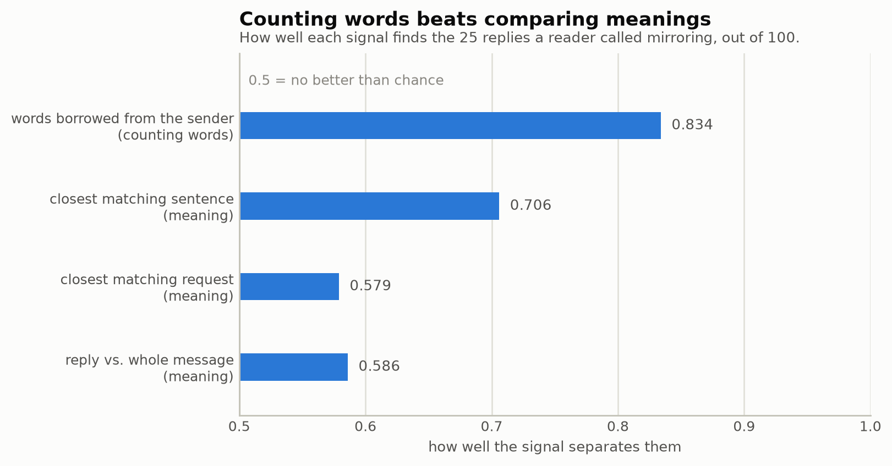
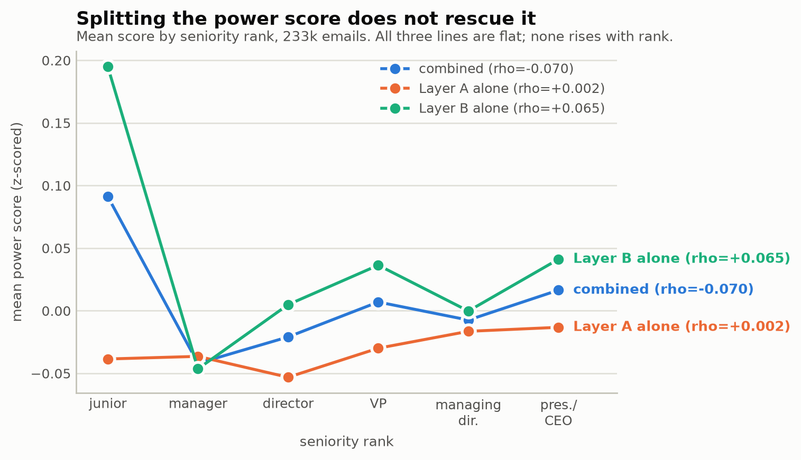
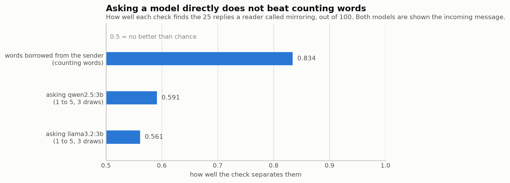

# Thesis Progress Log

A plain-language record of what has been built and found so far. Written for
you to read, not for a computer to run. Updated after each work session.

- **Code and data live in:** WSL (Linux environment on your Windows machine),
  pushed to GitHub at https://github.com/eunai9/llm-org-comm-thesis
- **Research plan (Exposé) lives in:** your OneDrive Thesis folder, unchanged

---

## Status at a glance

| Stage | Status |
|---|---|
| Project setup (coding environment, GitHub) | Done |
| Download and clean the Enron email dataset | Done |
| Figure out *who* sent each email (identity) | Done |
| Look up each person's job title / rank | Done |
| Reconstruct email conversation threads | Done |
| Measure "power" expressed in each email's writing style | Done — split into its two halves too, neither works, see section 45 |
| Draw the samples the simulator and judge will use | Done |
| Plumbing for talking to the AI models (cost, caching) | Done |
| Build the AI agent simulator | Done, except a second *paid* provider |
| Half-price bulk submission (batching) | Done |
| Give each persona a "memory" of recent context | Done |
| Two working demos (terminal + browser), runnable by anyone | Done |
| Build the AI judge (scoring rubric and pipeline) | Done, on the free path |
| Statistics that compare real vs. AI-written emails | Done, on the free path |
| AI replies to a real email, compared to the real reply | Section 38's judged pairs predate the Sep 5 prompt change and have not been re-judged yet — see "Ready to do" below |
| Does the judge favour its own kind of AI? (Q3) | Re-run at twice the size under the current prompt — self-preference is significant, p=.005. Section 41's number was stale. See section 52 |
| Does hierarchy shape what gets written? (Q1) | Re-run at 1,440 replies under the current prompt. Writing down is +0.134 (p=.092), measured six times better than before. Section 39's numbers are stale. See section 51 |
| Does real email show a direction pattern? (benchmark for Q1) | Measured. Writing down gives more orders in every check. The simulator's estimate is the same size but too noisy to detect. See section 48 |
| Is each result tied to the prompt that produced it? | It was not. A prompt change on Sep 5 silently moved Q1's numbers and nothing caught it. Run manifests now record a prompt hash. See section 51 |
| Validation pass: embedding map, 100 replies read by hand | Done — checked again under the current prompt, barely moves, see sections 35 and 53 |
| Measure the mirroring failure automatically | Done — see section 42 |
| Fix the mirroring failure by instructing the persona | Tried and did not work — phrasing moved, behavior did not, see section 43 |
| Fix it by making the persona decide before it writes | Tried and did not work — the gain is only a length effect, and the decision field turns out unstable, see section 49 |
| How much does the model disagree with itself? | Measured. Same prompt twice: only 60% of decisions repeat (kappa 0.25). Flag changes are noise; the borrowed-words mean is not. See section 50 |
| Does the model follow an instructed reply length? | Measured — the slope is 0.157, weak but real, see section 47 |
| Measure mirroring by meaning rather than by words | Tried and does not work — every variant scores worse, see section 44 |
| Measure mirroring by asking a model directly | Tried and does not work — both local models score near chance, see section 46 |
| Quoted text left inside "cleaned" message bodies | **Fixed in code and rebuilt — see section 37** |
| Get API keys / decide on budget | **Decided: staying free — see note below** |

---

## A few terms, explained once

- **Corpus** — the whole email dataset (all 500k+ Enron emails).
- **Deduplicate / dedup** — remove copies of the same email. The Enron export
  saved one copy of each email for every folder it appeared in (for example,
  once in the sender's "Sent" folder, once in each recipient's "Inbox"). So
  the raw file count is higher than the real number of emails.
- **Unit test** — a small automatic check. It checks one thing the code
  should do. With many of these, mistakes get caught right away, instead of
  showing up later in your results.
- **Coverage** — the percentage of emails we can actually use, after we
  apply a filter (for example, "we know who sent it").
- **Power score** — one number per email. It tries to measure how much
  authority the writer's language shows — for example, giving direct
  instructions instead of hedging, or getting fast replies instead of slow
  ones.
- **Construct validity** — whether a measurement really measures what it
  claims to measure. For the power score, the check is: do people in more
  senior roles score higher? If not, the score is not measuring what it was
  built to measure, whatever else it might be picking up.

---

## Why results in this log sometimes get re-run

Several sections below re-run a pilot and replace its numbers. This is on
purpose, and it helps to understand why once, instead of being surprised
each time it happens.

Every AI reply is saved in a cache, so it never has to be paid for or
generated twice. The cache is keyed on **the exact prompt text sent to the
model**. This is the right choice: it means a real change to the prompt can
never quietly return an old, stale reply.

The result: anything that feeds into that prompt text makes every cached
reply for that prompt go stale when it changes. Persona statistics do this
(a persona's "typical length" and writing habits are written into its
prompt), and so does scenario wording. So a fix to how a *corpus statistic*
is computed — even though it looks far from the simulator — correctly forces
every affected reply to be made again. This has happened twice: the tone
redesign (section 17) and the persona-statistics fix (section 31).

Re-running costs nothing, since everything runs on the local model. The cost
is that older results describe a pipeline that no longer exists. They have
to be re-run before they can be used. When that happens, it is stated
plainly — the numbers are never swapped quietly.

---

## What's been done

### 1. Project setup (Aug 7–8)

Set up a proper software project, so the work is organized, testable, and
backed up:

- Created a Python coding environment in WSL (a Linux system that runs
  alongside Windows — better suited for this kind of data work).
- Created a GitHub repository (`llm-org-comm-thesis`, private at first, now
  public) as an off-machine backup and version history — every change is
  recorded and can be recovered.
- Set up automatic code-quality checks (formatting, type-checking, and the
  unit tests mentioned above). These run before any change counts as "done."

### 2. Downloading the Enron email dataset (Aug 8)

- Downloaded the **official** Enron email archive (published by Carnegie
  Mellon University in 2015), not a copy from another source. This is the
  version other researchers cite, so the data source is easy to justify.
- Checked that the download was not corrupted (compared its digital
  fingerprint to the one CMU published).
- **Result:** 150 people's mailboxes, 517,401 individual email files, 2.6 GB.

### 3. Cleaning and parsing the emails (Aug 8)

Wrote code that reads each raw email file and pulls out the useful parts:
who sent it, who received it, when, the subject, and the actual written text
(with quoted reply chains and email signatures removed, since those are not
the sender's own words).

**Two real bugs were found and fixed while testing this against the actual
data** (not just made-up test examples):

1. **Duplicate removal was not working.** The system Enron used to export
   these emails gave every *copy* of a file its own unique ID. So the
   "official" ID could not be used to tell that two files were the same
   email. This let duplicates slip through unnoticed. Fixed by comparing the
   actual email content instead of relying on the ID.
2. **The program would have crashed partway through** on emails with
   certain non-English characters (accented names, etc.) in the
   sender/recipient fields. Fixed, with a permanent check added so this
   cannot happen again.

**Result after cleaning:**

| | |
|---|---:|
| Raw files | 517,401 |
| **Actual unique emails** | **254,359** |
| (i.e., the raw count was ~2x too high) | |
| Emails that turned out to be empty forwards (no real content) | 16,686 |

⚠️ **Important for your writing:** always cite **254,359** as the number of
emails in this study, not 517,401 — that raw number counts each email about
twice.

### 4. Figuring out who sent each email (Aug 9)

An email address alone does not tell you *who* a person is or what job they
had — and the same person often used more than one address. So the next
step was matching addresses to real people, using each of the 150 mailbox
owners' own "Sent" folder as the anchor (in other words, "whichever address
this person sends *from* is their address").

Found and fixed one more bug here: one real employee's email address
contained an apostrophe (`paul.y'barbo@enron.com`), which broke a database
query that did not expect this kind of punctuation. Fixed, and it will not
happen again.

**Result — this is the key number for your Q1 (hierarchy) analysis:**

- 191 person-addresses identified across 146 of the 150 mailboxes
- Of the emails usable for analysis (right length, right date range,
  internal senders), **44.8% come from a person we can identify.** This was
  expected to land between 25–45%, so 44.8% means the hierarchy analysis
  (Q1) is on solid ground.

---

### 5. Grouping emails into conversations (Aug 9)

To study how people talk to each other, we need to know which emails are
replies to which — that is, group them into conversations.

Normally email carries hidden technical labels that make this easy. **This
dataset has none of them** (the Enron export removed them — I checked all
254,359 emails, and not one has them). So instead, emails are grouped when
all three of these are true:

1. they have the same subject line (ignoring "Re:" and "Fw:"),
2. at least two of the same people are involved, and
3. they happened within 30 days of each other.

The rules are strict on purpose. Wrongly joining two unrelated conversations
is much worse for this project than splitting one real conversation into
two, because these conversations get shown to the AI as examples — and a
bad example produces a bad result.

**One thing worth knowing:** a large share of what first looked like
"conversations" turned out to be automated mail — daily newsletters and
system alerts that always share a subject line. The biggest was 251 emails,
all from one sender, over four months ("Williams Energy News Live"). These
are not conversations at all, so the code now finds and marks them
separately.

**Results:**

| | |
|---|---:|
| Real conversations found | 18,467 |
| Of those, with 3+ emails (best for AI examples) | 8,959 |
| Automated newsletters/alerts, correctly excluded | 14,532 |
| Emails that were one-offs, not part of any conversation | 157,993 |

8,959 usable conversations is far more than the ~200 this project needs, so
there is plenty to choose from.

⚠️ **Still to do here:** this method uses matching, not exact labels, so it
can make mistakes. I generated a sample of 50 conversations for someone to
check by hand (`data/interim/threads_review_sample.txt`). That accuracy
number should go in your thesis as a stated limit.

---

### 6. Job titles and seniority ranking (Aug 9)

This finishes a blocked piece: knowing not just *who* sent an email, but
their **job title and seniority level**, so hierarchy can actually be
compared.

**Both of the two sources we agreed on turned out to be dead links** — I
checked carefully (see the sourcing conversation for details), and neither
could be found anymore. Instead of giving up, I kept searching and found a
**live, working alternative**: a 156-person employee list (name, department,
job title, and a Junior/Senior label) published by a statistics professor
who has done formal research on this exact dataset, with a real academic
citation. Full details of what was tried, and why it was swapped, are in
`data/external/SOURCES.md`.

**How the matching works:** Enron's own email system named each person's
mailbox folder in a very consistent way — surname plus first initial (for
example, Sally Beck → `beck-s`). So instead of guessing who's who from names
in email headers (which is error-prone), the code rebuilds that exact
folder-naming pattern from the employee list's names, and matches it
directly against the real mailbox folder names. This is exact, not
approximate.

**I also built a job-title-to-seniority-rank table by hand** — 36 distinct
titles found in the employee list ("VP Trading", "Mgr Trading", "Director",
etc.), each given a rank from 1 (entry-level) to 6 (President/CEO). This was
done **before** looking at any result, so the ranking could not be shaped,
even by accident, to produce a nicer answer. This table is saved in the
project (`data/external/title_to_rank.csv`) and can go straight into a
thesis appendix.

**Results:**

| | |
|---|---:|
| Employees in the source list | 156 |
| Successfully matched to a mailbox | 129 (82.7%) |
| **Eligible emails with a known sender title/rank** | **47,567 / 117,794 (40.4%)** |

The 27 unmatched people fall into clear groups:
- A few are genuinely two different people who share a surname and first
  initial (for example, two people named "Dean, C..."), correctly left
  unmatched instead of guessed at
- A few appear in the employee list but never sent an email that made it
  into the usable dataset
- A very small number are one-off naming quirks (for example, someone who
  went by their middle name, or a two-word surname the automatic pattern did
  not expect) — noted, not hand-fixed, since chasing 3–4 individual people
  with special-case code is not worth the added complexity

**A nice sanity check:** the by-hand rank table was checked against the
employee list's own Junior/Senior label afterward. They agree **completely**
— every rank category (Manager, Director, VP, etc.) lines up with exactly
one of Junior or Senior, with zero contradictions. That is good independent
evidence the ranking is sound.

⚠️ **40.4% is now the real, final number for how much of the dataset can be
used in the hierarchy analysis (Q1).** This is a bit lower than the 44.8%
mentioned before, because now the bar is "we know their exact job title,"
not just "we know who they are." Both are healthy numbers for this kind of
study.

---

### 7. The power score (Aug 10)

This is the measurement Q1 (the hierarchy question) depends on most: a
per-email score meant to capture how much authority a person's writing
shows. It combines two kinds of signal, both built and frozen *before*
either was run against real results:

- **Writing-style signal** — how often someone gives direct instructions
  versus hedges ("maybe", "perhaps"), defers ("if it's not too much
  trouble"), or makes personal commitments ("I'll take care of it").
  Measured with a natural-language-processing tool (spaCy), run over every
  one of the 237,627 usable emails. ⚠️ **Superseded — see section 37:** a
  corpus-cleaning bug meant this undercounted how many messages were
  actually empty; the corrected figure is 233,282.
- **Behavioral signal** — how central someone is in the email network, how
  often they start conversations versus get the last word, and whether
  people reply to them faster than they reply to others.

**This step ran into serious engineering trouble before it worked.** One
email in the dataset — not a real message, more like a 1.7-million-character
block of pasted text — was large enough to overwhelm the text-processing
tool's memory and crashed the environment outright, twice, before the cause
was found. The fix excludes the 46 emails in the whole dataset (0.02%) that
are too long to plausibly be real correspondence. After that, the real run
finished cleanly in about 77 minutes. A second, unrelated crash turned out
to be a Windows setting problem (too much memory reserved for the Linux
environment, leaving Windows itself unable to breathe), and was fixed
separately. Both fixes are saved in the code, so this will not happen again.

**The result — reported honestly, exactly as planned in advance:**

| Seniority rank | Mean power score | Emails |
|---|---:|---:|
| 1 — Junior employee | **+0.088** | 27,467 |
| 2 — Manager | −0.044 | 10,906 |
| 3 — Director | −0.025 | 17,729 |
| 4 — Vice President | +0.003 | 18,092 |
| 5 — Managing Director | −0.010 | 6,703 |
| 6 — President / CEO | +0.016 | 3,796 |

**The score does not track seniority.** If it worked as hoped, the numbers
would climb steadily from rank 1 to rank 6. Instead, junior employees score
highest, executives are barely above zero, and the statistical correlation
between rank and score is close to flat (slightly negative: Spearman's ρ =
−0.065 — for reference, 0 means no relationship at all).

This was flagged as a real possibility from the start, on purpose, so there
would be no temptation to quietly adjust the formula until it "worked." The
formula stays exactly as originally frozen. **This is now a real,
reportable finding for the thesis** — either the writing-style/network idea
of "power" needs revisiting for this dataset, or (more likely, and worth
checking next) the two parts that make up this score need to be looked at
separately, not just as one combined number, and compared against the
upcoming AI-judged labels as a second opinion.

---

### 8. Sampling: drawing the three sets everything downstream uses (Aug 14)

Before you looked at options for revising the power score, you asked what
the next step would be if you simply left it as-is for now. This section is
that next step. It does not depend on how the power-score question
eventually gets resolved.

Everything from here on — the AI simulator, the AI judge, the labelling —
needs fixed sets of real emails to work with. These are drawn **once**, with
one random seed, so every later result traces back to the same starting
point. Three sets, drawn from the 47,567 emails that pass every filter
(real correspondence, reasonable length, sender's job title known, inside
the study window):

| Sample | What it's for | Drawn |
|---|---|---:|
| S_label | Emails an AI will label (purpose, tone, etc.) to check the power score and train further labelling | 3,000 / 3,000 |
| S_shots | Real email threads the simulator will be prompted with, to write realistic replies | 200 / 200 |
| S_real_eval | The *actual* real replies inside those same 200 threads, so a real reply and an AI-written reply can be judged side by side, answering the exact same message | 302 / 400 |

**S_real_eval came up short of the target (302, not 400) — reported
honestly rather than padded.** There simply are not 400 real replies inside
emails that also pass every other filter; some of the 200 threads only had
one or two eligible replies. This does not threaten anything downstream —
it just means slightly fewer real-vs-AI paired comparisons later.

**A performance problem, caught and fixed before it could happen again:**
the first real run of this step took **47 minutes**, which was surprising
for something that should be quick. The cause was a common, easy-to-miss
inefficiency — checking each of the ~18,000 real conversation threads one at
a time, in a slow way, instead of all at once. Rewritten to check them all
in one step, the exact same result now takes **under one second**. Worth
mentioning only because it would have made re-running this step later (say,
after a small config change) a half-hour tax for no reason.

---

### 9. Plumbing for talking to the AI models (Aug 15)

Phase 3 (the AI simulator) starts here. Before any AI can be asked to write
an email, there needs to be a reliable, cheap, and *reproducible* way to
talk to it. That layer is now built and tested.

Three pieces, each solving a specific problem:

**Cost control.** Every call is priced before it is made, checked against a
budget limit, and recorded afterward in a plain spreadsheet file you can
open and read. If a planned run would cost more than the set limit, it
refuses to start, instead of discovering the overspend afterward. Prices are
deliberately set to the *standard* rates, not the discounted promotional
ones that expire at the end of August — a budget warning that fires a
little early is useful; one that fires too late is not.

**A permanent archive of every AI response.** This is the most important
piece, and it matters for your thesis, not just for speed. **AI responses
are not repeatable** — asking the same question twice can give different
answers, and the model we use has no "randomness setting" to lock down. So
exact regeneration is genuinely impossible, and claiming otherwise in the
write-up would be false. What *is* possible is saving every response
permanently, so that:

- Re-running the analysis in January costs **nothing** and gives identical
  results.
- The whole thing can run with no internet at all — which also means a
  reviewer could check your work without needing their own API key.
- The archive can be published with the thesis, so "we archived all N
  responses" is something a reader can check, not just take on faith.

The archive is filed by a fingerprint of the **exact text** sent to the AI.
This detail matters: if it were filed by "which template was used" instead,
then editing a prompt's wording without renaming it would quietly return
answers generated under the *old* wording — producing an analysis of
prompts that were never actually sent. Filing by exact text makes that
mistake impossible.

**Guardrails against three costly mistakes.** The model we use rejects the
"creativity dial" (temperature) outright — the exposé had planned to use it,
so this is now a stated limit, not a mid-experiment surprise. It also has a
minimum prompt length below which the cost-saving cache silently does
nothing, and that minimum *differs between models*. And its "thinking" time
counts against the same budget as its visible answer, so a budget sized for
the answer alone cuts the answer short. All three are now written into the
code and covered by tests, so they fail loudly when the code is built,
instead of quietly during a paid run.

**One thing verified, not assumed:** the archive's fingerprints are exactly
the same across separate program runs. Python deliberately randomizes some
internal hashing between runs, so this was worth testing rather than
trusting — if it were not stable, the January re-run would miss every saved
response and quietly re-bill the whole project.

---

### 10. The simulator itself (Aug 15–17)

This is the machine that writes the simulated emails. Five parts:

**The personas.** Ten role archetypes — five seniority levels across two
departments (Trading and Legal). They are **never named after real Enron
people**, for two reasons that both matter. The obvious one is ethics: these
are real people's real messages. The less obvious one is that today's AI
models have memorized large parts of this famous dataset, so an AI asked to
write "as Jeff Skilling" might simply be *recalling* him rather than
*simulating* a role — which would quietly break the whole fidelity question
(Q2). Instead, each persona is a statistical summary of how people at that
level actually wrote.

⚠️ **A problem found and fixed along the way:** summarizing a group does not
automatically anonymize it. Four of the ten role groups turned out to
contain only one or two real people — so the "archetype" would effectively
have *been* that one person, bringing back exactly the problem the approach
was meant to avoid. The code now requires at least three people behind every
persona, and falls back to a broader average when a group is too small.
Which four personas this affected is recorded and reported, not hidden.

⚠️ **A limitation worth stating in the thesis:** at the most senior level,
both departments fell back to the same broader average, so those two
personas differ only by their *label*. A "department effect" measured at
that level would be measuring nothing real. The code detects and flags this
automatically.

**The scenarios.** 144 made-up workplace situations (six task types × three
directions × two stakes levels × four tones — see entries 17 and 18 below
for the tone dimension and the sixth task type). They contain no Enron
content at all — they are written from scratch. Real emails enter the study
separately, as the `S_shots` stimuli.

**Memory.** Each persona carries a small "memory" of recent working life,
following the standard published method for AI agents. It is retrieved once
per persona and reused across scenarios — cheaper, and a cleaner comparison,
since two scenarios that differ only in stakes cannot accidentally differ in
what the persona happened to remember.

**The prompt.** Carefully ordered so the expensive, unchanging part can be
cached and reused. Getting this order wrong would not produce an error — it
would just quietly raise the bill.

**The runner.** Walks through the whole experiment, checks the archive
before paying for anything, records where every result came from, and
refuses to start a real run from uncommitted code (so every future number
traces back to exact code).

**Three bugs caught by tests before any money was involved**, all silent
ones:

1. **Repeats collapsed into one.** The design asks the AI the same question
   five times, to measure how much its answers *vary*. Because the question
   is identical each time, the archive was returning the first answer all
   five times — so measured variation would have been exactly zero, and the
   "diversity" finding would have described the filing system, not the AI.
2. **The bulk-submission ID limit.** Our descriptive labels run to 70
   characters; the bulk API accepts shorter ones. This would have failed
   only at the moment a large paid submission was accepted.
3. **Stub test runs were being billed** at real prices in the cost log — the
   file the thesis's total-cost figure is summed from.

---

### 11. Running it for free, before spending anything (Aug 15–17)

You asked whether the prototype could be tested without paying. It can, and
it now runs three ways:

| Mode | Cost | The text is… |
|---|---|---|
| `--offline` | free | fake (fill-in-the-blank templates) |
| `--local llama3.2:3b` | free | **really generated**, by a small AI on your own PC |
| *(default)* | paid | generated by the top-tier models the thesis names |

The middle option is the useful one. A small open AI model now runs locally
on your machine (installed without needing administrator rights), so
prompts can be tested on real generated text before any money is spent.

**Safeguards, so free output can never be mistaken for a result:** locally
generated emails are stamped `local/…` in the results file, flagged in the
run record, and excluded from the cost calculation. This matters beyond
quality — the thesis names *specific* AI models, so a small model on a
laptop cannot stand in for one in a results table, however good it looks.

**It immediately earned its keep.** The first real local run showed the AI
opening emails with the literal word *"decline."* — nobody writes an email
that starts with a category label. The instruction wording was at fault,
not the model. After the fix, measured on the same twelve emails: emails
starting with a decision word went from **4 out of 12 to 0 out of 12**.

**Deliberately not fixed yet:** the generated emails are much shorter than
the persona's target, and the stated decision sometimes does not match the
email's content. These are most likely limits of the small local model, not
faults in the prompt — over-tuning the prompt against a weak model risks
making it *worse* for the real one. Worth rechecking once a real key exists.

---

### 12. Two ways to actually see it working (Aug 19)

Up to this point, the only way to look at a generated reply was to read a
data file with code. That is fine for analysis, but wrong for a demo. Two
proper demos now exist, both free, both showing the exact same underlying
behavior:

- **A terminal version** (`python -m thesis.sim.demo`) — pick a role and a
  scenario from a menu, see the reply printed nicely.
- **A browser version** (`python -m thesis.sim.webdemo`) — the same thing,
  as an actual web page with dropdowns, easier to read and easier to show
  someone else on the same screen. This is what you asked for as a "web
  demo" — confirmed as a **local-only** page (nothing reachable from outside
  your own machine), since a page reachable from the internet would need
  real hosting and cost money, which is not what you wanted.

**Two real problems, caught by actually testing rather than assuming it
worked:**
- The web page's server seemed unreachable on the first attempt — this
  turned out to be an unrelated quirk in how the background process was
  started, not a real networking problem. Confirmed by restarting it
  correctly.
- A generation request then timed out with no trace of it on the server —
  meaning it never actually arrived. Traced to the *test script itself* (a
  Windows PowerShell quirk), not the actual page — your real browser does
  not have this problem, confirmed by testing the same request successfully
  through a different path.

**A third real gap, found by trying to hand this to someone else:** neither
demo could actually run on a different computer, because this project
deliberately never uploads the processed email dataset (~270MB) to GitHub.
Fixed by freezing the real, computed numbers into a small file that *is*
uploaded (`data/external/personas_snapshot.json`), so anyone with the code —
your supervisor included — gets the real numbers without needing the
dataset itself. A written guide, **`RUNNING_THE_DEMO.md`**, walks through
the whole setup from scratch. It was tested twice on a completely clean
checkout before being trusted — the first attempt caught a real missing
step in my own instructions, which was fixed and checked again before being
finalized.

---

### 13. Giving each persona a memory (Aug 21)

One piece of the simulator had existed in code but never actually worked:
each role was supposed to carry a small memory of "recent context" that
shapes how it writes, but nothing had ever generated that content. Every
reply you have seen in either demo, until now, was written with an empty
memory.

That is now fixed. For each of the 10 roles, the AI was asked to invent 15
small, plausible things that might have happened recently in that kind of
job (never naming real people or real events), and then to summarize a few
general "tendencies" from those — the same two-layer memory design used in
well-known published AI-agent research. Retrieval (deciding which few
memories are most relevant to a given reply) already existed and had
already been tested; what was missing was only the step that invents the
memories in the first place.

**Measured, not assumed working:** pulled an actual generated reply and
confirmed the memory content really appears in what gets sent to the AI,
then ran real replies end to end to confirm nothing broke. The AI did not
always produce a full set of summarized tendencies — it fell short on some
roles — and that shortfall is reported as-is, not padded, the same approach
used for every other honest gap in this project so far.

⚠️ **One caveat to remember later:** this memory content was invented by the
small, free local AI model — fine for testing and demos, but the actual
thesis results should have memory generated by the *same*, real AI model
used for the main experiment. Mixing a weak model's invented memories into
a strong model's writing would be a real, confusing side effect, not just a
style choice — worth revisiting once a real key exists.

---

### 14. Starting the AI judge — the part that scores the emails (Aug 21)

The judge (the part that scores how good each email is) is now under
construction, using the same approach that worked for the simulator: build
it fully, test it for free, run it for real later, if that ever happens.

**One real limitation, stated plainly rather than glossed over.** The
research design calls for the judge to always be a *different* AI model
family than the one that wrote the email — this is what lets the study
detect whether a model is quietly biased toward favoring its own writing.
That specific comparison genuinely cannot be done on the free path.
Everything else about the judge — the actual scoring questions, how a
question is asked, how the scoring pipeline runs — does not need that
comparison to be built and tested.

**What's built:** six scoring questions, in two groups (does this sound
like the right person for the role, and separately, is it well-written),
each scored 1–5 with a required short quote justifying the score.
Importantly, the judge is never told whether it is looking at a real email
or an AI-written one — that blindness is what will make the eventual
real-vs-AI comparison trustworthy, instead of something the judge could
shortcut by just recognizing which is which. Three different phrasings of
the same six questions were also built, because how *consistent* the judge
is when the same question is worded differently is itself worth measuring,
not something to skip over.

**Verified live, for free:** ran it against two made-up example emails —
one professional, one deliberately unprofessional — using the free local
model. It correctly scored the unprofessional one low on every dimension,
and the professional one reasonably, confirming the mechanism works before
any money is involved.

---

### 15. Can the AI tell a real email from an AI-written one? (Aug 21–22)

Two more pieces, finishing the judge and starting to make sense of its
output.

**A second, separate way of asking the judge to look at an email:** instead
of scoring it on the six questions, just ask "does this look real, or
written for a study?" on a 1–5 scale. This is deliberately a *different*
request from the six-question scoring, not an extra seventh question bolted
on — asking the judge to hunt for signs of fakery in the same breath as
asking it to judge quality risked contaminating the quality scores
themselves.

**The statistics that actually compare real vs. AI-written emails.** Four
of them, matching the research plan exactly:
- Is there a real difference in how the two are scored? (a standard
  significance test)
- Can we *positively* say they're similar, rather than just failing to find
  a difference? (a stricter, more honest framing your own plan specifically
  called for)
- Can the judge itself tell them apart, directly?
- Can a much simpler, non-AI method (just counting which words appear) tell
  them apart?

⚠️ **Two of the four need a kind of data this project can't produce yet** —
a real email and an AI-written reply to the *exact same* incoming message,
so the comparison is not muddied by comparing different situations. That
pairing needs a simulator capability (answering a real email directly,
instead of a made-up scenario) that had not been built yet. Those two
statistics are built and thoroughly tested on made-up example numbers,
ready for when that data exists.

**The other two ran on real data already collected:** the judge's own guess
at telling real from AI-written scored barely better than a coin flip
(which matches what you'd hope to see — it means the AI-written emails are
hard to spot). The simple word-counting method, by contrast, told them
apart *perfectly* — but with only 5 real Enron emails and 5 emails about
made-up scenarios, that is almost certainly because the topics discussed
are just obviously different, not a real finding about writing quality.
Worth knowing, not worth reading much into yet.

---

### 16. Comparing an AI reply to the actual real reply, on the same email (Aug 22)

Until now, the AI simulator only ever answered made-up practice situations.
This section teaches it to answer a **real** email — the exact same one a
real Enron employee actually replied to — so the AI's reply and the real
person's reply can be compared head to head, on identical footing. This is
what the "statistics that compare real vs. AI-written emails" (section 15)
were actually waiting for: without this, they had nothing genuinely matched
to compare, only different topics being compared to each other.

Of the 200 real conversations sampled earlier for this purpose, 190 replies
turned out usable (133 distinct conversations; some conversations had more
than one real person reply, and each of those is now its own comparison).
The rest are skipped for the same reason a handful of roles were already
left out of the simulator entirely — either the real replier's seniority
was the single most senior tier (deliberately excluded from the start, to
avoid the AI "recognizing" a real famous person), or their department was
not one of the two modeled (Trading or Legal).

**Two real bugs, caught before they could quietly produce wrong numbers:**
one conversation with two different real repliers was at first being
tracked as if it were only one comparison, silently losing the second; and
an identifier was being shortened in a way that — very rarely, but possibly
— could make two different comparisons look like the same one. Both fixed
and checked.

**Ran the whole thing for real, for the first time:** generated 6 AI
replies to real emails, compared each against the real person's actual
reply, and ran the statistics. The result is a good, concrete example of
exactly why two different statistical tests are used side by side: the
simpler test found "no clear difference" on every dimension — which sounds
like good news — but the stricter test (the one that requires *positive*
evidence of similarity, not just an absence of a detected difference)
correctly refused to call them equivalent on any dimension. On two of the
six ("does the reply actually engage with this specific situation" and "is
disagreement handled well"), the real gap was more than double what the
stricter test would accept. With only 6 examples and the smallest free AI
model, this is not a real finding yet — but it is the pipeline working
correctly end to end for the first time, and it already gives a preview of
the kind of honest, non-oversold result this project is built to produce.

---

### 17. Adding tone as a fourth dimension of the scenario grid (Aug 23, corrected Aug 24)

The scenario grid gained a fourth factor: **tone** of the message a persona
receives. Four levels: Deferential, Warm, Neutral, Assertive. Each task type
now has four hand-written versions of the same underlying request, one per
tone — same request, different voice. "Neutral" is each task type's
plainest phrasing; the other three rephrase it in a different voice. The
persona is never told how to respond — it only ever sees a stimulus already
written in one of these four voices, and replies however it naturally
would. This tests whether the tone of an incoming message shapes the reply,
on top of who it is from.

**This was wrong the first time.** The version built and reported on Aug 23
instead gave the *persona* an explicit instruction ("Write in a deferential
tone: downplay your own authority...") on top of a fixed, tone-less
incoming message — testing instruction-following, not whether an incoming
message's tone shapes a reply. A pilot run under that version even reported
a real "tone dominates hierarchy" finding, which does not carry over: it
was answering a different, less interesting question. Caught while
re-explaining the design, and corrected the same day — the fix rewrote
every incoming message into four tone variants and removed the instruction
sentence entirely. No pilot has been rerun against the corrected version
yet.

**Naming note (unaffected by the correction):** the fourth level was
originally going to be "Aggressive." Renamed to "Assertive" — real business
email in this corpus almost never reaches outright hostility, so an
"aggressive" condition would have tested how far the AI can be pushed into
an unrealistic register, not a genuine organizational behavior.

**What this cost:** the scenario grid was 30 situations (5 task types × 3
directions × 2 stakes); adding 4 tones makes it 120. To keep the total
number of AI replies generated from growing 4x along with it, the number of
repeated draws per situation (needed to tell a real effect apart from the
AI's own randomness — see the terms section at the top) was cut from 5 to
2, the lowest number that still lets that distinction be made at all. Net
effect: total generations go from 3,000 to 4,800 — a real increase, but far
short of the 12,000 a straight 4x would have been.

---

### 18. A sixth task type: confirming details (Aug 23)

Added one more situation to the scenario grid: **confirm_details** —
someone checking that a plan already in motion is still on track ("just
confirming we're still moving forward with the numbers from last week's
call, right?"), which only needs a quick yes/no, not a real decision. This
fills a gap the other five did not cover: `approve_or_decline` already
carries risk and a real choice, `request_information` asks for new data,
but nothing tested the lightweight, low-effort acknowledgment end of
workplace email.

Task types are now 6 instead of 5, so the scenario grid grows from 120 to
144 situations (6 × 3 directions × 2 stakes × 4 tones), and total AI-reply
generations from 4,800 to 5,760.

---

### 19. A mixed-model crash that only shows up when a persona effect is genuinely zero (Aug 24)

While generating the (since-superseded) 240-reply direction × tone pilot,
the Q1 mixed model crashed partway through with a numerical error
(`LinAlgError: Singular matrix`), not a Python bug. The cause: for
`hedge_rate`, persona genuinely explains close to none of the variance —
the same thing the very first Q1 pilot already found, where its estimated
persona effect was already close to 0. Statistics software fits that "zero"
by searching for the best value of a number that cannot go below zero, and
right at that lower boundary, the default search method's internal math can
divide by (numerically) zero. Two other search methods that don't rely on
that math (Powell, Nelder-Mead) handle it fine, so the model now tries the
default first and automatically falls back to those if it fails — a
one-line change in practice, checked with a test that reproduces the exact
zero-effect situation and confirms it no longer crashes.

---

### 20. Rerunning the Q1 pilot with the corrected tone design (Aug 24)

With section 17's fix in place, reran the same 240-reply pilot (10 personas
× 3 directions × 4 incoming-message tones × 2 fixed task types). Because
the incoming messages themselves changed, every reply was freshly
generated, not served from cache. The result flips completely from the
flawed version:

- **Direction still matters, and now replicates the very first Q1 pilot
  almost exactly:** replying down uses more direct/imperative language than
  replying to a peer (+0.23, p<0.001), and replying up shows a smaller but
  still significant bump (+0.14, p=0.046).
- **The tone of the incoming message has no detectable effect** on either
  imperative language or hedging (all p > 0.2) — a real persona replies
  roughly the same way whether the request it received was phrased
  politely or bluntly.

So the honest reading is the opposite of what the flawed run suggested:
hierarchy shapes the reply; the tone of what prompted it does not, at least
on these two features. One pattern worth a second look later, not yet
tested statistically: replies to an assertively-phrased message while
writing up skewed heavily toward "accept" (12 of 20), while
warmly-phrased messages while writing down skewed toward "defer"/"decline"
— plausible, but at n≈20 per cell not something to lean on.

Same standing caveats as every pilot so far: one small local model
(llama3.2:3b), not the full 144-scenario grid, exploratory rather than
thesis-grade.

---

### 21. Renaming "style" to "tone" (Aug 24)

The incoming-message factor from sections 17 and 20 was called `style`,
which turned out to collide in name (though not in meaning) with an
existing, unrelated idea: each persona already carries its own
corpus-derived writing style (`PersonaStyle` — how often it hedges, gives
direct instructions, etc., see section 10). Renamed the scenario factor to
`tone` throughout the code, tests, and both demos, so the two ideas can't
be confused with each other again. No behavior changed.

---

### 22. A real interaction model: does hierarchy's effect depend on incoming tone? (Aug 24)

Section 20's two separate models could each only say "direction matters"
and "tone doesn't" on their own — neither could say whether tone's null
effect held everywhere, or whether hierarchy's effect changed shape
depending on the tone of message that triggered it. Added
`fit_interaction_model` to `analysis/hierarchy.py`: one mixed model with
both factors and their product (`outcome ~ direction * tone`), so the
interaction itself gets a coefficient and a p-value instead of being
invisible to two separate models. Tested the same way as the rest of this
module — synthetic data with a known effect placed at exactly one
(direction, tone) combination, confirming it shows up in the interaction
term and does not leak into either main effect.

Run against the same 240-reply pilot from section 20 (free — every response
was already cached, so this needed no new AI calls):

- **Direction's effect on `imperative_ratio` replicates again**, this time
  measured specifically at neutral incoming tone: writing up +0.35
  (p=0.010), writing down +0.325 (p=0.016) — closely matching both earlier
  pilots.
- **No interaction term reaches significance for `imperative_ratio`**,
  though two are suggestive (writing up in response to a deferential or an
  assertive message, both p≈0.07-0.08) — direction's effect looks roughly
  the same across incoming tones, though a bigger run should not treat this
  as fully settled.
- **One interaction term is significant for `hedge_rate`**: replying down
  to a warm message drops hedging by 0.275 (p=0.043) more than either
  factor predicts alone. Flagged, not trusted yet — this is 1 significant
  result out of 12 interaction tests run (6 per outcome × 2 outcomes), so
  it is within the range you would expect from chance alone, and needs to
  replicate before it counts as a real finding.

---

### 23. A free approximation of the judge-swap design (Aug 24)

The plan's Q3 self-preference test — does a judge favor its own kind of AI
over another? — was flagged as genuinely out of reach on the free path,
because it assumed "family" meant Claude vs. OpenAI. Tried a substitute:
two different *local* models as the two families instead of two paid ones
— **llama3.2:3b** (Meta) and **qwen2.5:3b** (Alibaba), genuinely different
training lineages, both small enough to run on this machine. Pulled
qwen2.5:3b (~2 GB, free) and reused the existing judge machinery unchanged:
120 replies generated (10 personas × 3 directions × 2 task types × both
models), each blind-scored by both models acting as judge — 240 scores
total, zero cost.

The self-preference question is exactly the interaction term in a
`generator × judge` model, so this reused `fit_interaction_model` from
section 22 instead of needing new statistics: does a judge rate its own
family's output higher than the other family's, beyond (a) that
generator's own baseline quality and (b) that judge's own baseline
generosity?


Two effects turned out to be real and much larger than any self-preference
signal, and both are visible in the plot above:

- **qwen writes better replies than llama, by both judges' scoring** —
  qwen-generated messages score about 1 point higher (on the 1-5 rubric)
  than llama-generated ones, consistently. That is both lines sloping up.
- **llama is a more generous judge than qwen** — llama-as-judge scores
  everything roughly 0.6 points higher than qwen-as-judge does, no matter
  who wrote it. That is the vertical gap between the two lines.

Self-preference is whatever is left over: the small *non-parallelism*,
meaning llama's line falls less steeply than qwen's as it moves to the
other family's output. It is visible but small, which is exactly what the
p=0.065 says numerically.

After controlling for both of those (the interaction model's whole job), a
self-preference signal remains: llama-judge rates llama-generated replies
about **0.42 points higher than the two effects above would predict on
their own** — but only at p=0.065, just short of standard significance, and
weaker still (p=0.20) on the single rubric item closest to "does this look
authentic" (`corpus_plausibility`). It points the same direction as
self-preference, but is not confirmed at this sample size. One real
limitation of a 2×2 design worth naming: the single interaction number here
is symmetric — it can say whether *matching* generator/judge pairs score
higher than the additive model predicts overall, but not how much each
individual model favors itself separately.

Standing caveats apply doubly here: two 3B local models are a stand-in for
the plan's actual cross-provider design, not a replacement for it, and
n=120 items is a pilot, not a powered study.

---

### 24. Re-running the real-vs-AI comparison, and a clear failure to report (Aug 24)

The tone correction in section 17 changed the text every persona receives,
which correctly made the cached AI replies behind the earlier real-vs-AI
comparison stale. Those numbers described a pipeline that no longer
existed, so they were dropped and the comparison was rerun from scratch:
the same real email threads, an AI reply to each, and both the AI reply and
the real person's actual reply scored blind by the judge.

**The first attempt produced a wrong answer, and the reason matters.** That
run reported a large, statistically significant gap on role consistency —
real replies 4.65 vs AI 3.81 — and it was an artifact. Real replies were
handed to the judge as `Subject: ... / body`, while AI replies were handed
over as body text only. The two sides differed in *format*, not just in who
wrote them, which also means the judge was never properly blind: "has a
subject line" was a perfect giveaway. Caught while checking what a separate
word-frequency classifier was keying on (section 25).

**Corrected result, both sides formatted identically, 40 matched pairs:**

| Dimension | Real | AI | Gap | Difference detected? | Similarity proven? |
|---|---:|---:|---:|---|---|
| Clarity | 4.70 | 4.72 | −0.03 | No | **Yes** |
| Role consistency | 4.58 | 4.62 | −0.05 | No | **Yes** |
| Politeness | 4.45 | 4.62 | −0.17 | No | No |
| Conflict management | 4.50 | 4.67 | −0.17 | No | No |
| Corpus plausibility | 4.25 | 4.53 | −0.28 | No | No |
| Contextual fit | 4.12 | 4.62 | −0.50 | Borderline (p=.055) | No |


The role-consistency failure disappears completely once the comparison is
made fair. Every gap now runs the other way: the AI reply scored at least
as well as the real one on all six dimensions, similarity is positively
proven on two, and the one near-significant difference favors the AI. **On
the judge's own rubric, these replies pass.**

Also fixed here: pairs are now keyed on the individual reply, not the
conversation, so conversations with more than one real replier no longer
collapse into one. That is why this run has 40 pairs where the first had
31.

---

### 25. The judge says they match; a much simpler method says they don't (Aug 24)

Ran the model-free check that had been built but never used on real data:
no AI involved at all, just word frequencies (TF-IDF) and a standard
classifier, asked to guess which replies are real. A score of 0.5 means it
cannot tell; 1.0 means it always can.

| Comparison | Score | What it isolates |
|---|---:|---|
| Unmatched format | 0.887 | Contaminated by the subject-line artifact above |
| Format-matched | 0.719 | The fair comparison |
| Format-matched, names removed | 0.819 | Real names replaced by placeholders |
| Body text only, both sides | 0.841 | Prose alone |


**This is arguably the most useful result the project has produced.** On
the same 40 pairs, an AI judge scoring six rubric dimensions cannot tell
real from generated — but a simple word-counting classifier separates them
at 0.72–0.84. Both statements are true at once. The research plan already
warned that "rated similarity is weak" and recommended pairing it with
exactly this kind of check; the project now has its own data showing the
point, rather than just citing the worry.

**What gives the AI replies away**, and neither reason is subtle:

- **Length.** Real replies run 53 words at the median, AI replies 19.5 —
  nearly three times shorter.
- **Concreteness.** Real workplace email is thick with names, companies,
  dates and figures. The AI replies mention almost nothing specific.
  Counter-intuitively, *removing* real names raised the score rather than
  lowering it: swapping many rare distinct names for a few repeated
  placeholders concentrated the signal instead of erasing it. So the tell
  is not which names appear, but how many.

⚠️ **Important caveat for the thesis:** part of that concreteness gap is
designed in, not a model failing. The personas are deliberately anonymized
role archetypes with no real colleague names or deal names, so they
*cannot* produce them. The write-up needs to separate "the AI writes
unconvincingly" from "the design forbids the AI from being specific."

---

### 26. Fixing a subtle statistical leak in the model-free check (Aug 24)

While running the above, found a real flaw in `model_free_discrimination_auc`:
it built its word list from *all* the text before splitting into train/test
folds, which lets each training round peek at the vocabulary of the very
examples it is about to be tested on. That is textbook data leakage, and it
inflates the score by an unknown amount — bad anywhere, but especially
here, since this number exists precisely to be the harder-to-argue-with
companion to the AI judge's opinion.

Fixed by rebuilding the word list separately inside each fold. The
practical difference on this data turned out to be small (0.872 → 0.887,
i.e. within noise, and in the opposite direction to the usual leakage
effect) — but "it happened not to matter this time" is not a defense of a
method that goes into a thesis. Two tests added, including one whose data
is built so that every held-out fold contains vocabulary its training folds
have never seen — a situation that can only arise once the fix is in
place.

---

### 27. Plots for the judge results (Aug 24)

Judge results in this log were tables only, which makes the reader piece
the pattern together in their head. Each one now carries a figure showing
how the measured amount moves across the settings that were varied — the
real-vs-AI gap by rubric dimension, the generator-by-judge interaction, and
separability under successively fairer comparisons.

The plotting code lives in `src/thesis/analysis/plots.py`, not in a
notebook, so the figures regenerate with a single command
(`python -m thesis.analysis.plots`), and the numbers behind them sit in one
place that produces the picture this log shows — they cannot drift apart
from the text. Nine tests cover the argument-shape mistakes that would
produce a confidently mislabelled chart. Adds `matplotlib` to
`requirements.txt`.

---

### 28. A supervisor checkpoint memo (Aug 24)

Wrote up everything above as a single standing document for the supervisor
meeting — the data foundation, the pilot findings, the two analysis errors
found and corrected, what these results can and cannot support, and four
decisions that need your supervisor's input (ethics-approval timing, which
models produce the final results, how to present the power-score null, and
who checks the thread-matching sample). Published as a private web page
rather than a file, so it can be shared by link.

---

### 29. Widening Q2 to all 190 pairs, and what the length gap turns out to be (Aug 28)

Section 24's fair comparison used the first 40 of the 190 real-stimulus
pairs available. Reran it against all 190 (63 fresh AI replies, 338 fresh
judge calls, the rest served from cache), which is what the memo's
proposed-next-steps list called for: enough pairs to actually settle the
dimensions the n=40 run left unclear.

**Equivalence now holds on every single dimension:**

| Dimension | Real | AI | Gap | Detected? | Equivalent? |
|---|---:|---:|---:|---|---|
| Role consistency | 4.45 | 4.36 | +0.09 | No | **Yes** |
| Contextual fit | 4.15 | 4.09 | +0.06 | No | **Yes** |
| Corpus plausibility | 4.26 | 4.33 | −0.07 | No | **Yes** |
| Politeness | 4.15 | 4.24 | −0.09 | No | **Yes** |
| Conflict management | 4.19 | 4.39 | −0.21 | **Yes (p=.037)** | **Yes** |
| Clarity | 4.46 | 4.69 | −0.23 | **Yes (p=.015)** | **Yes** |


Two dimensions cross into "statistically detectable" territory here that
did not at n=40 — clarity and conflict management — simply because a
bigger sample has more power to detect a small real difference. Both
differences stayed small enough (under a quarter of a point) to still pass
the equivalence test. This is the clearest example yet of why both tests
are reported side by side: "detectable" and "large" are not the same
claim, and only a big-enough sample lets that difference actually show up,
instead of just being stated.

**The length gap is real, and turns out to explain almost the entire
model-free "tell."** Real replies run 79 words on average, generated ones
18.5 — a ratio that held steady from the n=40 sample to n=190. Checked
whether this is a bug: it is not. `MAX_OUTPUT_TOKENS = 2048` is nowhere
close to binding, and the simulator's own prompt directly tells the model
to aim for the persona's real, corpus-derived typical length ("a short
reply is usually the realistic one; do not pad to seem thorough"). The
model is undershooting its own target, not hitting an artificial ceiling —
itself worth a closer look later, since undershooting a stated,
corpus-calibrated target is a bigger miss than "the model tends to be
concise." (Followed up in section 30: the real target the model was given
turns out to be lower than the 79-word figure above, so the size of the
undershoot needed correcting too.)

Isolating how much of that length gap explains the earlier
model-free-classifier result (section 25): a classifier given nothing but
each reply's word count reaches 0.946 AUC on its own; the full-text
classifier reaches 0.966. Almost all of the "these are separable" signal is
length; only about 0.02 AUC of extra separability comes from anything else
— vocabulary, entities, phrasing.


**Put together, this explains section 25's apparent contradiction.** The
judge said real and generated were hard to tell apart; the word-count
classifier said they were nearly perfectly separable. Both were right, and
the reason is length: on content quality, as the judge's own rubric scores
it, the two are equivalent everywhere. What actually gives an AI reply
away is almost entirely that it is much shorter — not a deeper style or
content difference the judge is failing to notice.

---

### 30. The length gap is real. The "4x" figure was wrong. (Aug 28)

Section 29 said the model writes about 4x too short. It compared the model's
output (18.5 words) with the real reply average (79 words). That is the wrong
target. The model is never told to write 79 words. The prompt shows
`persona.style.mean_tokens`, as the line "Typical message length: about X
words".

Those numbers are much lower. They run from 40 to 90 words, and average
**53.5**. So the real undershoot is **2.9x**, not 4x. The gap is real. It is
smaller than first reported. The old figure is corrected here rather than
quietly replaced.

**Checking that number found a second problem.** `mean_tokens` averages every
message a role sends. It applies no length filter. 34.5% of the corpus is
under 20 words. Those are one-line acknowledgments and forwards. They can
never be picked as a stimulus, because the sampling frame needs 20 to 600
words. Inside that band the corpus averages **108.9 words** (median 67). That
is more than twice the 53.5 words personas are actually given.

So there are two problems, not one. They should stay separate:

1. **The model does not follow the length instruction.** It writes about 2.9x
   shorter than the number it is given. This is about model behavior.
2. **The instruction itself is too low.** `mean_tokens` includes messages that
   could never be a stimulus. Even a model that followed the instruction
   perfectly would still look too short next to a real reply. This is a data
   problem. `mean_tokens` should use the same 20 to 600 word band the sampling
   frame uses.

Neither is fixed yet. Fixing the second one changes every persona and makes
every cached reply stale, so it needs a check first.

---

### 31. Persona statistics now use the same length band as the sample (Aug 28)

Fixed problem 2 from section 30. `mean_tokens` and the other persona style
numbers now use only messages of 20 to 600 words. That is the band the
sampling frame already uses. The change is one line of SQL
(`AND m.n_tokens_clean BETWEEN ? AND ?`). The bounds come from config, not
from hardcoded numbers, so they cannot drift apart from the sampling frame.

This is a bigger change than it looks. It rewrites `personas_snapshot.json`,
the file the simulator reads. It also makes every cached AI reply stale,
because "typical length" is part of the prompt text the cache keys on. I
checked with you before running it.

**The result confirms the diagnosis.** Persona `mean_tokens` now runs 69 to
102 words and averages **78.2**. Before it ran 40 to 90 and averaged 53.5. The
new average almost matches the 79-word real reply average from section 29. The
other style numbers rose a little as well. Dropping one-line messages raises
`imperative_ratio` and `hedge_rate`, because short acknowledgments carry
almost no directive or hedging language.

`personas_snapshot.json` was regenerated and committed
(`python -m thesis.sim.persona`). `memory_snapshot.json` was left alone.
Persona memory text does not use `mean_tokens`, so regenerating it would cost
about 100 calls for no expected change. 442 tests pass. ruff, black and mypy
are clean. No test covers the SQL in `derive_personas`, because it needs the
full corpus. Nothing broke here, but nothing would have caught it either.

**Still open:** does the model's undershoot shrink against the corrected
target? That needs a new generation run.

---

### 32. Re-run against corrected personas, and an accidental experiment (Aug 29)

The persona fix in section 31 changed the prompt text. The cache keys on that
text, so every cached AI reply in this log went stale. The old results were
correct for the setup they ran under. They just stopped describing the current
pipeline. Q2 was re-run first, because it is the headline claim and the one
most affected by `mean_tokens`. That took 190 pairs, 151 fresh generations and
380 judge calls.

**The headline holds, and gets cleaner.** All six dimensions are still
equivalent. This time no dimension shows even a detectable difference. Before,
clarity (p=.015) and conflict management (p=.037) did. The two largest gaps
shrank. Conflict management went from −0.21 to +0.01.

| Dimension | Real | AI | Gap | Detected? | Equivalent? |
|---|---:|---:|---:|---|---|
| Role consistency | 4.51 | 4.33 | +0.18 | No (p=.084) | **Yes** |
| Politeness | 4.17 | 4.33 | −0.16 | No | **Yes** |
| Contextual fit | 4.12 | 4.02 | +0.11 | No | **Yes** |
| Clarity | 4.57 | 4.66 | −0.08 | No | **Yes** |
| Corpus plausibility | 4.25 | 4.29 | −0.04 | No | **Yes** |
| Conflict management | 4.24 | 4.23 | +0.01 | No | **Yes** |


**The length result was a surprise.** The prediction was that the undershoot
would shrink once the target was accurate. It grew instead, from 2.9x to
3.93x. That is the wrong way to read it. The target moved and the output did
not:

| | Original personas | Corrected personas | Change |
|---|---:|---:|---:|
| Instructed target | 53.5 words | 78.2 words | **+46%** |
| Actual output | 18.5 words | 19.9 words | **+7%** |


This was an accidental but controlled test. Same 190 stimuli, same model, same
everything except the stated typical length, which rose by almost half. Output
moved by an amount that could be generation noise. **The model is not trying
and falling short. It is ignoring the length instruction.** That is a clearer
result than a wrong target would have been. It turns the length gap from a
calibration problem into an instruction-following problem.

The limit is worth stating. This is two conditions, not a designed experiment.
It shows low sensitivity. It does not measure a slope. The follow-up is cheap
and free: hold everything else fixed, state several target lengths (say 20,
50, 100 and 200 words), and measure the response curve.

**Discrimination is unchanged**, as expected, since output length barely
moved. Full-text AUC is 0.976 (was 0.966). Length alone is 0.931 (was 0.946).
Real and generated replies are still almost perfectly separable, still mostly
on length.

**Not yet re-run:** the Q1 direction pilots and the judge-swap. Q1 matters
more. `imperative_ratio` is both a persona statistic that changed and the
outcome the direction effect is measured on.

---

### 33. The Q1 direction effect did not survive the persona fix (Aug 29)

Re-ran the 240-reply direction and tone pilot against the corrected personas.
**The most-replicated finding in this project collapsed.**

| `imperative_ratio ~ direction` | Before the fix | After the fix |
|---|---|---|
| Writing up vs. a peer | +0.135 (**p=.046**) | +0.056 (p=.401) |
| Writing down vs. a peer | +0.231 (**p=.001**) | −0.052 (p=.437) |

Significance disappeared. The "writing down" effect also flipped sign. The
whole pattern changed shape:

| Mean imperative ratio | Writing down | To a peer | Writing up |
|---|---:|---:|---:|
| Original personas | 0.475 | 0.244 | 0.379 |
| Corrected personas | 0.323 | 0.375 | 0.431 |


The old result was a V shape. Writing to a peer gave the least directive
language, with up and down both higher. That was flagged at the time as
strange. The new pattern is a straight line. Writing up is most directive,
writing down least. That makes more sense. **But it is not significant, so it
is not a finding either.** The honest summary: there is no detectable
direction effect on directive language.

**The bigger lesson is about the three "replications".** Sections 7, 20 and 22
each reported this effect. Each was treated as more support. All three ran
against the same personas with the same undetected bug. So they were three
measurements of one broken setup, not three independent confirmations.
Repeating a measurement under a shared error reproduces the error. That
belongs in the methods chapter. It is worth more than the finding it cost.

The rest of this run is null too:

- **`hedge_rate` by direction:** nothing (up p=.925, down p=.672).
- **Decision by direction:** χ²=5.02, p=.756. No association.
- **Tone:** one main effect (a deferential incoming message gives more hedging,
  p=.044) and one interaction (up × deferential) cross p<.05, out of about a
  dozen tests. That is what chance looks like. Not treated as findings.
- **Persona clustering:** `group_var = 0.0000` on both outcomes. Personas
  explain almost none of the variance. This is the same degenerate case the
  optimizer fallback in section 19 was built for.

**Q2 is not affected.** It was re-run against the same corrected personas in
section 32 and held up. One claim survived the correction and the other did
not.

---

### 34. The Q1 null is a measurement failure, not a finding (Aug 29)

Before accepting "hierarchy has no effect on directive language", I checked
whether the outcome measure can detect an effect at this reply length. It
cannot.

`imperative_ratio` is a per-sentence rate. It divides imperative sentences by
total sentences. That works for a normal email. It means almost nothing for a
one-sentence email, where it can only be 0 or 1.

| | Generated replies | Real replies |
|---|---:|---:|
| Median sentences per reply | **1.0** | 4.0 |
| Replies that are a single sentence | **57.5%** | 2.6% |
| Distinct values `imperative_ratio` takes | **4** | 26 |
| Smallest step between adjacent values | **0.167** | 0.005 |


**The smallest step the measure can take (0.167) is as big as the effect being
looked for (0.05 to 0.23).** 98% of generated replies score exactly 0.0, 0.5
or 1.0. Fitting a mixed model to that is close to fitting noise. More replies
do not help. The limit is per reply, so more one-sentence replies only add
more coarse observations.

This explains three oddities that were recorded as unrelated:

- **`deference_rate` was exactly zero everywhere** (section 12). Earlier this
  was blamed on the lexicon being rare (2.8% of real messages). That was half
  the story. At one sentence per reply the lexicon has almost no chance to
  fire. It takes **1 distinct value** across all 240 generated replies.
- **Persona variance was exactly 0.0000** on both outcomes, every time. A
  three-valued outcome cannot show differences between personas.
- **The old pre-fix effect looked strong.** A coarse outcome with few levels
  makes spurious structure easy to find. That fits a result which vanished as
  soon as an unrelated bug was fixed.

**So the honest statement is not "there is no direction effect". It is "this
design cannot measure one."** That is a weaker claim about the world and a
stronger claim about the method. It is the claim the evidence supports.

**This also makes reply length the upstream cause.** The model ignores its
length instruction (section 32). That is not a cosmetic fidelity problem. It
destroys the resolution of every per-sentence outcome Q1 uses. Fixing Q1 means
fixing reply length, or changing the outcome. Three options, best first:

1. **Model the sentence, not the reply.** Each sentence is one binary
   observation in a logistic mixed model, with random intercepts for persona
   and reply. This uses the data as it is, instead of dividing small integers
   by smaller ones.
2. **Get longer replies.** The prompt cannot do this today, because the model
   ignores the stated target (section 32). It would need another mechanism.
3. **Use outcomes that do not depend on sentence counts**, such as per-token
   rates or counts per reply.

None of these is done yet. Option 1 is cheap, needs no new generations, and is
the obvious next step.

---

### 35. Sanity checks on the simulations, and 100 replies read by hand (Aug 30)

Your supervisor asked for early insight from some simulations, plus "some form
of validation or basic sanity checks — like t-SNE plot, some qualitative
inspection (what works and what doesn't), maybe manually review 100 messages".
This section is that work. It is the first time the generated text was read
directly instead of scored.

**Nothing new was generated.** All 190 matched real-vs-AI pairs came from the
response cache. 190 of 190 were cache hits. No model calls and no cost. These
are the same replies section 32 reported on. The pairing now lives in one
place (`python -m thesis.analysis.pairs`) instead of being rebuilt inside each
analysis. That is why the three checks below run on the same rows.

**Short version.** The machinery works and the replies are on topic. But
reading 100 of them found a common failure the LLM judge cannot see. It also
found that three numbers in this log were measured on text that still held
someone else's writing. Both problems are fixable.

#### The map, and why it needs a number next to it

Every reply, real and generated, was turned into a vector by a local embedding
model (`nomic-embed-text`, free, through the same Ollama instance). t-SNE then
put those vectors on a flat page. The picture looks reassuring. The two clouds
sit on top of each other, with real replies a little more central.


**The picture cannot answer the question it looks like it answers.** Here is a
harder test. Hide the labels. Give all 380 replies to a simple program. Ask it
to guess which ones a person wrote. The score is how often it guesses right.
**0.5 means it is guessing blindly. 1.0 means it is always right.** It scores
**0.844**. That is far from blind guessing, even though the picture looks
mixed. So the map is only reported with that number next to it. Real and AI
replies belong to the same world, but the voice is different.

The test ran three times. Each round removes one clue that has nothing to do
with writing style. So each round is fairer than the one before.

| What the program was shown | How often it guessed right | Length of the real reply |
|---|---:|---:|
| 1. The real reply exactly as the corpus stores it | 0.963 | 79.3 words |
| 2. With the old quoted email cut off the bottom | 0.844 | 54.4 words |
| 3. Also cut to the same length as its AI partner | 0.812 | 17.9 words |


Round 1 is easy for the wrong reason. Real replies still had the older email
quoted underneath. An AI reply never has that. So the program was partly
spotting "this one has an old email attached", not "a person wrote this".
Round 2 cuts that off. Real replies are also much longer, and length alone is
a giveaway. Round 3 cuts every real reply to the length of its AI partner.

**What is left at 0.81 is a real difference in writing.** The first number
oversold it. The older version of this test moves the same way when
recalculated: from **0.969 to 0.906**, and length alone from 0.931 to
**0.809**. The earlier conclusion still holds. Real and AI replies are easy to
tell apart, mostly by length. The size was overstated. Section 32's "nearly
perfectly separable" should read 0.91, not 0.98.

#### The replies do answer their own message

A cheap check that could have failed. Is a generated reply closer to the real
reply it was matched with than to a real reply from another thread? Mean
cosine similarity is **0.57 for its own pair and 0.46 for another's**. **81%
of replies are closer to their own.** This matters. A simulator writing
generic office email would score the same on both. This one does not.


#### Reading 100 of them

I drew a sample of 100 pairs, with a fixed seed, split across writing up, down
and sideways in proportion. Each item shows the incoming message, the real
reply and the generated reply side by side. I read every one and gave it one
main code. The packet and the coding sheet are in `outputs/tables/`. **These
codes are my first pass. You should code them yourself.** One coder's
judgement is an input to a reliability check, not a result.


**47 of 100 are fine.** A colleague could have sent them. The other 53 fail in
these ways:

- **25 mirror the request.** This is the main failure. No category invented in
  advance predicted it. Asked to approve two vacation days, the persona
  replies "Can you confirm that these dates are acceptable?" Asked to send a
  list to Richard, it replies "Can you send the list to Richard?" The reply is
  fluent, correctly addressed and on topic. It also hands the sender's own
  task straight back.
- **10 state something they cannot know.** One reply claims it checked with
  the compliance team and reports no company under investigation. The real
  replier names one that is. Another answers a question about money owed with
  an invented figure. Another invents a sponsorship cost and a streaming
  offer that appear nowhere.
- **7 answer a social message in business language.** Banter about who signed
  more contracts gets a project-management reply. An out-of-office joke gets a
  contract query. The model has one register only.
- 6 are generic, 3 are incoherent, and 3 get the role or the format wrong.

Two mechanical facts from the same sample. **89% have no greeting and 100%
have no sign-off.** The median generated reply is 21 words against 35 for its
real partner. The formatting gap is easy to fix in the prompt. The mirroring
is not.

**Mirroring and the one-sentence problem are probably the same problem.**
Section 34 showed generated replies have a median of one sentence, which
breaks every per-sentence outcome Q1 uses. Reading the replies suggests why. A
reply that hands the task back has nothing else to say, and 25 of them do
that. So reply length is a symptom, not a formatting quirk. The persona is
never told it is the person who has to act.

**Mirroring is not spread evenly.** It happens in 38% of replies written
downward and 33% written upward, against 16% written to a peer. The cells are
small (21, 24 and 55 items). Treat it as something to test, not a finding. It
is still the first hint that the direction manipulation touches behavior at
all, after section 33's null.


#### The judge cannot see this failure

The judge scores real and generated replies as equivalent on all six rubric
dimensions. A reader finds a quarter of them handing the request back. The
disagreement is structural. **The judge prompt holds the reply and nothing
else.** Two of the six dimensions ask about fit to "the specific message it is
responding to" and to "the stated role and seniority level". Neither the
incoming message nor the role is in the prompt. Read on its own, a mirrored
reply is a good email.

The obvious fix is to show the judge the incoming message. That cannot break
blinding. The incoming message is real in both arms and says nothing about who
wrote the reply. So all 100 reviewed replies were scored twice by
`qwen2.5:3b`, once each way, and compared against my codes.

**The fix does not work.**

| Mean `contextual_fit` | Reply only | With the incoming message |
|---|---:|---:|
| Coded sound by a reader | 3.05 | 3.56 |
| Coded as mirroring the request | 2.72 | **3.72** |
| Gap | +0.33 (p=.32) | −0.16 (p=.38) |


**Neither gap can be told apart from noise.** So the honest headline is that
the judge does not detect mirroring in either condition. It is not that
context makes it worse. The sign flip suggests a mechanism. A mirrored reply
reuses the incoming message's words, so with that message in view, word
overlap can look like contextual fit. 25 mirrored replies cannot establish
that.

One thing is clear and significant. Adding context raises every score:
clarity +0.70, politeness +0.66, contextual fit +0.63, corpus plausibility
+0.59, conflict management +0.48, role consistency +0.40. All p<.05 and most
p<.001 on a signed-rank test over the same items. **More context makes this
judge more generous, not more accurate.** That belongs in the methods chapter.
A rubric change can raise every score and add no information.

What this means for Q2: read section 32's result as "the judge cannot separate
real from generated replies from what it was shown", not as "the replies are
equivalent". Catching mirroring needs a measure built for it, not a better
rubric prompt.

#### Half the "real" replies held someone else's writing

Reading the packet exposed an ingest bug that no test caught. The cleaner that
strips quoted text missed the two most common cases in this corpus:

1. `-----Original Message-----` **indented by one space**. The pattern was
   anchored to column zero.
2. **Lotus Notes quoting**, which has no banner at all. It is an indented
   sender line, a timestamp, then indented `To:`, `cc:` and `Subject:` lines.
   Notes was the client most of Enron used, so this is not an edge case.

A third bug came with them. The signature stripper deleted any trailing line
holding the word "email", "phone" or "fax". That removed real closing
sentences, such as "I received an email from Chris about the schedule".

**Effect on the evaluation set.** 48% of the 190 real replies get shorter
after the fix. Mean length falls from **79.3 to 54.4 words** (median 56.5 to
37). **25 of 190 drop below the 20-word floor** the sampling frame requires.
They were never eligible as evaluation items.

**Effect on the whole corpus.** Milder. In a 20,000-message sample, 17.7% get
shorter and 2.4% leave the 20 to 600 word band. The bias sits where the
evaluation happens, because replies quote and first messages do not.

All three patterns are fixed in `thesis/data/rfc822.py`, with tests. **The
derived data is not rebuilt yet.** Rebuilding means re-running ingest (about
47 minutes) and every step below it. That regenerates persona statistics,
which makes every cached reply stale again. It is the same cascade as section
32. That is your call. Until then the analysis re-cleans the text in memory,
and the pairs table holds both the repaired and the unrepaired column.

**What this costs the existing numbers.** The 79-word real-reply average
anchors the whole length discussion in sections 29 to 32. The correct figure
is about 54. Persona `mean_tokens` was set to 78.2 in section 31 to match that
anchor, and it comes from the same contaminated field, so it is too high as
well. Section 32's conclusion still stands: 19.9 words is far short of any of
these targets. But the size of the gap is wrong, and the planned dose-response
experiment should wait for clean data.

#### 190 pairs are not 190 independent observations

The 190 pairs come from **133 distinct threads** and hold only **151 distinct
generated replies**. One thread gives 11 pairs. That is one incoming message
with eleven real repliers, each matched to a persona. Where two repliers share
a persona, the generated reply is the same text twice. Section 32's paired
Wilcoxon and TOST treat all 190 as independent. They are not, so those
p-values and equivalence bounds are too optimistic. The fix is standard and
cheap: cluster by thread, or average within thread before testing. It needs no
new generation.

---

### 36. The measurement fix gives a better null, not a hidden effect (Aug 30)

Did section 34's recommended step. Refit the Q1 grid at the level the data
actually has: one binary observation per **sentence**, instead of a rate
divided across a reply that is usually one sentence long. Two new pieces of
machinery do this. `extract_sentence_features` in features.py, and
`fit_sentence_level_model` in hierarchy.py, a logistic mixed model through
`statsmodels`' variational-Bayes GLMM. A linear model has no business fitting
a 0/1 outcome. Both run on the same 240 cached replies from section 33, so
this needed no new generation. The quote-stripping bug does not touch it,
because that bug lives in the corpus cleaner and generated text is never
quoted.

**The direction effect is still not significant, now on 347 sentences instead
of 240 coarse ratios:**

| | Writing up | Writing down |
|---|---|---|
| Reply-level ratio (linear, section 33) | +0.056 (p=.401) | −0.052 (p=.437) |
| Sentence-level (logistic, this section) | +0.195 logit (p≈.310) | −0.126 logit (p≈.534) |

So the effect was not hiding. The update is narrower and more useful.
**Section 34's measurement problem was real and worth fixing. Fixing it gives
a null you can trust, not a hidden effect.** Two things support that:

- **Both methods find the same shape.** The sentence model's predicted
  probabilities are 0.319 (down), 0.347 (lateral) and 0.393 (up). The linear
  model gives 0.323 / 0.375 / 0.431. Two different models, fit on
  differently-shaped data, agree on the shape. Whatever weak signal is in this
  data points the same way however it is measured. Neither method can call it
  significant at this sample size.

  

- **The persona variance stopped being suspiciously exact.** The linear
  model's persona variance was `0.0000` to four decimal places every time.
  That is itself a sign of an outcome too coarse to show differences between
  personas. The logistic model recovers a real persona standard deviation of
  0.211 on the logit scale. That is what should happen once the outcome can
  vary inside one persona's replies.

**What this means for Q1.** It does not bring back the retracted finding. No
version of this analysis supports "hierarchy shapes directive language". It
does mean the null is a real null, not a measurement artifact. It leaves a
small pattern with a consistent shape that is probably underpowered. n=10
personas is not much for estimating a random intercept. A bigger run could
still settle it. So could the mirroring fix from section 35, which may be a
more direct lever on reply length and content than direction ever was.

One caveat about the numbers. `SentenceModelResult`'s coefficients are
posterior means from variational Bayes, not maximum-likelihood estimates. Its
p-values are an approximate Wald test from the posterior mean and SD. They are
not the same quantity `MixedModelResult` reports. This is written in the
function's docstring, so a reader of the code sees it before trusting the
number.

Two tests recover a known injected effect on the logit scale, following this
module's practice of testing recovery rather than only that the function runs.
Ten more cover reference levels and error handling. 487 tests pass. ruff,
black and mypy are clean.

---

### 37. Rebuilding the corpus with the quote-stripping fix (Aug 31)

Section 35 fixed the quote stripper in `rfc822.py` on Aug 30, but never
applied it to the data. Every derived artifact still used the old cleaning:
ingest, threads, features, network, power, sampling, personas. I rebuilt the
whole chain from the raw corpus.

**Two WSL crashes on the way, and a lesson about this machine.** The features
stage runs spaCy over 233k messages. It crashed the whole WSL VM twice. Not a
Python error. The filesystem unmounted and remounted with journal corruption,
and it took the local Ollama server down both times. Cutting the script's
parallelism from 4 to 2 to 1 process changed nothing, which ruled out the
script. The machine has 16GB of RAM. WSL is capped at 8GB. Docker Desktop was
holding about 2GB more in background processes, with no tray icon or window to
show it. Closing Docker Desktop freed enough room, and the same script ran
cleanly. One detail worth repeating: I confirmed the processes by their file
paths, not their names. An early guess that some "whale"-named processes were
Docker was wrong. They belonged to Naver Whale, a browser. For any future
large local-model or corpus-scale job here, check free system memory first,
not just WSL's own usage.

**The rebuild's numbers, checked against this log:**

- **Threading and conversation counts did not change.** 254,359 unique
  messages, 18,467 conversations, 8,959 with 3 or more messages. Identical to
  section 5. This is expected. Threading uses headers and participants, not
  the cleaned body text.
- **The "usable messages" number drops.** Messages that are empty after
  cleaning rose from 16,686 to **21,031**. Stripping quotes properly showed
  that 4,345 more messages (+26%) had nothing of the sender's own left. The
  old stripper counted quoted text as content. **Usable messages for feature
  extraction is now 233,282, not 237,627.** That is a real correction to a
  number cited earlier in this log.
- **The power score still fails its validity check.** Spearman(rank,
  power_score) is **−0.0695**, against −0.065 before the rebuild. The same
  null, from an independent recalculation on cleaner text. Whatever is wrong
  with this measure, the quote bug did not cause it.
- **`S_real_eval` now draws 313 of 400 requested pairs**, up from 302. More
  real replies clear the 20-word floor once quoted text no longer inflates
  them.
- **Persona `mean_tokens` moved again**, as expected. It is now 74.5 words on
  average (range 62 to 93), down from 78.2 in section 31. The corpus-wide
  contamination was milder than the 48% figure for the evaluation set, which
  matches section 35's own estimate of about 18% corpus-wide. This is a
  second, smaller correction in the same direction.

**Every cached AI reply is now stale for the fourth time.** Same cascade as
sections 17 and 31, same reason: persona statistics go into the prompt text
the cache keys on. This affects the sentence-level Q1 result in section 36 and
the n=190 Q2 result in section 32. Both ran against the section 31 personas,
not these. I did not re-run either straight away. How much of the last few
sections to redo is a real decision, not an automatic one.

---

### 38. Q2 on the rebuilt corpus: one dimension stops being equivalent (Sep 2)

Section 32 found equivalence on all six rubric dimensions, with no detectable
difference on any. That was the cleanest result in this project. I re-ran it
on the rebuilt corpus from section 37: fresh pairs through `analysis/pairs.py`
instead of a one-off script, fresh generations, fresh judging, same design as
before. **The headline does not fully hold.**

| Dimension | Real | Generated | Gap | Detected? | Equivalent? |
|---|---:|---:|---:|---|---|
| Role consistency | 4.47 | 4.24 | +0.23 | **Yes (p=.015)** | **No** |
| Conflict management | 4.33 | 4.12 | +0.21 | Borderline (p=.054) | Yes |
| Clarity | 4.63 | 4.50 | +0.13 | Borderline (p=.062) | Yes |
| Corpus plausibility | 4.20 | 4.34 | −0.14 | No | Yes |
| Contextual fit | 4.07 | 3.97 | +0.10 | No | Yes |
| Politeness | 4.18 | 4.13 | +0.05 | No | Yes |


**Role consistency now shows a real gap and fails the equivalence test.** That
is the first dimension to fail it since the n=190 result. Real replies score
higher on "does this read as someone in the stated role and seniority level".

The first n=40 pilot (section 24) also flagged role consistency, but for a
wrong reason: a format bug that unblinded the judge. This is not that bug
returning. The format is identical on both sides here, the gap is much smaller
(+0.23 against +0.84), and the text is properly cleaned. It looks like a
modest real signal that appeared once contamination and format artifacts were
removed.

**I added thread-level clustering this time**, the fix section 35 flagged.
183 pairs come from only 121 distinct threads, so treating all 183 as
independent overstates precision. Averaging within thread first gives 121
effective observations. It mostly agrees with the plain numbers. Role
consistency stays flagged either way (clustered p=.046). Corpus plausibility
flips from equivalent to not shown, once clustering removes some of the plain
test's false precision. Both versions are reported above rather than one, so
the sensitivity to that choice stays visible.

**Length and discrimination keep their shape and get smaller.** Real replies
now average 65.0 words (median 44.0), down from the quote-inflated 79.3.
Generated replies are unchanged at 19.8. Full-text discrimination AUC is 0.927
(was 0.976). Length alone is 0.908 (was 0.931). Still highly separable, still
mostly on length.

**How to describe Q2 from now on:** not "the judge finds them equivalent
everywhere", but "equivalent on five of six dimensions, with a modest
role-consistency gap that a corpus correction brought into view". That is a
weaker claim and a more defensible one.

---

### 39. Q1 on the rebuilt corpus: mostly the same null, one contrast moves (Sep 4)

> **Note added Sep 17: the numbers in this section are stale.** They were
> generated on Sep 4 at 12:30. On Sep 5 at 16:46, commit `8f8df1e` added a
> paragraph to `TASK_FRAMING` in `src/thesis/sim/prompt.py`, the "you are the
> person this message was sent to" instruction from section 43. It applies to
> every reply, with no variant switch. The response cache is keyed on the
> prompt text, so that commit changed every Q1 reply. Section 51 re-ran the
> same 24 scenarios under the current prompt and did not reproduce the
> borderline writing-up result below. The numbers here are left exactly as
> they were, because they are correct for the prompt that produced them. They
> should not be compared with any result generated after Sep 5.

Section 38 showed that a corpus correction can move a result. Q1 needed the
same check, because the rebuild changes persona style statistics, and those go
into the prompt text every Q1 reply comes from.

**Q1 had no script to check with.** Every earlier Q1 run (sections 7, 20, 22,
33, 34, 36) used code that was written once, never committed, and thrown away.
Nobody could re-run it without working out what it did. That is fixed.
`src/thesis/analysis/q1.py` is a real module. Run it with
`python -m thesis.analysis.q1 --local llama3.2:3b`. It rebuilds the design,
generates or reuses the 240-reply grid, fits both models, and prints the old
numbers next to the new ones.

**The design was recovered, not guessed.** No commit recorded what the
240-reply pilot contained. I read it out of the local response cache still on
this machine from the Aug 30 run: 10 personas × 3 directions × 4 incoming
tones × 2 task types, one draw each. Each task type is pinned to one stakes
level rather than crossed with it. `approve_or_decline` is always high stakes.
`report_problem` is always routine. A test checks that `build_q1_cells` with
the current 10 personas gives exactly 240 cells.

**Regenerated for real.** 188 of the 240 replies are fresh, against the
rebuilt-corpus personas. 52 came from cache, partly from an earlier smoke test
of this module and partly from prompt text that repeats. None of the 240 are
leftover pre-rebuild data.

**The result:**

| | writing down | writing up |
|---|---|---|
| Reply-level (linear), before | −0.052 (p=.437) | +0.056 (p=.401) |
| Reply-level (linear), now | +0.027 (p=.672) | +0.083 (p=.192) |
| Sentence-level (logistic, logit scale), before | −0.126 (p=.534) | +0.195 (p=.310) |
| Sentence-level (logistic, logit scale), now | +0.163 (p=.401) | **+0.395 (p=.046)** |

Three of the four numbers stay null, like every earlier run. The fourth,
writing up at sentence level, crosses p<.05 for the first time in this
project. As a probability, a persona writing up uses an imperative sentence
36.9% of the time, against 28.3% to a peer and 31.7% writing down. That is a V
shape. Sections 33 and 36 reported a smooth rise. This is closer to the first
pilot in section 7 than to anything since.


**This is not a finding yet. Four reasons:**

1. It is one significant result out of four contrasts, with no correction for
   multiple comparisons. One false positive in four tests at 5% is common.
2. `fit_sentence_level_model`'s p-values are an approximate Wald test from a
   variational-Bayes fit. They are not the calibrated number the linear model
   gives. Its docstring says so.
3. p=.046 is barely under the line.
4. The reply-level model, on the same 240 replies, does not confirm it
   (p=.192).

So section 36's null does not fully survive the rebuild, and nothing here
confirms a new effect. One measurement of one contrast crossed a threshold.
Three others did not, including the same contrast measured another way.

**Two more numbers moved in this run:**

- `decision ~ direction` (plain chi-square, not clustered by persona) went
  from chi2=5.02, p=.756 to chi2=18.02, **p=.021**. Escalation moves most: 8
  of 80 replies writing down, 4 of 80 to a peer, 17 of 80 writing up. Section
  33 already flagged this test as suggestive only, because it ignores persona
  clustering. That limit still applies. **Note added Sep 16:** section 50
  measured how stable `decision` is. Given the same email twice, with nothing
  changed but the draw, the model repeats its own decision 60% of the time
  (kappa 0.25). So this test runs on a noisy outcome. That kind of noise pulls
  an effect towards zero rather than creating one, so it is not a reason to
  think the effect is fake. It is a reason to treat p=.021 as weaker than it
  looks, and to re-run it with more draws per cell before it carries weight.
- `hedge_rate ~ direction` stays null (up p=.525, down p=.491).
- Persona variance stays near zero on the reply-level model (0.0019) and is a
  real 0.276 on the logit scale for the sentence-level model. Both match every
  earlier run.

**Section 34's measurement problem is still here.** 59.2% of the 240 replies
are one sentence long, against 57.5% before. The rebuild did not touch reply
length. So the sentence-level model is still the more trustworthy of the two.

**What this leaves behind:** a real module instead of scratch code.
`src/thesis/analysis/q1.py`, with 18 tests in `tests/test_q1.py` covering the
design reconstruction and the feature glue. The model fitting is already
tested in `test_hierarchy.py`. The next corpus or persona change can be
checked with one command. 505 tests pass. ruff, black and mypy are clean.

---

### 40. The embedding check, re-run on the rebuilt corpus (Sep 4)

> **Checked against the current prompt on Sep 18 (section 53).** Unlike
> sections 39 and 41, this result did not depend on the Sep 5 prompt change.
> Re-run on replies generated with the current prompt, both AUC numbers below
> move by about a hundredth. The numbers here stand as current, not stale.

Section 35's embedding check was the one part of that session never re-run
after the rebuild. I re-ran it. It costs nothing. The replies come from cache
and the embedding model is local.

**It is now a two-round test, not three.** Round 2 in section 35 was "cut the
old quoted email off the real reply". The rebuild in section 37 does that to
the corpus itself. So re-cleaning the stored text changes nothing now. The
code checks for this and skips the round, instead of drawing the same
measurement twice.

| What the program was shown | How often it guessed right | Length of the real reply |
|---|---:|---:|
| 1. The real reply as the corpus now stores it | 0.882 | 65.0 words |
| 2. Also cut to the same length as its AI partner | 0.813 | 19.0 words |


Compare with section 35's 0.963 / 0.844 / 0.812. It is the same story with the
middle step already done. The first number falls from 0.963 to 0.882, because
the corpus no longer gives the program a free clue. **The number that matters
barely moves: 0.812 to 0.813.** That round was already the fair one. The
corpus fix changed how the test looks, not what it says.

**Topical tracking holds and improves a little.** A generated reply is still
closer to its own real reply (mean cosine 0.582) than to a real reply from
another thread (0.465). **86% of replies are closer to their own**, up from
81%.

Figures from this run use the prefix `embedding_rebuilt_`. Section 35's keep
their own names. A re-run can no longer overwrite a figure that a written-up
section points at. That is how the picture above section 35's table came to
disagree with the table for a few minutes today.

---

### 41. The judge-swap pilot on the rebuilt corpus (Sep 4)

> **Note added Sep 17: the numbers in this section are stale.** The replies
> were generated on Sep 4 at 21:54. On Sep 5 at 16:46, commit `8f8df1e` added
> a paragraph to `TASK_FRAMING` in `src/thesis/sim/prompt.py`, the "you are the
> person this message was sent to" instruction from section 43. It applies to
> every reply, with no variant switch. The response cache is keyed on the
> prompt text, so that commit changed every reply this section scored. This was
> checked directly, not inferred: for one cell, the cached entry holding this
> section's reply has a 5,260-character system prompt against today's 5,975,
> and the only difference is that paragraph. The same failure hit section 39,
> and section 51 is where it was found. Section 52 re-runs this design under
> the current prompt at twice the size. The numbers here are left exactly as
> they were, because they are correct for the prompt that produced them. They
> should not be compared with any result generated after Sep 5.

Section 37 rebuilt the corpus and left three stale results. Q2 was checked in
section 38 and Q1 in section 39. This is the third: the judge-swap pilot from
section 23, the free stand-in for Q3 (does a judge favor its own kind of AI?).

**This pilot had no script either.** Like Q1's, its code was written once and
never committed. `src/thesis/analysis/judge_swap.py` is that script now. Run
it with `python -m thesis.analysis.judge_swap --generators llama3.2:3b
qwen2.5:3b`. It rebuilds section 23's design, generates or reuses the 120
replies, scores each one with both models as judge, fits the model from
section 22, and prints old numbers next to new ones.

**The design was recovered, not guessed.** Section 23 gave counts (10 personas
× 3 directions × 2 task types × both models) but never said which task types
or which tone. I read it from the cache. Every `qwen2.5:3b` call cached from
Aug 24, all 60 of them, decodes to `approve_or_decline` at high stakes and
`report_problem` at routine stakes, at neutral tone only. Those are the same
two task types Q1 uses. A test checks the design gives exactly 60 cells per
generator model.

**Regenerated, mostly for free.** All 60 `llama3.2:3b` replies were already
cached. They are the same prompts as the neutral-tone quarter of Q1's rerun in
section 39, because a cached prompt does not care which analysis asked for it.
The 60 `qwen2.5:3b` replies were new. All 240 judge scores (120 replies × 2
judges) were fresh.

**Fixed a real bug on the way.** The fit crashed the first time.
`fit_interaction_model` in `analysis/hierarchy.py` parses coefficient names by
splitting on every `:`. It assumed a factor value never contains one. Here
both factors are model ids, `llama3.2:3b` and `qwen2.5:3b`, and both contain a
colon. The parser read a level's own colon as patsy's separator between two
sides of an interaction term, then crashed looking for a marker that was not
there. I fixed it at the source. The split now looks for patsy's separator
specifically: a `:` sitting between one term's closing `]` and the next term's
`C(`. A colon inside a level never matches that. A regression test with
colon-containing levels covers it in `test_hierarchy.py`. No earlier result
was affected, because no earlier level contained a colon.

**The result:**

| | old (section 23) | new (rebuilt corpus) |
|---|---:|---:|
| Generator quality effect (qwen vs. llama, judge fixed) | −1.02 | −0.54 (p<.001) |
| Judge generosity effect (llama vs. qwen judge, generator fixed) | +0.63 | +0.61 (p<.001) |
| Self-preference interaction, overall rubric mean | +0.42 (p=.065) | +0.32 (p=.134) |
| Self-preference interaction, `corpus_plausibility` only | p=.20 (coefficient never recorded) | +0.70 (**p=.012**) |

**Corrected Sep 14 (section 48).** A fix to the model-fitting code moved two
of these p-values slightly. Overall self-preference is now p=.142, not .134.
Plausibility is now p=.014, not .012. The coefficients are the same, and so is
every conclusion below.

**Two things moved, in opposite directions.**

qwen still writes replies that score higher than llama's, by both judges. That
part replicates. The gap is about half its old size (−0.54 against −1.02). The
judge-generosity gap barely moved (+0.61 against +0.63). llama-as-judge is
still the more generous rater, whoever wrote the reply.

The headline self-preference number got weaker, not stronger. Section 23
called p=.065 "just short of significance". It is now p=.134. On the overall
rubric mean, this pilot does not replicate.

But `corpus_plausibility` alone flipped the other way. Section 23 named it as
the item closest to "does this look authentic", and it gave the weakest
evidence then (p=.20). Now it gives the strongest. llama-judge rates
llama-generated replies 0.70 points higher on plausibility than the additive
model predicts, p=.012. Last time the whole-rubric average carried the weak
signal and this item did not. Now it is the other way round.

**Read this as carefully as section 39's moved number.** It is one significant
result out of two tests, with no correction for multiple comparisons. It comes
from the same 120-reply, 240-score pilot section 23 already called a pilot.
Persona variance in the overall-rubric model came out at exactly zero, which
is a boundary solution rather than a real pattern. (Corrected Sep 14: that
zero was the old optimizer stopping at a worse fit. The fixed code finds
0.033. See section 48.) So this is not confirmed
self-preference. It is also not the flat absence section 23 reported. The
pattern moved, and it moved toward one specific item.


The caveats from section 23 still hold. Two 3B local models stand in for the
plan's cross-provider design. They do not replace it. This pilot was never
sized to settle a marginal signal.

---

### 42. Measuring the mirroring failure instead of reading for it (Sep 5)

Section 35 found by hand that a quarter of generated replies answer a request
by handing it back to the sender. That number existed only because someone
read 100 replies. It could not be computed for the other 83 pairs, for a
future run, or for a before-and-after test of a prompt fix. Section 35 also
showed the LLM judge cannot see this failure at all.

**So I built a measure.** `src/thesis/analysis/mirroring.py` makes no model
calls. It uses spaCy and set arithmetic. It runs over every reply the project
has produced in a few seconds and costs nothing. It has three signals, kept
apart rather than blended:

- **`borrowed_words`** — the share of the reply's own content words that
  already appeared in the message it answers.
- **`longest_repeat`** — the longest run of words repeated word for word from
  that message, relative to the reply's length.
- **`returned_request`** — `borrowed_words`, but only when the incoming
  message asks for something and the reply also asks for something.

**The simplest signal won. The cleverest one lost.** Checked against the 100
hand codes:

| Signal | How well it finds the replies a reader called mirroring |
|---|---:|
| Words borrowed from the sender | **0.834** |
| Longest repeated phrase | 0.786 |
| Both sides ask for something | 0.667 |


`returned_request` was designed to match the concept most closely. It is the
weakest of the three. The misses show why. "Can you send it to me? I don't
have access to their directories" clearly hands the task back, but the message
it answers contains no explicit request, so the gate scores it zero. The
concept was narrower than the failure. **`borrowed_words` is the headline
measure.** It is the plainest and it works best.

A weighted mix of `borrowed_words` and "the reply is itself a request" scores
0.871. **I did not adopt it.** Its weight was chosen by looking at the same
100 items it is scored on, so 0.871 is too good by an unknown amount. It can
be reconsidered when a second coder's sheet exists.

**What it finds across all 183 pairs.** Generated replies are built about
twice as much from the sender's own words as real replies are:

| | Mean share of the reply's words taken from the sender |
|---|---:|
| AI replies | **0.579** |
| Real replies | 0.301 |
| Real replies, cut to the AI reply's length | 0.278 |


The length-matched row matters. `borrowed_words` is a share of a reply's
distinct vocabulary. A longer reply has more room for words the sender never
used, so a real reply would score lower just for being longer. Cutting real
replies to their AI partner's length removes that advantage. The gap gets
slightly wider, not smaller.

At the "most of this reply is the sender's words" cut-off, **25.7% of AI
replies are flagged, against 7.1% of length-matched real replies**. The 25.7%
almost matches section 35's hand-coded 25%, on a set of mostly different
replies. The measure reproduces the reader's rate without being fitted to do
so.

**It also overturned one of section 35's own hints.** That section saw
mirroring look more common writing down (38%) and up (33%) than to a peer
(16%), and warned it was only 21 and 24 items. Here is the check:

| | Hand-coded, the 100 sampled | Measured, all 183 |
|---|---:|---:|
| Writing down | 38.1% | 23.5% |
| Writing to a peer | 16.4% | 28.4% |
| Writing up | 33.3% | 21.6% |


**On the same 100 items the measure agrees with the reader almost exactly**:
38.1% / 18.2% / 33.3% against 38.1% / 16.4% / 33.3%. So this is not the
measure disagreeing with the coding. It is the sample. The direction pattern
came from which 100 replies were drawn. It does not survive the full set. One
evening of hand coding produced a hint. Ten seconds of a measure that runs on
everything retired it.

**Two limits.** The measure is lexical, so it misses mirroring that reuses the
meaning without the words. "Send the email to him", answering a request for
someone's email address, scores near zero. It also flags some replies that
fail for other reasons, because an incoherent reply built from the sender's
words looks the same to it. At the cut-off, about two flags in three are
replies the reader also called mirroring, and it catches about seven in ten of
them. Both figures come from a threshold chosen on those same 100 items, so
both are too good.

**This is now the before-and-after instrument for the prompt fix.** The
persona is never told it is the one who has to act. That is the next change,
and its effect is now a number.

---

### 43. Telling the persona to act: the phrasing changed, the habit did not (Sep 5)

With the measure from section 42 in place, I made the change it was built to
test. The persona prompt now says this, in the cached prefix every reply is
built from:

> You are the person this message was sent to. If it asks you to do something,
> decide something, or send something, then you are the one who has to act on
> it: reply with what you will do, what you have decided, or what you genuinely
> still need before you can act. Do not answer a request by putting the same
> request back to the sender. Asking for something is fine when the message
> truly did not give you what you need — it is not a way of handing the task
> back.

**The wording never mentions words, vocabulary or repetition.** The measure is
lexical. An instruction like "do not reuse the sender's wording" would aim at
the measure and prove nothing. This instruction describes the behavior.

All 183 pairs were regenerated. Same stimuli, same personas, same local model,
one added paragraph. This is the fifth time the cache went stale, for the
usual reason: the persona prompt is part of the text the cache keys on.

**The failure it targeted did not move.**

| | Before | After | Change | |
|---|---:|---:|---:|---|
| Mean share of the reply's words taken from the sender | 0.579 | 0.565 | −0.014 | p=.61 |
| Replies built mostly from the sender's words | 25.7% | 19.1% | −6.6 pts | p=.12 |

Paired reply by reply on the same stimuli. 31 replies stopped being flagged
and 19 started. The mean did not move. The flagged rate moved the right way
but cannot be told apart from noise.

**Two other things did move, and both are significant.**

| | Before | After | |
|---|---:|---:|---|
| Replies phrased as a request | 49.7% | 38.8% | **p=.02** |
| Reply length | 19.8 words | 22.7 words | **p=.0002** |


So the model read the instruction and responded to it. It phrased fewer
replies as requests and wrote a little more. It did not stop handing the task
back. It handed it back in different grammar:

> **Before** — "Send the list to Richard."
> **After** — "Can you pass this along to Richard? Thanks."

That second reply scores lower on the measure and does the same thing. **So
part of the 6.6-point drop is rephrasing, not improvement.** The lexical blind
spot named in section 42 is not hypothetical. It is active in this comparison.
The real improvement is smaller than an already-insignificant number suggests.

Some replies did get better:

> **Before** — "I'll take your 1 and 3 for my 1 and 4"
> **After** — "I'll take my 1 and 4, but I need to check the numbers with legal
> before finalizing."

Some got worse. One went from asking a reasonable question to repeating the
sender's own instruction almost word for word: "Please e-mail the agreement to
your customer. If not, give me a name and phone number."

**This is section 32's finding in a second area.** There the model ignored an
instruction about reply length. Here it half-follows an instruction about who
acts. It obeys the surface form the instruction names and not the behavior the
instruction is about. Two instructions, one pattern. For a thesis about
whether LLM agents can simulate organizational roles, that is more useful than
a prompt fix that worked. It says something about the limits of prompt control
over a 3B open-weights model.

**What this does not settle.** A larger model may follow the instruction
properly. That is supervisor question 2, not something this run can answer.
And the negative result is only as good as the measure. A version that
compares meaning rather than words would catch the rephrased cases.

**Both generations are kept.** The before and after pair files sit side by
side in `data/interim/`, so this comparison can be re-run and any future
prompt change can be measured against either.

---

### 44. The semantic version of the mirroring measure does not work (Sep 5)

Section 43 left one question open. The lexical measure scores a reply lower
for saying the same thing in different words. "Send the list to Richard."
became "Can you pass this along to Richard? Thanks." So part of the small
improvement may have been rephrasing. A meaning-level measure was supposed to
settle that. It does not.

**Four variants, all on the local embedding model.** They are free, and the
vectors were already cached from section 40.

| What it compares | How well it finds the hand-coded mirrored replies |
|---|---:|
| **Words borrowed from the sender** (the lexical measure) | **0.834** |
| Closest matching sentence, by meaning | 0.706 |
| Whole reply against the whole message, by meaning | 0.586 |
| Closest matching *request* sentence, by meaning | 0.579 |



A fifth variant scored 0.609. It measured how much closer the reply sits to
the message than the real human reply did, which should control for topic. A
rank-average of the lexical measure and the best semantic one scored 0.757,
worse than the lexical measure alone.

**Why it fails is not a coding error.** An embedding of a short business email
is dominated by what the email is about. A reply that hands the request back
and a reply that answers it are both about the same contract, the same
counterparty, the same deadline. So they sit at almost the same distance from
the incoming message. What separates them is who has to act. That is a small
part of the meaning as this model represents it, and it gets swamped.

**The decisive check is where it fails.** Take the seven replies the reader
called mirroring that the lexical measure misses. Those are exactly the cases
a semantic measure was meant to catch. Request-echo scores **0.398 on them,
against 0.383 for sound replies.** No separation. It does not fail gracefully
and it does not fail in a useful, complementary way. It fails on the subset it
was built for.

**It still answers section 43's question, from the other side.** Scoring both
generations gives this:

| | Before the instruction | After |
|---|---:|---:|
| Words borrowed from the sender | 0.579 | 0.565 (p=.61) |
| Closest matching sentence, by meaning | 0.776 | 0.777 (p=.64) |
| Closest matching request, by meaning | 0.402 | 0.406 (p=.15) |

Flat on all three. The lexical measure fell a little and the meaning measures
did not move at all. So section 43's reading stands: **the prompt change
altered wording, not behavior.** That rests on a weak instrument, so it is
support and not proof. It points the same way as the examples I read.

**Kept behind a flag.** `--semantic` adds these signals. They are off by
default. They need a running embedding model, they are slower, and a signal
scoring 0.58 does not belong in a default pipeline. They stay in the module
rather than in a scratch file so this negative result can be re-checked with
one command.

**What would work is no longer cheap.** That is the real conclusion here. Two
options remain, and both cost something. First, ask a model the narrow
question directly ("does this reply ask the sender to do the thing they
asked?") with the incoming message shown. Section 35 found that adding context
made the judge more generous without making it sharper, so this route needs
its own validation against the hand codes before any number from it can be
believed. Second, code a second sample by hand. That is the November human
coding round already in the plan. The free, automatic, meaning-aware measure
that would have avoided both does not exist here.

---

### 45. Splitting the power score does not rescue it (Sep 5)

Section 7 found the power score does not track seniority. Section 37
checked again after the corpus rebuild and got the same null. One question
stayed open both times: maybe one half of the score works even though the
combined number does not. This checks that, on the same 233,282 emails
both earlier checks used.

**The split needs no new weights.** `compute_power_score` now takes a
`layers` argument: `"both"` (the default, unchanged from before), `"a"`
(linguistic features only), or `"b"` (network features only). Each still
uses the exact weights already frozen in `configs/data.yaml`. Nothing was
re-tuned to get a better number here or anywhere else in this section.

**All three scores, checked against seniority the same way as before:**

| Score | Spearman(rank, score) | Monotonic by rank? |
|---|---:|---|
| Combined (both layers) | −0.0695 | No |
| Layer A alone (linguistic) | +0.0018 | No |
| Layer B alone (network) | +0.0649 | No |



**Neither half works.** Layer A alone sits even closer to zero than the
combined score. Layer B alone sits a little further from zero, but it is
still tiny, and it is not monotonic either — the mean jumps around by rank
instead of climbing. Junior employees score highest on Layer B alone, the
same pattern that broke the combined score in section 7.

**This answers the third open supervisor question directly.** There is no
better half to report instead of the combined null. All three views —
combined, linguistic alone, network alone — say the same thing: this
score does not track seniority in this corpus. Report it as one null, not
three, because splitting it did not turn up a hidden one that works.

---

### 46. Asking a model the mirroring question does not work either (Sep 11)

Section 44 left one route open. Ask a model the narrow question directly,
with the incoming message shown, and check it against the same 100 hand
codes. I did that with both local models. **Neither one works.**

| Check | How well it finds the replies a reader called mirroring |
|---|---:|
| **Words borrowed from the sender** (section 42) | **0.834** |
| Asking qwen2.5:3b | 0.591 |
| Asking llama3.2:3b | 0.561 |



**The check is not adopted.** Counting borrowed words stays the measure.

#### What the check does

`src/thesis/analysis/mirroring_model.py` shows the model two things: the
message that came in, and the reply. It asks one question. Does this reply
act on what the sender asked for, or does it hand the same task back? The
answer is a score from 1 to 5 with all five levels written out. 1 means the
reply acts. 5 means it hands the request straight back. The model must also
quote a short piece of the reply before it gives the score.

The scale is graded and not yes/no on purpose. AUC needs a ranking. A yes/no
answer gives one point on the curve and throws away every ordering the model
could express.

Each reply is scored three times. Each draw is its own cache entry, so the
three answers are three real answers and not one answer served three times.
That bug is recorded in section 10 and it would have made the spread zero by
construction.

The model call lives in its own module. `mirroring.py` still calls no model.

#### Why it fails

Both models answer near the top of the scale for almost every reply.

| Mean score, 1 to 5 | qwen2.5:3b | llama3.2:3b |
|---|---:|---:|
| Coded as mirroring by a reader | 4.693 | 4.200 |
| Coded sound by a reader | 4.516 | 4.049 |
| Gap | 0.18 | 0.15 |

97 of the 100 replies score 4 or higher with qwen. 28 of the 75 sound
replies get a flat 5, which means "hands the request straight back" on the
scale the model was given. One of them is this:

> **Sender** — "Attached is a draft of the Master Firm Purchase / Sale
> Agreement for Turlock. I trust you will e-mail same to your customer."
> **Reply** — "Debra, I'll send it to our customer now."

That reply does the thing it was asked to do. The model scored it 5.

**The failure is not noise, and that is the strongest part of this result.**
qwen agrees with itself. Its three draws give the same number 63% of the
time and land within one point 97% of the time, with a mean spread of 0.45.
So the model gives a stable answer. The stable answer is just the same for
both groups.

llama fails twice over. Its three draws agree exactly 17% of the time and
the mean spread is 1.08 points. It is unstable *and* it cannot separate.

I also checked the seven replies the lexical measure misses, the way section
44 did. qwen gives them 4.619 against 4.516 for sound replies. llama gives
4.333 against 4.049. Both gaps are about a tenth to a quarter of a point on
seven items. **That is not separation.** These are the cases a model-based
check was supposed to catch, and it does not catch them.

#### This is section 35 again, in a narrower form

Section 35 showed the judge every incoming message and every rubric score
rose by 0.4 to 0.7 points. It got more generous, not sharper. That was six
broad questions about a whole email.

Here the question is as narrow as it can be. One thing, about one reply,
with the message in view, with all five levels spelled out and two worked
examples. The model still agrees with almost every proposition put to it.
So the problem in section 35 was not that the rubric asked too much. A 3B
model asked "is this reply bad in this specific way" says yes.

#### Where the mirroring measure stands now

Three attempts at something better than counting words have now failed:

1. Meaning-level embedding signals (section 44). Best was 0.706.
2. Asking qwen2.5:3b directly. 0.591.
3. Asking llama3.2:3b directly. 0.561.

`borrowed_words` at 0.834 is still the best measure this project has, and it
is the simplest one. The decision in section 43 stands on it and does not
change.

**The one route left is a second hand coding.** That is the November human
coding round already in the plan. It is also what would fix the limit under
all of these numbers.

**That limit has not moved.** The hand codes are one reader's first pass.
Every AUC in this section is measured against one person's judgement, and so
is the 0.834 it is compared to. A second coder's sheet is what turns these
into numbers with a known error bar.

**Cost was zero.** 600 local calls, two models, no paid API.

---

### 47. The length instruction does work. The slope is 0.157. (Sep 11)

Section 32 measured the length instruction with two conditions and called the
result ignoring. This is the designed version of that test. One factor, five
levels: the persona is told to aim for 20, 50, 100, 200 or 400 words. Same 40
stimuli in every condition, same personas, same memories, same model. 200 local
generations.

**The instruction moves the output. It moves it very little.**

The elasticity of reply length on stated target is **0.157** (95% CI 0.099 to
0.216, p=1.5e-07). That is log(words written) fitted on log(words asked for),
with a random intercept per item. 200 replies, 40 items, and all 40 items
appear in all five conditions.

In plain words: double the number you ask for and the reply gets about 11%
longer. Ask for 20 times more and you get about 60% more. Following the
instruction would mean a slope of 1. This model gives about one sixth of that.

| Words asked for | Mean written | Median | SD | Replies reaching 80% of target |
|---:|---:|---:|---:|---:|
| 20 | 14.1 | 13.0 | 7.5 | 27.5% |
| 50 | 19.4 | 18.5 | 8.7 | 5.0% |
| 100 | 18.4 | 17.0 | 8.3 | 0% |
| 200 | 20.3 | 17.0 | 12.5 | 0% |
| 400 | 24.1 | 23.0 | 10.0 | 0% |


**The response is asymmetric. The model can be made shorter, not longer.** The
one clear move is at the bottom of the range. Going from 20 to 50 raises the
mean from 14.1 to 19.4 words, which is a local elasticity of about 0.35 (paired
Wilcoxon p=.0015). Going from 50 to 400, an 8x step, raises it from 19.4 to
24.1, a local elasticity of about 0.10. Most of the measured slope comes from
the shortest condition. Telling this model to be brief works. Telling it to be
long barely does.

This is also the first evidence that the instruction can push in either
direction. The live prompt tells each persona 62 to 93 words and gets 22.7
(section 43). Asking for 20 gets 14.1. Section 32 could not see this, because
both of its conditions were above the model's own habitual length.

**The curve is not a clean rise.** 50 words gives 19.4 and 100 words gives
18.4. The middle of the range is flat, and it dips. The slope above is a fit
through a bumpy line, not a description of a smooth one.


**No reply ever reaches a target of 100 or more.** 27.5% of replies reach 80%
of the target when the target is 20. At 50 it is 5%. At 100, 200 and 400 it is
zero. The longest reply in the whole run was 51 words, against a target of 200.
At a target of 400 the longest was 44 words. `MAX_OUTPUT_TOKENS` is 2048, which
is roughly 1,500 words, so the cap is nowhere near binding. The ceiling is the
model, not the setting.

**The spread does not change.** Levene's test across the five conditions gives
W=1.65, p=0.164. Reply lengths are about as varied at 400 as at 20. So the
model is not responding by occasionally writing a long reply. It writes short
replies everywhere.

**This confirms section 32's numbers and corrects its wording.** Section 32 saw
the stated target rise 46% and the output rise 7.6%. A slope of 0.157 predicts
a 6.1% rise for a 46% rise in the target. Those agree. Section 32's two points
were too close together to tell a slope of 0.157 from a slope of zero, so it
read the small move as noise and said the model ignores the instruction. The
data was right. The word was too strong. The model responds, weakly.

That matters for how section 43 reads. Section 43 put the length instruction
and the act instruction together as one pattern: the model obeys the surface
form an instruction names and not the behavior it is about. The length half is
now sharper than that. Instruction-following is not absent here. It is damped
by a factor of about six, and it works in one direction more than the other.

#### How it was run

`src/thesis/analysis/length_dose.py`, run with
`python -m thesis.analysis.length_dose --local llama3.2:3b`. It overrides
`style.mean_tokens` on every persona, which is the one field the prompt renders
as "Typical message length: about N words", and leaves everything else alone.
Each condition renders different prompt text, so each gets its own cache
entries and no condition can be served another condition's replies.

The slope is fitted by `fit_dose_response_model`, added to
`analysis/hierarchy.py`. It is that module's first model with a continuous
predictor; every other one treats its factor as unordered levels, which would
give four contrasts here instead of one slope. Its test injects a known slope
and checks it comes back, which is the standing practice for every model in
that module (section 36).

**Three design choices worth stating.**

1. **20 words is in the grid on purpose.** The model writes about 20 to 23
   words on its own. A grid that only rises cannot tell "the instruction does
   nothing" from "the model cannot write long".
2. **Every persona gets the same target inside a condition.** The live prompt
   gives each persona its own corpus-derived number, 62 to 93 words. A
   dose-response design needs one dose per condition, so that spread is removed
   here. The cost is that no condition reproduces the live prompt exactly.
3. **The run used the current prompt**, including the act instruction added in
   section 43. So these numbers describe the pipeline as it stands, not the one
   section 32 measured.

**What this does not settle.** One model, 3 billion parameters, running
locally. 40 items. One phrasing of the instruction. This measures how
llama3.2:3b responds to this sentence. A larger model may follow the number. A
blunter sentence ("Write about 400 words.") may work better than a described
tendency. Neither is tested here, and neither can be read off this slope.

**Cost was zero.** 200 local generations, about 85 minutes on the laptop.

---

### 48. Real email: writing down gives more orders. The simulator is too small to see it. (Sep 14)

Section 39 tested Q1 in the simulator and found almost no direction effect.
That null had nothing to be compared against. Nobody had measured what
direction does in real Enron email. So the null could mean two different
things. The simulator might miss a real pattern. Or real email might have no
pattern either. This section measures the real pattern with the same measures
and the same models, and puts the two side by side.

The power score (sections 7 and 45) does not answer this. It compares senders
by rank. Q1 asks whether the same writer writes differently when writing up,
to a peer, or down.

**The answer first.** Real email shows one clear pattern. People give more
orders when they write down. Writing up looks about the same as writing to a
peer. Hedging does not change with direction. The simulator's estimate for
writing down is the same size, but 240 replies are too few to detect it. Its
one borderline effect, writing up, is not in real email.

#### What was measured

Direction needs a rank for both sender and recipient. Rank comes from the
156-person employee list (section 6). Up means the recipient ranks higher.
Peer means the same job-title level. Down means lower.

The three measures are the ones section 39 used:

- **Orders per email** (`imperative_ratio`): the share of an email's sentences
  that give an order, such as "Send me the file." or "Please call him."
- **Orders per sentence** (`is_imperative`): each sentence counts once, as an
  order or not. The model gives the chance that a sentence is an order. This
  is the more trustworthy of the two (section 36).
- **Hedges per email** (`hedge_rate`): the share of sentences with a softener,
  such as "maybe" or "I think".

All three were recomputed on the selected emails with the exact calls `q1.py`
uses on generated replies. As a check, the recomputed orders per email match
the stored corpus values exactly, for all 2,998 emails.

Decision cannot be measured here. Real email has no decision field.

#### Which emails

| | Emails |
|---|---:|
| In the token band, not empty | 155,734 |
| ...with a ranked sender | 45,601 |
| Strict: one To recipient, no cc or bcc, recipient ranked | 2,292 |
| ...minus emails to the sender's own second address | 2,206 |
| ...inside the sampling frame | **2,202** |
| Loose: every To recipient ranked, all one direction, cc allowed | 3,094, then 3,005, then **2,998** |

Strict is the primary sample: 850 emails up, 797 to a peer, 555 down, from 107
senders. 82 senders write in at least two directions and 37 in all three. 664
of the emails are replies.

Two steps changed the counts. First, 86 strict emails went from a person to
the same person at another address. By address they looked like mail to a
peer. The 164 ranked addresses belong to 127 people, and every one is linked to
its person. So this could be checked for every email. Those 86 are removed.
Second, the sampling frame (`sampling.eligible_pool`) adds the study dates and
an internal sender. It removed 4 more strict emails, all for bad dates. The
frame has no filter for auto-generated mail, so none was applied.

#### The design problem: direction depends on the sender's rank

A rank 1 employee can never write down. A rank 6 executive can never write up.
In this sample rank 1 writes 264 emails up, 396 to a peer and none down. So a
plain comparison would partly compare junior writers with senior writers. The
simulator does not have this problem, because every persona writes in all
three directions.

Two ways to handle it, reported side by side:

- **Primary:** sender rank as a control, plus a random intercept per sender.
  The sentence model also gets an intercept per email, because sentences in
  one email are alike. That fit was stable. The email SD is 0.28 on the logit
  scale, and the direction numbers barely move against the sender-only
  version.
- **Check:** one dummy per sender, with standard errors clustered by sender.
  Then each contrast uses only differences inside one sender's own email.

#### The result

Each number is the difference from writing to a peer.

| Real email, strict sample | Writing up | Writing down |
|---|---|---|
| Orders per email | +0.018 (p=.133) | **+0.043 (p=.002)** |
| Orders per sentence (logit scale) | +0.070 (p=.096) | **+0.253 (p<.001)** |
| Hedges per email | −0.005 (p=.43) | −0.005 (p=.53) |

In plain numbers: a sentence written down is an order 17.5% of the time. To a
peer it is 14.2%. Written up it is 15.0%. Per email, the share of orders is
0.186 writing down, 0.143 to a peer and 0.161 writing up. So writing down
gives about 30% more orders than writing to a peer. Both writing-down results
survive a Holm correction across the six tests (p=.009 and p<.001). None of
the other four does (p≥.38).

**The writing-down effect holds in every version. Nothing else does.**

| Version | Orders per email, down | Orders per sentence, down | Orders per sentence, up |
|---|---|---|---|
| Primary (strict) | +0.043 (p=.002) | +0.253 (p<.001) | +0.070 (p=.096) |
| Sentence model, sender intercept only | | +0.242 (p<.001) | +0.064 (p=.127) |
| No rank control | +0.035 (p=.009) | +0.194 (p<.001) | +0.057 (p=.173) |
| Sender fixed effects | +0.042 (p=.005) | +0.249 (p=.034) | +0.072 (p=.404) |
| Loose sample, 2,998 emails | +0.033 (p=.005) | +0.181 (p<.001) | −0.025 (p=.483) |
| Replies only, 664 emails | +0.064 (p=.012) | +0.361 (p<.001) | +0.231 (p=.006) |

Writing down is positive and below p=.05 in all 11 fits. Writing up is
positive in 10 of 11 fits and below p=.05 once, in the replies-only sentence
model. With this many tests, one hit is not a finding. Hedges cross p<.05
once in 10 fits (loose sample, writing up, −0.011, p=.043). That is not a
finding either.

The rank control does not create the effect. Without it the writing-down
effect is smaller (+0.194 on the logit scale, against +0.253). The
fixed-effects version, which uses only differences inside one sender, gives
the same size (+0.249). Its p-value is weaker (p=.034) for two reasons. It
spends one parameter on every sender. And it drops 5 senders whose sentences
are all orders or all not.

#### Side by side with the simulator

The levels differ a lot. The simulator gives an order in 28% to 37% of
sentences. Real email does in 14% to 18%. Real emails are longer (median 4
sentences, against 1 in the simulator), and the extra sentences are mostly not
orders. So the fair comparison is the pattern: the change from writing to a
peer.

| Change from writing to a peer | Real email | Simulator (section 39) |
|---|---|---|
| Orders per email, down | +0.043 (p=.002) | +0.027 (p=.672) |
| Orders per email, up | +0.018 (p=.133) | +0.083 (p=.192) |
| Orders per sentence, down (logit) | +0.253 (p<.001) | +0.163 (p=.401) |
| Orders per sentence, up (logit) | +0.070 (p=.096) | +0.395 (p=.046) |
| Chance a sentence is an order, down | +3.3 points | +3.4 points |
| Chance a sentence is an order, up | +0.8 points | +8.6 points |
| Hedges per email, down and up | −0.005 and −0.005 | +0.027 and +0.025 |


**Of the three possible conclusions, the one that holds is "something in
between".** Exactly:

1. **Writing down: real email has a clear effect, and the simulator's estimate
   is the same size.** +3.3 points against +3.4 points. The simulator is not
   wrong here. It is too small to tell. Its standard error for this contrast
   is almost four times the real one (0.19 against 0.05 on the logit scale).
   So section 39's null for writing down is a power problem. It does not show
   that the effect is missing.
2. **Writing up: the simulator shows an effect that real email does not.** +8.6
   points against +0.8 points. This is the one contrast section 39 called
   borderline (p=.046). Real email does not support it.
3. **Hedges: neither side shows anything.** Here the simulator's null is
   realistic.

So the simulator gets the order of the three directions wrong. In real email,
writing down is highest, and peer and up are close together. In the
simulator, writing up is highest, then down, then peer. Both put peer lowest.

None of the real-minus-simulator differences is significant. A rough z-test
gives p=.11 for writing up and p=.65 for writing down. It is rough because
both standard errors are backed out of rounded p-values. So the mismatch on
writing up is not proven either. It is something to check with more data.

**This changes how section 39 reads.** Section 39 said "mostly a null, one
borderline contrast". Against the benchmark, the null for writing down hides
a real, small effect. The simulator matches that effect in size but cannot
detect it. And the borderline contrast is one that real email does not show.
The next step is more simulated data, not more analysis of the same 240
replies. For 80% power on writing down, the simulator needs roughly 1,100 to
2,700 replies at today's reply length. The low end assumes it reproduces the
real effect on the logit scale (0.25). The high end uses its own estimate
(0.16). Both figures ignore that 10 personas also limit precision.

#### Limits

- **Observational.** People write up and down about different things. A
  request for approval goes up. A task goes down. So this shows what hierarchy
  looks like in real email, not a pure effect of rank. That is still the right
  benchmark, because the simulator should reproduce what real email looks
  like.
- **Same rank means the same job-title level.** It does not mean the same team
  or the same boss.
- **A small slice of the corpus.** Rank comes from a 156-person list, so this
  covers only emails between people on that list: 2,202 of 155,734 eligible
  emails (1.4%), from 107 senders.
- **Mostly first messages.** The simulator writes replies. Only 664 strict
  emails are replies. The replies-only check shows the same pattern, and a
  stronger one.
- **Approximate p-values for the sentence model.** It is fitted by variational
  Bayes, as in sections 36 and 39.
- **No decision benchmark.** Real email has no decision field. The simulator's
  decision result in section 39 has nothing real to compare with.

#### A bug found on the way

**The linear mixed model could return a broken fit without any error.**
`_fit_with_fallback` in `hierarchy.py` kept the first optimizer that reported
convergence. On this data L-BFGS reported convergence at a broken point: an
intercept of 0, a sender variance of 0 and an infinite log-likelihood. Powell
and Nelder-Mead agreed on a sensible fit. The function now tries all three and
keeps the converged fit with the highest finite log-likelihood. I re-ran
sections 39 and 47 under the new rule. Every number is unchanged.

Section 41 does change a little, because its interaction model uses the same
function. The persona variance in its overall-rubric model is now 0.033
instead of exactly zero. Two p-values move: overall self-preference goes from
p=.134 to p=.142, and plausibility from p=.012 to p=.014. The coefficients do
not move, and neither do the conclusions. Section 41 now carries a note.

#### How it was run

`src/thesis/analysis/q1_real.py`, run with `python -m thesis.analysis.q1_real`.
No model calls. spaCy ran only on the 2,998 selected emails, never on the
whole corpus (section 37). The run takes a few minutes. The manifest
`outputs/manifests/q1_real.json` holds aggregates only. The per-email and
per-sentence tables go to `data/interim/`, which is not committed.

`hierarchy.py` gained three things, all off by default so every earlier caller
fits the same model as before:

- `covariates` for the direction and sentence models.
- `nested_col` for a second random intercept in the sentence model. It is
  built sparse and fitted with L-BFGS-B. The default BFGS was about 80 times
  slower with one random effect per email, and gave the same estimates.
- `fit_direction_fixed_effects`, the sender-dummy check.

The tests follow section 36's practice: each model must recover a known
injected effect. The rank-control test builds data where rank and direction
are tied. It checks that the effect comes back with the control and does not
come back without it. 663 tests pass: the 625 from before, 29 new ones, and 9
in another session's uncommitted `test_blind_review.py`. black, ruff and mypy
are clean.

---

### 49. Deciding before writing does not cure mirroring (Sep 16)

**Result first.** The model now states its decision before it writes the
email. Mirroring did not go away. The measure looks better, but only because
the replies got longer. At the same length the measure moves the wrong way.
One thing did change a lot: the decision itself. Only 41% of replies keep the
decision they had with the old prompt.

**Why this step follows.** Section 43 told the persona to act on the request.
The wording of the replies changed and the behaviour did not. That was an
instruction. This step changes the structure instead. The model writes the
JSON fields in the order the schema lists them. In every run so far that order
was `subject`, `body`, `decision`. So the email was written first and the
decision was added afterwards as a label. The prompt even called the decision
"separate bookkeeping, recorded alongside your email". If the model decides
first and then writes, the email has something to carry out. The DeepSeek
result (`PROGRESS_nvidia.md` section 8) suggests model size matters most: a
bigger model mirrors much less with the same prompt. This tests whether
structure can help the small model at all.

#### What changed

A new prompt variant, `decide_first`. The default prompt is untouched, byte
for byte. Three things differ in the variant:

1. **Field order.** `reasoning_brief`, `decision`, `confidence`, `subject`,
   `body`. Same field names, so nothing downstream had to change.
2. **Field descriptions.** The decision is described as "the stance you are
   taking on what was asked. Your email will carry it out." The body is "the
   body of the reply, as it would be sent. It does what you decided above."
3. **Two passages of prompt text.** The taxonomy now says "Before you write,
   choose one of five stances on whatever was asked. Then write the reply
   that carries it out." The output instruction now says "Fill the fields in
   order. First decide what you will do. Then write the email that does it."

Everything else is identical: the task framing, the act instruction from
section 43, the persona text, the memory, and the incoming email.

**Two checks before the run.**

- **The default did not change.** The act run was rebuilt from the cache
  alone, with the default variant and no model calls allowed. All 183 replies
  were cache hits, and every field matched the stored act run. A single
  changed character in the default prompt would have missed every entry,
  because the cache is keyed on the exact prompt text. Unit tests now pin the
  default text and schema by hash as well.
- **The order really flipped.** The raw text the model returns starts
  `{ "reasoning_brief": ..., "decision": ...`. Checked on the first replies of
  the run. Without this the experiment would measure nothing.

#### What mirroring means here

A reply mirrors when it hands the sender's own request back. The measure is
**borrowed words**: the share of the reply's distinct content words that
already appear in the email it answers. 0 means none of them, 1 means all of
them. A reply is **flagged** when it reaches 0.80. Section 42 chose that
cut-off by looking at 100 coded replies, so read the level with care and the
differences with more.

Reply length matters for this measure. Borrowed words is a share of a reply's
own words. A longer reply has more room for words the sender never used, so it
scores lower even when it copies just as much. That is why every comparison is
also run with each new reply cut to the length of its old partner.

#### The numbers

Same 183 emails, same personas, same model, paired reply by reply.

| As written | Act prompt | Decide-first | Change | |
|---|---:|---:|---:|---|
| Borrowed words | 0.565 | 0.498 | −0.067 | **p=.0009** |
| Replies flagged | 19.1% | 14.2% | −4.9 pts | p=.18 |
| Reply length | 22.7 words | 26.9 words | +4.2 | |

| Cut to the same length | Act prompt | Decide-first | Change | |
|---|---:|---:|---:|---|
| Borrowed words | 0.565 | 0.546 | −0.018 | p=.29 |
| Replies flagged | 19.1% | 21.9% | +2.7 pts | p=.51 |

Real human replies, cut to the same length, score 0.294 and are flagged 9.8%
of the time. Both runs are far above that.


**The improvement is a length effect.** As written, 22 replies stop being
flagged and 13 start. Cut to the same length it reverses: 16 stop and 21
start. So the model answered a structural change to the prompt by writing
about four words more. It did not answer it by acting differently. This is
section 43 again, and it fits section 47: this model responds to prompt
changes mostly by changing length, with an elasticity of 0.157.

**The section 11 risk did not return.** No reply in either run opens with a
decision word. That was the worry: the decision now sits directly before the
body, and an early local run once produced emails beginning "decline.". The
rule against it was kept in the variant and it held.

#### Reading the replies

The measure counts words, so rephrasing can fool it. Section 43 showed exactly
that: "Send the list to Richard." became "Can you pass this along to Richard?"
and scored lower while doing the same thing. So I read the replies whose flag
changed, in both directions, and the ones still flagged. **This reading is
Claude's, not a person's.**

35 rows change flag as written; 26 of them are distinct replies, because some
threads give two repliers the same persona and therefore the same text. In 6
of the 26 the decide-first reply still hands the task back. Two of those had
stopped being flagged. Asked to print and return two originals, the reply
says: "I concur with the requested changes. Please print two originals and
return them to me." The score fell from 0.86 to 0.62. The behaviour is the
same.

**The clearest evidence sits inside the new field.** In two replies the plan
says the persona will act, and the email then hands the task back anyway:

> **Plan** — "I will forward the agreement to the customer with the customer's
> name and phone number."
> **Email** — "Please give me the customer's name and phone number so I can
> forward the agreement to them."

The model wrote the correct plan and did not carry it out. That is the
strongest form of this negative result. Deciding first is not enough, because
the email is not built from the decision.

Of the 183 plans, 67 use the words ask, confirm, check with, or request. Most
are legitimate: "I will call Pan Canadian Energy Services and ask if there are
any outstanding legal actions" is a real action. The plans rarely say "ask the
sender to do it". So the plan is usually sound. The email is where it fails.

#### The decision field is not stable

The decision totals barely move. The individual decisions move a lot.

| Act prompt \ decide-first | accept | decline | defer | escalate |
|---|---:|---:|---:|---:|
| **accept** (106) | 57 | 3 | 45 | 1 |
| **decline** (4) | 2 | 0 | 2 | 0 |
| **defer** (69) | 44 | 7 | 18 | 0 |
| **escalate** (4) | 3 | 0 | 1 | 0 |

Only 75 of 183 decisions agree, which is 41%. Accept and defer swap in both
directions, 45 one way and 44 the other. That is why the totals look steady
while the answers underneath do not.

**Read this carefully.** Two things differ between the runs: the prompt and
the model's own randomness. So this does not show that the prompt caused the
instability. It does show that the decision for one email is not stable.

That matters because `decision` is a Q1 outcome, and section 39 reported a
decision effect at p=.021. **The clean follow-up is named and not run yet:**
re-run the act prompt with a different draw index (`CompletionRequest.variant`)
and measure how often the model agrees with itself on the same email. That
separates the prompt effect from noise. It needs no new design and costs about
an hour of local generation.

#### Limits

- One model, 3 billion parameters, running locally. One phrasing of the
  variant.
- The reading is Claude's first pass, like section 35's codes. No person has
  checked these replies.
- The flag cut-off was chosen on 100 coded replies, so the level is optimistic
  and only the differences should be read closely.

#### How it was run

```
python -m thesis.analysis.pairs --local llama3.2:3b \
  --prompt-variant decide_first --progress-every 20 \
  --out data/interim/real_vs_generated_pairs_decide_first.parquet
```

About 50 of the 183 prompts were identical to another pair's and came from the
cache. The rest were generated, in about 65 minutes. **Cost was zero.** The
act run and its file are untouched, so the comparison can be re-run.

---

### 50. The model disagrees with itself about the decision (Sep 16)

**Result first.** The same prompt was run twice over the same 183 emails.
Nothing changed but the draw. The model kept the same decision for 110 of
them, which is 60%. Guessing with the same totals would already get 46%. So
the decision field is unstable on its own. Section 49 saw 41% across two
prompts, which is lower, so the prompt did move decisions there. Most of that
gap was noise. For the mirroring measures the answer splits in two. The
borrowed-words mean is steady across draws. The flag counts are not.

**Why this step follows.** Section 49 compared two prompts on the same 183
emails and found only 41% of the decisions matched. Two things differed
between those runs: the prompt, and the model's own randomness. So that
comparison cannot say which one moved the decisions. This step removes the
prompt from it. Same emails, same personas, same default prompt, same model.
Only the draw index differs. Whatever disagreement is left is the model
alone. That is the noise floor, and every paired comparison in this project
should be read against it.

#### How a second draw is possible

The cache is keyed on the exact prompt text plus a draw index. Asking for the
same prompt at draw 2 misses the stored draw-1 entry, so the model is asked
again and the second answer is stored beside the first.

The draw index is never sent to the model. Ollama gets the identical request
both times. The answers differ because Ollama samples at its own default
settings, with no fixed seed.

It worked. None of the 183 replies came back identical to its draw-1 partner.

**The default prompt did not change.** Before the run, the act run was
rebuilt from the cache alone, at draw 1, with no model calls allowed. All 183
replies were cache hits and every field matched the stored file. One changed
character in the prompt would have missed every entry.

#### How often the model agrees with itself

110 of the 183 decisions match, which is 60%.

Plain agreement flatters any measure with one common answer. Both runs say
"accept" most of the time, so some matches happen by luck. **Cohen's kappa**
asks how far the agreement gets from that luck level towards perfect
agreement. 0 means no better than luck. 1 means the two draws always agree.
Here luck alone would give 46%, and kappa is **0.25**.

For comparison, section 49's two prompts agree 41% of the time, with a kappa
of **−0.12**. Below zero means those two runs matched slightly less often
than luck would.

| Draw 1 \ draw 2 | accept | decline | defer | escalate |
|---|---:|---:|---:|---:|
| **accept** (106) | 70 | 7 | 29 | 0 |
| **decline** (4) | 2 | 1 | 1 | 0 |
| **defer** (69) | 27 | 0 | 39 | 3 |
| **escalate** (4) | 2 | 1 | 1 | 0 |

The swap is the one section 49 found. 29 accepts become defers and 27 defers
become accepts. The totals barely move: accept 106 to 101, defer 69 to 70.
The answers underneath move a lot.


**Three readings were possible. The middle one holds.**

1. Self-agreement near 41% would mean the prompt explained nothing. It is not
   that.
2. Self-agreement of 80% or more would mean decide-first really did move
   decisions, and section 49 measured a prompt effect. It is not that either.
3. In between, which is what happened. Exactly: the same prompt disagrees
   with itself on 40% of the emails, and two different prompts disagree on
   59%. So about two thirds of the disagreement section 49 reported is
   already there with no prompt change at all. The rest is the prompt. One
   pair of runs cannot split it finer than that.

#### The noise floor for the other measures

The same two runs give the noise floor for everything else this project
compares. All of it is paired reply by reply.

The measures, in plain words:

- **Borrowed words** — the share of a reply's own distinct content words that
  already appear in the email it answers. 0 means none of them, 1 means all.
- **Flagged** — a reply is flagged when borrowed words reaches 0.80. The
  cut-off was chosen on 100 hand-coded replies (section 42), so read the
  level with care and the differences with more.
- **Orders per reply** — the share of a reply's sentences that give an order,
  such as "Send me the file." Same measure and same code as Q1 uses.

| Measure | Draw 1 | Draw 2 | Change | |
|---|---:|---:|---:|---|
| Borrowed words | 0.565 | 0.561 | −0.004 | p=.98 |
| Replies flagged | 19.1% | 26.2% | +7.1 pts | p=.08 |
| Reply length | 22.7 words | 20.3 words | −2.4 | p=.0003 |
| Orders per reply | 0.339 | 0.277 | −0.062 | p=.10 |

A mean hides how far one reply moves. The correlation between the two draws
says that directly. 1 would mean the draw does not matter for a single reply.
0 would mean draw 1 tells you nothing about draw 2.

| Measure | Correlation between the two draws |
|---|---:|
| Reply length | 0.53 |
| Borrowed words | 0.48 |
| Orders per reply | 0.15 |

So no measure here is stable for one reply. Orders per reply is barely
related to itself across draws.

**Section 49's flag changes were not evidence of anything.** Two draws of the
same prompt move 47 replies across the flag line: 30 start being flagged and
17 stop. Section 49's prompt change moved 35 replies as written (13 start, 22
stop) and 37 at the same length (21 start, 16 stop). Changing the prompt
moves fewer replies than changing nothing. Those counts cannot support a
claim about the prompt in either direction.

**The borrowed-words mean is different.** Two draws move it by 0.004, and the
test says nothing happened (p=.98). Section 49's prompt change moved it by
0.067 (p=.0009). The noise floor for that mean is near zero, so section 49's
number survives this check. The aggregate measure is worth using. The
per-reply flag is not.

**Reply length moved more than it should have.** Draw 2 is 2.4 words shorter,
and the paired test gives p=.0003. Two draws of one prompt should not differ
in a fixed direction. I cannot say why this one does. Nothing in the request
changed, and both runs used the same local server and the same model file.
The safe reading is that a few words of difference between two runs is not by
itself evidence that a prompt did anything. Section 49 credited decide-first
with +4.2 words. Changing nothing moved length by 2.4 words here.

That also explains the flag counts. Borrowed words is a share of a reply's
own words, so a shorter reply scores higher. Draw 2 is shorter, and 7 points
more of its replies are flagged. The flag rate tracks length, which is what
section 49 concluded about this measure in the first place.

#### What this means for section 39

Section 39 reported `decision ~ direction` at chi2=18.02, p=.021. That test
runs on a field the model reproduces 60% of the time, with one draw per cell.

Two things follow, and no more than two.

1. **The result is weaker than p=.021 looks.** It is measured on an unstable
   outcome. Section 33 already limited it for a separate reason: the test
   ignores persona clustering.
2. **This kind of noise does not invent an effect.** Random error in an
   outcome pulls a measured association towards zero, not away from it. So
   this is not a reason to call the decision effect fake. It is a reason to
   call the estimate imprecise and the p-value untrustworthy on its own.

Q1 was not re-run here. What would settle it is more draws per cell, which is
generation time rather than analysis. Section 39 now carries a note pointing
at this section.

#### Limits

- One model, 3 billion parameters, running locally. One prompt. 183 emails.
- Two draws. Two draws say how often the model repeats itself. They do not
  give the full spread of what it would say over ten.
- Ollama's default sampling settings, with no fixed seed. A lower temperature
  would raise the agreement rate. Nothing here describes what the decision
  field does under settings this project never set.
- The length shift above is unexplained.

#### How it was run

```
python -m thesis.analysis.pairs --local llama3.2:3b --draw 2 \
  --progress-every 20 \
  --out data/interim/real_vs_generated_pairs_act_draw2.parquet
```

139 replies were generated and 44 came from the cache, because some pairs
send an identical prompt. 54 minutes. **Cost was zero.**

`--draw` is new in `thesis.analysis.pairs` and defaults to 1, so every run
made before it existed still hits the cache entries it already has. The
analysis is `src/thesis/analysis/draw_stability.py`, run with
`python -m thesis.analysis.draw_stability`. It calls no model. As a check on
that module, running it over section 49's two files reproduces every number
that section reports.

698 tests pass: the 684 from before and 14 new ones. 9 of that total sit in
another session's uncommitted `test_blind_review.py`. The new tests cover the
deterministic half of this change: the draw reaches every cell, two draws get
different cache keys, and draw 1 is unchanged. black, ruff and mypy are clean.

---

### 51. Q1 at six times the size, and a stale number found on the way (Sep 17)

**Result first.** Q1 now runs on 1,440 replies instead of 240. Writing down
gives more orders than writing to a peer, by +0.134 on the logit scale
(p=.092). That is still not significant, but it is measured about 2.4 times
more precisely than before. Writing up is +0.064 (p=.434). Section 39's one
borderline result does not survive. One new thing turned up: the simulator
softens its language less when writing down, and real email does not do that.
Separately, this run found that section 39's replies came from a prompt that
no longer exists.

**Why this step follows.** Section 39 found almost nothing in the simulator.
Section 48 then measured the same thing in real Enron email and found a clear
pattern: people give more orders when writing down. It also showed the
simulator's estimate for writing down was about the right size but four times
noisier, and estimated that 1,100 to 2,700 replies would be needed to detect
it. Section 50 added that the model disagrees with itself, so single-draw
outcomes carry noise. This section runs Q1 at the size section 48 asked for.

#### What was run

The old Q1 design used 24 scenarios: 2 task types, 3 directions, 4 tones, with
each task type pinned to one stakes level. The full scenario grid has 144: 6
task types, 3 directions, 2 stakes levels, 4 tones. With 10 personas that is
1,440 replies. The 24 are an exact subset of the 144, so the small design sits
inside the big one and both can be reported from one run.

`build_q1_cells` takes a `--design` flag. It defaults to the 24-scenario
design, so nothing that existed before changes.

**The analysis plan was fixed before any number was looked at,** and written
into the run manifest so the file records the order rather than a claim about
it. Primary outcome: orders per sentence, logistic mixed model, random
intercept per persona, lateral as the reference, two contrasts only. Secondary:
orders per reply and hedges per reply. Exploratory: whether the direction
effect changes with stakes or task type, Holm-corrected, with a single p<.05
among them counting as nothing.

#### A stale number, found on the way

The plan was that the 240 old replies would be reused unchanged, so the small
design inside the big run would reproduce section 39. It did not. 239 of the
240 reply texts differ.

The cause is not the scenarios. It is the prompt. Section 39's grid was
generated on Sep 4 at 12:30. On Sep 5 at 16:46, commit `8f8df1e` added one
paragraph to `TASK_FRAMING`, the "you are the person this message was sent to"
instruction from section 43. It is not behind a variant switch, so it applies
to every reply. The response cache is keyed on the exact prompt text, so that
commit gave every Q1 cell a new key. The 240 cache entries that looked like
section 39's replies were newer replies written under the new prompt.

This was checked directly rather than inferred. For one cell, the entry holding
section 39's old reply was opened and compared with today's. The two prompts
differ by exactly that one paragraph and nothing else, 5,513 characters against
5,975.

**The analysis code is not the cause.** Re-fitting section 39's own saved file
under today's code reproduces section 39 exactly, including +0.395 (p=.046) for
writing up and chi2=18.02 (p=.021) for decisions. Only the generated text
changed.

#### The result

Each number is the difference from writing to a peer, on the logit scale. A
positive number means more orders.

**Orders per sentence** counts each sentence once, as an order or not. An order
is a sentence like "Send me the file." This is the primary outcome, and the
more trustworthy of the two measures since section 36.

| Orders per sentence | Writing down | Writing up |
|---|---|---|
| Section 39 (240 replies, old prompt) | +0.163 (p=.401) | **+0.395 (p=.046)** |
| Same 24 scenarios, current prompt, 240 replies | +0.198 (p=.298) | +0.151 (p=.437) |
| Full grid, current prompt, 1,440 replies | +0.134 (p=.092) | +0.064 (p=.434) |
| Real email (section 48) | +0.253 (p<.001) | +0.070 (p=.096) |

**Do not read this as "more data retracted section 39".** Most of the movement
in the writing-up number happened at the same sample size, between the first
and second rows. But that step cannot be trusted either. Each of those two
estimates has a standard error near 0.19, so the difference between them
carries a standard error near 0.27. A gap of 0.244 is well inside noise.

The honest statement has two parts. Section 39's number was never well
estimated. Under the current prompt the estimate is smaller and much better
estimated. Whether the prompt or the draw moved it cannot be separated with one
draw of each. Section 50 is the reason to expect the draw alone to move things:
orders per reply correlate only 0.15 between two draws of the same prompt.

**Orders per reply** is the share of a reply's sentences that give an order.
It stays null: +0.030 writing down (p=.269) and +0.014 writing up (p=.607).

#### Precision: the run did what it was meant to do

A standard error says how well a number is pinned down. Smaller is better.
Six times the data should shrink it by about the square root of 6, which is
2.45.

| Orders per sentence, writing down | Estimate | Standard error |
|---|---|---|
| Section 39 (240 replies) | +0.163 | 0.194 |
| Full grid (1,440 replies) | +0.134 | 0.080 |
| Real email (2,202 emails) | +0.253 | 0.052 |

The standard error fell by a factor of 2.43. That is what six times the data
should give. The simulator's estimate is now about half of real email's, and
the difference between them is not significant (p=.209). So the two cannot be
called equal and cannot be called different.

**What it would cost to settle it.** To detect an effect of +0.134 at 80% power
the standard error would have to reach 0.048. At today's reply length that is
about 4,028 replies. So 1,440 sits below what this particular effect size
needs. Section 48's range of 1,100 to 2,700 assumed the true effect was as big
as real email's. It is smaller here, so the requirement is larger.

#### The one clear gap between the simulator and real email

**Hedges per reply** is the share of a reply's sentences carrying a softener,
such as "maybe" or "I think".

| Hedges per reply, writing down | Value |
|---|---|
| Section 39 (old prompt) | +0.027 (p=.491) |
| Same 24 scenarios, current prompt | −0.113 (p=.034) |
| Full grid, current prompt | −0.065 (p=.001) |
| Real email | −0.005 (p=.526) |

The simulator hedges noticeably less when writing down. Real email does not
change. The difference is −0.060, p=.004, and it survives a Holm correction
across all six simulator-versus-real comparisons (adjusted p=.024). The other
five are all adjusted to 1.000.

**Two cautions.** The sign flipped when the act paragraph landed, so this is a
property of the current prompt rather than a standing fact about the simulator.
And it is one result. It needs replication before it counts.

#### The exploratory tests found nothing

The full grid is the first Q1 design that crosses stakes and runs more than two
task types, so this could be asked for the first time. Twelve interaction terms
were fitted, two for stakes and ten for task type, and Holm-corrected as one
family. **Every adjusted p-value is 1.000.** The smallest raw p-value is .054,
for writing down on `request_information`, which becomes .654 after correction.
Nothing here is a finding, which is what the pre-registered rule said to
conclude.

#### Decisions, and why the number is not leaned on

`decision ~ direction` gives chi2=20.21, p=.010, df=8. This is not presented as
a finding, for two reasons already on record. The test ignores clustering by
persona (section 33). And section 50 showed the model reproduces its own
decision only 60% of the time, so this runs on an unstable outcome with one
draw per cell.

#### The lesson, which is worth more than the number

A prompt change made to fix one problem silently moved a different measured
outcome, and nothing caught it for twelve days. The reason is simple: **no
result file recorded which prompt produced it.**

This is the same family of failure as the cache cascades in sections 17, 31 and
37, where a change far from the simulator correctly invalidated stored replies.
It is also the same family as section 33, where three "replications" turned out
to share one bug. The pattern is that provenance which is not written down is
provenance that does not exist.

**The hole is now closed.** `prompt_text_hash` in `sim/prompt.py` hashes the
prompt templates for a variant, and the hash is written into the run manifest
by both the Q1 grid and the pairs runner. Persona and scenario text are left
out on purpose, because those vary per cell. A future cross-run comparison can
now see a changed prompt instead of depending on someone noticing.

#### Limits

- One model, 3 billion parameters, running locally. 10 personas.
- One draw per cell. Section 50's noise floor applies to every number here.
- 2,022 sentences from 1,440 replies is 1.40 per reply. Section 34's
  resolution limit has not gone away.
- Reply-level persona variance is 0.0000 again, the degenerate value sections
  33 and 34 flagged. The sentence-level model gives a real 0.1141.
- The comparison with real email is a comparison of patterns, not levels. The
  simulator gives an order in about a third of sentences, real email in about a
  sixth.

#### How it was run

```
python -m thesis.analysis.q1 --local llama3.2:3b --design full \
  --progress-every 50 --compare-real
```

1,200 replies were generated and 240 came from the cache. About 7 hours.
**Cost was zero.** The grid is in `data/interim/q1_direction_grid_full.parquet`
and the numbers in `outputs/manifests/q1_full_grid.json`. The 240-cell file
from section 39 was not touched.

712 tests pass: the 698 from before and 14 new ones. 9 of that total still sit
in another session's uncommitted `test_blind_review.py`. The new tests cover
the deterministic half of this change: the design flag gives exactly 1,440
cells, the default still gives 240, the 24 scenarios are a subset of the 144,
the analysis plan is pinned, and the prompt hash changes when the prompt text
changes. No test calls a model. black, ruff and mypy are clean.

---

### 52. Self-preference is real at twice the size, on the current prompt (Sep 17)

**Result first.** The judge favors its own kind of AI. Run at twice the size
and under the current prompt, the self-preference interaction is +0.397,
p=.005. Section 41 reported the same interaction as +0.32, p=.142, and called
it not confirmed. This is now a real finding.

**Why this step follows.** Section 41 called its own result too small to
trust. Section 51 then found that section 41's replies came from a prompt
commit `8f8df1e` changed on Sep 5, one day after they were generated. Section
41 needed two fixes, not one: more replies, and the current prompt. This run
does both at once. It adds the assertive tone next to neutral, which doubles
the design to 240 replies, and every reply is generated fresh, so all of them
come from the prompt as it stands today.

**What self-preference means here.** Two 3B local models, llama3.2:3b and
qwen2.5:3b, each write replies and each judge replies, including their own.
Three numbers separate three explanations for the same raw pattern:

- **Generator quality** — one model may just write better replies, whichever
  model judges them.
- **Judge generosity** — one model may just score everything higher,
  whichever model wrote it.
- **Self-preference** — what is left after those two are accounted for: does
  a judge score its own family's replies higher than its own generosity and
  that generator's own quality would already predict on their own? This is
  the interaction term, and it is the number Q3 asks about.

**The design, and why one run gives two answers.** The 6 neutral-tone
scenarios are the same design section 41 used. Adding the assertive tone
gives 12 scenarios, 120 replies per generator, 240 in total, scored by both
judges: 480 scores. The 6 neutral scenarios sit inside the 12, so refitting
on just those rows gives the same design as section 41, at the same size,
under the current prompt. One run gives three numbers to compare instead of
one.

**The three comparisons, side by side.**

| Self-preference (overall rubric mean) | Replies | Prompt | Coefficient | SE | p |
|---|---:|---|---:|---:|---:|
| Section 41 | 120 | before Sep 5 | +0.32 | n/a | .142 |
| Neutral-only, this run | 120 | current | +0.40 | 0.196 | .042 |
| Full, this run | 240 | current | +0.40 | 0.142 | **.005** |

**Two different comparisons sit in this table, and they answer different
questions.**

Neutral-only against full compares the same prompt at two sizes, 120 replies
against 240. The coefficient does not move. The standard error falls from
0.196 to 0.142, close to what doubling the data should give on its own
(0.196 divided by the square root of 2 is 0.139). This is a clean case of
more data buying precision, and it is what took p from .042 to .005.

Section 41 against the neutral-only row compares two prompts at the same
size, 120 replies each. This comparison is not clean. The prompt changed and
the draw changed together, with one draw of each. Section 50 already showed
this matters: two draws of one identical prompt disagree substantially on
other measures. So the move from p=.142 to p=.042 at the same sample size
cannot be assigned to the prompt alone. Some of it may be draw noise. This is
the same caution section 51 gave for Q1's writing-up number, and it applies
here for the same reason.

**The full run is the number to use going forward.** Whatever mix of prompt
and noise explains the neutral-only shift, the full run's p=.005 is measured
at 240 replies under the prompt this project uses today. That is the current
number for Q3.

**One item moved the other way.** The `corpus_plausibility`-only interaction
was section 41's clearest signal, at +0.70, p=.014. Now it is +0.367, p=.055
at full size, and p=.155 at the matched 120-reply size. This is one narrow
rubric item, and section 41 already warned that a single item can be moved by
chance. It moved, in both directions across these runs. The overall-rubric
interaction is the steadier of the two, since it averages six items instead
of trusting one.

**The main effects grew too.** Generator quality (how much better qwen
writes than llama, by both judges) and judge generosity (how much more
llama scores everything than qwen) both got larger under the current prompt:
−0.54 and +0.61 in section 41, against −0.69 and +0.75 in the full run here.
The current prompt did not only change the interaction. It shifted the whole
grid these three numbers are built from, which fits section 51's finding
that the Sep 5 change moved more than the one thing it was meant to fix.

**Power.** The number of replies an effect this size would need for 80%
power, using this run's own coefficient and precision, is 239. This run has
240. So this sits close to the smallest run that would have found this
effect at all. A slightly smaller true effect, or a noisier draw, could have
kept it below significance again.

**Own-family scores**, the number the figure below plots: llama, judged by
llama, scores 4.143 (was 4.103 in section 41). qwen, judged by qwen, scores
3.683 (was 3.714). llama's own-family score rose a little; qwen's fell a
little.


**Section 41 is now marked stale**, the same way section 39 was in section
51: its numbers stand exactly as written, with a dated note pointing here.

**Limits.** Two 3B local models stand in for the plan's cross-provider
design; that gap is unchanged. One draw per cell — section 50 measured how
noisy a single draw is for the decision field and for word-count measures,
but not for rubric scores directly, so the size of that noise for scores
themselves is still unmeasured. Persona variance for the overall-rubric
model is 0.0000 again, the same degenerate case sections 33, 34 and 41 hit.

**How it was run.**

```
python -m thesis.analysis.judge_swap --generators llama3.2:3b qwen2.5:3b --design two_tone
```

240 replies generated and 480 judge calls, nothing served from cache, since
the prompt is new to this run. Cost was zero. `prompt_text_hash` is now
recorded in the run manifest
(`outputs/manifests/judge_swap_two_tone.json`), the same fix section 51 made
for Q1, so a later run can check this one against a recorded value instead
of finding a mismatch by hand, the way this section had to.

---

### 53. The embedding check, re-run on the current prompt: it barely moves (Sep 18)

**Result first.** Sections 39 and 41 both changed when re-run on the current
prompt. This one does not. The numbers hold.

**Why this step follows.** Section 40's embedding check, like sections 39 and
41, used replies generated before the Sep 5 prompt change. It was never
checked against the current prompt. This closes that gap, the last one left
from the audit that found sections 39 and 41 stale.

**What the check does, in plain words.** Every reply, real and generated, is
turned into a vector by a local embedding model. A simple classifier is then
asked to guess, from the vector alone, whether a reply is real or generated.
The score is how often it guesses right: 0.5 is a coin flip, 1.0 is always
right. This is run twice, once on the real reply as it is, and once with the
real reply cut down to the generated reply's own length, since a real reply
is longer and length alone is a clue that has nothing to do with writing
style.

**The numbers, old against new:**

| | Section 40 (stale prompt) | This run (current prompt) |
|---|---:|---:|
| Real reply as stored | 0.882 | 0.89 |
| Cut to the generated reply's length | 0.813 | 0.817 |
| Generated reply length | 19.8 words | 22.7 words |
| Topical tracking: closer to its own real reply | 86% | 86.3% |


Both AUC numbers moved by about a hundredth. Topical tracking, whether a
generated reply sits closer to the real reply it was matched with than to a
real reply from another thread, moved by three tenths of a point. None of
this is a real change.

**This is worth noting because generated length did move.** The current
prompt makes replies 15% longer, 19.8 to 22.7 words, the same shift section
43 already reported. A measure built mostly on length, like the model-free
word-count check in sections 25 and 29, would be expected to move with that.
This one barely did. So whatever this classifier is picking up on, it is not
only length, and the current prompt did not change it much.

**Section 40 does not need a stale note.** Sections 39 and 41 got dated notes
because their numbers changed enough to mislead a reader who used them going
forward. Section 40's numbers do not. They are checked, not corrected.

**How it was run.** No new model calls beyond the embedding step itself,
which is local and free.

```
python -m thesis.analysis.embedding_map \
  --pairs data/interim/real_vs_generated_pairs_act.parquet \
  --figure-prefix embedding_act_ \
  --out outputs/manifests/embedding_map_act.json
```

65 stimulus-and-reply pairs' texts were embedded fresh (the rest came from
cache), a few seconds. Figures carry the `embedding_act_` prefix, so section
35's and section 40's own figures are untouched.

---

## What's next

*(Rewritten Aug 31 — the previous version was written before the corpus
rebuild in section 37, and had gone stale in the specific way every
version of this section keeps going stale: describing pending analysis as
current after the data underneath it changed. Read section 37 before
trusting any number elsewhere in this log dated before Aug 31.)*

**The corpus is now rebuilt on the corrected text, and all three stale
results have been re-analyzed against it.** Section 37 fixed a real bug
(quoted text inflating message lengths) and reconfirmed one real null
(the power score still does not track seniority, now on independently
cleaned data). Q2 (section 38), Q1 (section 39), and the judge-swap
(section 41) have all since been redone against the rebuild. None of the
older numbers were wrong for what they measured — they described a
pipeline that has since changed, and every re-run found real, if modest,
differences once checked rather than assumed to still hold.

You and your supervisor decided not to spend money on this project. That
remains settled, and remains less limiting than it first looked — the
judge self-preference question (Q3), once written off here as impossible
without two paid model families, was answered for free with two local
families instead (section 23, re-checked in section 41).

**Waiting on your supervisor** (four questions, all in the checkpoint
memo, none blocking other work):

1. Ethics approval for the November human-coding round — what is needed,
   and what is the lead time?
2. Which models produce the final results — is departmental compute or
   research credit available, or does the thesis get reframed around
   open-weights models as the object of study?
3. How to present the power-score null — section 45 split it into
   linguistic and network parts, and both are flat too, so there is no
   better half to lead with. Still open: report it as one null, or show
   all three numbers as evidence the null is not an artifact of how the
   two parts were combined?
4. Who checks the 50-thread reconstruction sample — self-review, or a
   second reader for defensibility?

**Q2, Q1, and the judge-swap are all now current** (sections 38, 39, and
41) — every result flagged stale after the corpus rebuild has been redone
against it. There is no more re-analysis backlog from section 37 left.

**The mirroring measure exists (section 42) and the prompt fix it was
built to test has been run (section 43). The fix did not work.** Telling
the persona it is the one who has to act moved how replies are phrased
(fewer are worded as requests, p=.02) and made them slightly longer
(p=.0002), but did not move the habit itself (mean unchanged, p=.61;
flagged rate 25.7% to 19.1%, p=.12). That is the same pattern as section
32's length instruction: the model complies with the surface form an
instruction names and not with the behavior it is about.

**The semantic version of that measure was tried and does not work
(section 44).** Every meaning-level variant scores worse than counting
borrowed words (0.71 and below, against 0.83), and it fails hardest on
exactly the replies the lexical measure misses. It does confirm section
43's reading — nothing moved on any measure — but as support, not proof.

**Asking a model the question directly was the last free route, and it
does not work either (section 46).** qwen2.5:3b scores 0.591 and
llama3.2:3b scores 0.561, against 0.834 for counting borrowed words. Both
models answer near the top of the scale for almost every reply, mirrored
or not. qwen is stable across its three draws (63% exact agreement) and
still cannot separate, so this is not a noise problem. **Three attempts at
a better mirroring measure have now failed, and the plainest one still
wins.** The only route left is a second hand-coded sample, which is the
November human coding round already in the plan.

**The length instruction now has a measured slope (section 47), and it is
not zero.** Five stated targets from 20 to 400 words give an elasticity of
0.157 (p=1.5e-07). Doubling the number asked for buys about 11% more words.
The response is asymmetric: asking for 20 words does make replies shorter
(14.1 words against 22.7 in the live prompt), while asking for 400 barely
moves them (24.1). No reply ever reaches 80% of a target of 100 or more. This
confirms section 32's numbers and corrects its wording. Its two conditions
were too close together to tell this slope from zero, so it called the
behavior ignoring. The behavior is weak following, not ignoring. This closes
the dose-response item that sat on this list.

**The power score is also split now (section 45), and splitting it did not
help.** Layer A alone (Spearman +0.0018) and Layer B alone (+0.0649) are
both as flat as the combined score (−0.0695), and neither is monotonic by
rank. There is no hidden working half. This closes out supervisor question
3 on the data side — what is left is a presentational choice, not an
analysis one.

**Q1 now has a real-email benchmark (section 48).** Real email shows one
clear pattern. Writing down gives more orders: +3.3 points in the chance that
a sentence is an order, p<.001, in every check. The simulator's estimate for
writing down is the same size (+3.4 points) but not significant with 240
replies. Its borderline writing-up effect (+8.6 points) is not in real email
(+0.8 points). Hedges show nothing on either side. So section 39's null is
partly a power problem.

**Changing the output order did not work either (section 49).** The persona
now states its decision before it writes the email. Mirroring did not go away.
As written the flagged rate falls from 19.1% to 14.2% (p=.18), but the replies
are 4 words longer, and at the same length the rate rises to 21.9%. Reading
the replies confirms it: in two cases the plan says the persona will act and
the email still hands the task back. Two prompt fixes have now failed on this
habit, one by instruction and one by structure. The DeepSeek comparison points
at model size instead.

**That run raised a question about Q1, and section 50 answered it.** The act
prompt was run a second time, with nothing different but the draw index. The
model repeats its own decision on only 60% of the emails (kappa 0.25). Luck
alone would give 46%. So the decision field is unstable by itself, and about
two thirds of the disagreement section 49 blamed on the prompt is there
without any prompt change. Two consequences. First, section 39's decision
result (chi2=18.02, p=.021) is measured on a noisy outcome, so it is weaker
than its p-value looks — though noise of this kind pulls an effect towards
zero rather than creating one, so it does not make the effect fake. Section 39
now carries that note. Second, the same two runs give a noise floor for every
other paired comparison here: the flag counts section 49 reported are smaller
than what two identical-prompt draws produce, while its borrowed-words mean
(−0.067, p=.0009) sits far above a noise floor of −0.004.

**Q3 (judge-swap) is also settled now, and it changed (section 52).**
Section 41's replies turned out to share the same stale-prompt problem as
Q1's: generated the day before the Sep 5 change, and never re-run since.
Re-run at twice the size and the current prompt, the self-preference
interaction is +0.397, p=.005, a real result, where section 41 could only
call its own +0.32 "not confirmed" at p=.142. Section 41 is now marked
stale, the way section 39 was. One more result from before Sep 5 still
needed checking: the embedding check.

**The embedding check turned out to be the one result that did not need
fixing (section 53).** Re-run on the current prompt, both separability
numbers move by about a hundredth, and topical tracking barely moves either.
Section 40 stands as current. That leaves exactly one section still resting
on the pre-Sep-5 prompt with no re-check: **Q2 (section 38)**, the paired
real-vs-generated fidelity result, where role consistency was the one
dimension that failed equivalence. Its 183 judged pairs were generated on
Sep 2, three days before the prompt changed. Fixing it needs a real module,
the same as Q1 and the judge-swap did, since the judging step behind section
38 was never committed as a reusable script. Scoring both sides of 183 pairs
is about 366 judge calls, roughly 2 to 3 hours, not a quick repair.

**Next priority is therefore yours to pick**, since the cheap technical
work in this thread is finished. The strongest candidates are re-coding
the 100-item packet (below), which unblocks both the reliability figure
and the better automatic measure, and the four supervisor questions.

**Ready to do:**

- **Re-judge Q2 under the current prompt** (section 38). The last stale
  result from before Sep 5. Needs a real module built first, the way Q1 and
  the judge-swap got one, then about 366 judge calls, roughly 2 to 3 hours.
  Not a quick repair, but the fidelity headline (role consistency failing
  equivalence) should not be trusted until it is checked the way sections 39,
  41 and 52 already were.
- **Re-code the 100-item review packet yourself** (section 35). This is now
  the only open route to a better mirroring measure, after section 46 closed
  the model-based one. The codes currently in
  `outputs/tables/manual_review_coded_first_pass.csv` are one reader's;
  two independent codings give an agreement statistic, which is
  what makes the qualitative half of this defensible — and it is a dry run
  for the November human-coding round, with none of its ethics overhead.
- **Decide how Q1 proceeds, now that the bigger run is done.** Section 51 ran
  1,440 replies. Writing down is +0.134 (p=.092), about half of real email's
  +0.253, and measured 2.4 times better than section 39. It is still not
  significant. Reaching 80% power on an effect this size needs about 4,028
  replies, which is roughly 14 more hours of local generation and costs
  nothing but time. The question for your supervisor is whether Q1 is worth
  that, given the answer would still come from one 3B model with 10 personas.
  For Q1 the real-email arm remains the stronger one.
- **Spend the next generation on draws, not on more cells.** Section 50 found
  orders per reply correlate only 0.15 between two draws of one prompt, and
  that the model repeats its own decision 60% of the time. Every number in
  section 51 rests on a single draw. Three draws per cell on the existing
  1,440 would give a spread to report and would average out the noise, instead
  of buying more cells whose individual values stay this unstable. It would
  also let a prompt effect be separated from draw noise, which section 51 could
  not do. If only one generation run happens next, this is the one worth doing.
- **Watch the hedging gap.** Section 51 found the simulator hedges less when
  writing down while real email does not, −0.060 at p=.004, surviving a Holm
  correction. It is the first clear place the simulator behaves unlike real
  email. It appeared only after the Sep 5 prompt change, so it may be a
  property of that prompt. It needs replication before it is reported as a
  result.
- **Build the contamination probe and anonymized-stimulus arm.** Named in
  the research plan, and still the strongest objection an examiner can
  raise; both are cheap and turn an unanswerable question into a table.

**Known limitation running through everything:** all results so far come
from 3-billion-parameter local models. They show the machinery works and
have caught several real bugs, but cannot appear in a results table as-is.
Decision 2 above is what settles that.

---

## If a paid option ever becomes relevant again

Keeping this for reference only — not the current plan. **The short
version:** two accounts, both prepaid, roughly **$150 total** for the
whole thesis. Worth asking your supervisor about a research budget first —
this is a normal thing for a department to cover.

**Anthropic** — <https://console.anthropic.com>
1. Sign up, then add credits under *Billing*.
2. Create a key under *API keys*. It is shown **once** — copy it right
   away.

**OpenAI** — <https://platform.openai.com/signup>
1. Sign up. ⚠️ This is *not* the same as a ChatGPT subscription — a
   ChatGPT Plus plan gives no API access, so do not buy one expecting it
   to count.
2. Add credits under *Billing*.
3. ⚠️ Check *Organization → General* for identity verification. Some
   models are gated behind it and it **can take days**, so start this
   early rather than finding out the week something is due.
4. Create a key under *API keys*, and copy it right away.

**Then, in the project folder**, make a file called `.env` containing:

```
ANTHROPIC_API_KEY=sk-ant-...
OPENAI_API_KEY=sk-...
```

That file is already excluded from GitHub, so the keys cannot be committed
by accident. **Never paste a key into a chat or a document.**

**Then check it worked:**

```
python -m thesis.llm.verify_models --list
```

That prints every model your account can actually use — which is what
gets recorded in the config, instead of trusting a website that may be out
of date.

---

## Where to look

- **All code and this file:** https://github.com/eunai9/llm-org-comm-thesis
- **Auto-generated data summary:** `outputs/manifests/corpus_report.md`
- **Conversations to hand-check:** `data/interim/threads_review_sample.txt`
- **Where the employee/title data came from, and what didn't work:**
  `data/external/SOURCES.md`
