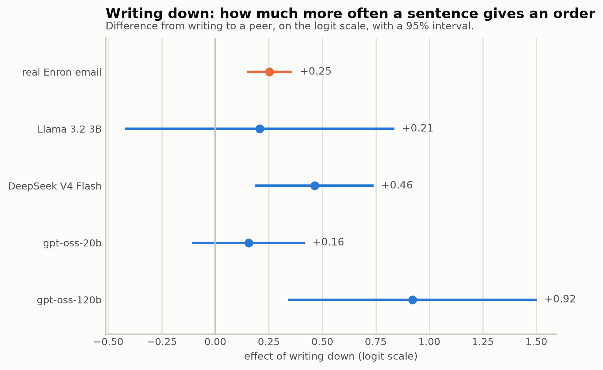

# LLM Comparison Progress Log

This file compares the four models used in the free-tier simulator work, one
topic at a time: mirroring, separability from real writing, and the Q1
hierarchy effect. Each section holds every model's numbers together, so they
can be read at once.

`PROGRESS_nvidia.md` still holds the day-by-day build log: what was tried,
what broke, and the exact commit history. This file only reorganizes its
numbers by topic. Most numbers here are not new. The exceptions are the
gpt-oss-20b Q1 grid (Sep 21) and the gpt-oss-120b Q1 grid (Sep 22), both first
reported in the Q1 section. This work is still a trial. Nothing
here replaces a result in `PROGRESS.md` yet, except where a section says so
directly (the Q1 real-email comparison).

---

## Status at a glance

| | Llama 3.2 3B | DeepSeek V4 Flash | gpt-oss-20b | gpt-oss-120b |
|---|---|---|---|---|
| 183 real-email pairs generated | Yes (see `PROGRESS.md`) | Yes | Yes | Yes |
| Mirroring measured | Yes | Yes | Yes | Yes |
| Told apart from real writing (AUC) measured | Yes | Yes | Yes | Yes |
| Q1 grid (240 replies) generated | Yes | Yes | Yes | Yes |
| Q1 checked against the real-email benchmark | Yes | Yes | Yes | Yes |
| Hand-coded by a person | No | No | No | No |

Other open items: a run without the "act" instruction, an embedding map and
review pack for the newer models, a judge study across model families, and
committing the blind-coding module. See "Next steps" at the end.

---

## The models compared

| Model | Family | Reached through | Setting | Notes |
|---|---|---|---|---|
| Llama 3.2 3B | Meta | Local, on this laptop (Ollama) | none | 3B parameters. Runs on 8 GB of memory. |
| DeepSeek V4 Flash | DeepSeek | NVIDIA free tier | none | |
| gpt-oss-20b | OpenAI | NVIDIA free tier | `@low` reasoning effort | Without it, some replies run past the JSON until the token limit. |
| gpt-oss-120b | OpenAI | Groq free tier | `@low` reasoning effort | NVIDIA does not serve this model. This laptop cannot run it: it needs about 60 GB of memory, and the laptop has 16 GB plus 1 GB of graphics memory. |

All four answer the same 183 real email threads with the same prompt,
including the "act" instruction from `PROGRESS.md` section 43 (the persona
must act on a request, not hand it back). The two exceptions, kept for the
historical record, are noted where they appear: a Llama run made before that
instruction existed, and the original Q1 pilot from `PROGRESS.md` section 39.

---

## A few terms, explained once

- **Client**: the code that sends a prompt to a model service and reads the
  answer back.
- **Free tier**: the free level of NVIDIA's or Groq's hosted service. No
  payment is used anywhere in this project.
- **Reasoning effort**: a setting that tells a model how much it should
  "think" before answering. `gpt-oss` models need a low setting here, or they
  sometimes keep writing instead of stopping.
- **Cache**: the folder `runs/_cache`. It stores every model reply this
  project has received. A later run with the same prompt and model reads the
  saved reply instead of calling the model again.
- **Borrowed words**: the share of a reply's own distinct content words that
  already appear in the incoming email. 0 means none of them, 1 means all.
  Used for the mirroring measure.
- **AUC**: shown one real reply and one AI reply, how often a classifier
  ranks the real one as more likely real. 0.5 means pure guessing, 1 means
  always right. Used for the "can it be told apart" measure.
- **Imperative sentence**: a sentence that tells the reader to do something,
  such as "Send me the numbers by Friday." Used for the Q1 measure.
- **p-value**: the chance of seeing a result this large if there were really
  no effect. Below 0.05 is usually called significant.

---

## Why use free hosted models

The thesis will not pay for any LLM API. This was decided with the
supervisor. All generated replies before this work came from a small local
model, `llama3.2:3b`. This laptop has 8 GB of memory for its Linux system, so
about 8B parameters is the upper limit for anything running locally. A 3B
model cannot stand in for a named, citable frontier model in a results table.

NVIDIA's Developer Program and Groq both give free access to larger models
through an API. Using them keeps the no-payment decision and removes the
small-model problem.

Limits to keep in mind:

- NVIDIA's terms allow "testing and evaluation", not "production". NVIDIA's
  own forum says research counts as allowed use.
- Each prompt contains Enron text, and it goes to a third-party server. The
  corpus is public, but the supervisor should know this.
- Either service can remove a model or change its free tier at any time. The
  cache protects every reply already received.

---

## Clients, limits, and pacing

**Which NVIDIA models answer at all.** The catalog lists 82 models. Each
candidate got one tiny request.

| Model | Result |
|---|---|
| `nvidia/nemotron-3-super-120b-a12b` | Answers |
| `deepseek-ai/deepseek-v4-flash-0731` | Answers |
| `openai/gpt-oss-20b` | Answers |
| `google/gemma-4-31b-it` | No answer within 120 s |
| `mistralai/mistral-nemotron` | No answer within 120 s |
| `meta/llama-3.2-90b-vision-instruct` | No answer within 120 s |
| `mistralai/mistral-large-2-instruct` | Not served (error 404) |
| `nvidia/llama-3.1-nemotron-70b-instruct` | Not served (error 404) |

DeepSeek V4 Flash was picked as the main reply writer: fastest, shortest
valid output, and a well-known model.

**The reasoning-effort mechanism.** A model name may end in `@low`, `@medium`
or `@high`, for example `openai/gpt-oss-20b@low`. The client sends the plain
name to the service and adds the setting to the request. The full name stays
on every saved reply and in the cache key, so replies made with different
settings never mix.

**Rate limits and pacing.**

| | NVIDIA free tier | Groq free tier |
|---|---|---|
| Requests per minute | about 40 | 30 |
| Tokens per minute | not published | 8,000 |
| Requests per day | not published | 1,000 |
| Tokens per day | not published | 200,000 |
| Client's gap between calls | 1.5 s | 15 s |
| Timeout per try | 120 s | 120 s |
| Retries | 5 | 5 |

Groq's token-per-minute cap binds before its request cap. A reply of this
project costs about 1,930 tokens, so only about 4 fit in a minute. A first
test at 2 seconds per call drew two 429 errors; 15 seconds keeps it inside
the token pace. NVIDIA often holds a request without answering rather than
refusing it outright: in one 8-reply test, 6 requests stalled and every
retry worked. The timeout was cut from an original 300 s to 120 s, because a
stuck request at 300 s with 5 retries could block a run for up to 30 minutes.

**One client body for both services.** NVIDIA and Groq both speak the same,
OpenAI-compatible request format. The shared parts, request shape, spacing,
retries, and response mapping, live in one module, and each service's client
is a thin subclass of it. Two things differ: Groq's schema request uses
strict mode, which guarantees the reply matches the shape exactly, while
NVIDIA's does not (this is why `gpt-oss` needed `@low` there); and Groq's
request drops the model's own reasoning text, which this project never reads.

**Running long jobs safely.** A run of several hours can die for reasons
unrelated to the code.

- The laptop must stay on and awake. Everything runs inside WSL on this
  machine; the model runs on a remote server, but the program that sends
  requests and saves replies runs here. Sleep was set to "Never" while
  plugged in.
- A run started from a Claude Code session is attached to that session. If
  the session or the editor closes, the run can die with it. Long runs are
  started in the user's own terminal window, inside `tmux`, with the window
  left open.
- Every finished reply is saved to the cache immediately. If a run stops for
  any reason, the same command continues where it left off. Only time is
  lost, never a result.

---

## Generation results: speed, reliability, cost

Llama's full 183-pair run predates this log; its numbers are in
`PROGRESS.md`. For the three free-tier models:

| | DeepSeek V4 Flash | gpt-oss-20b | gpt-oss-120b |
|---|---:|---:|---:|
| Pairs written | 183 of 183 | 183 of 183 | 183 of 183 |
| Time to generate | about 6.5 hours, 3 attempts (stalls forced 2 restarts) | 376 seconds | 34 minutes |
| Empty replies | 0 | 0 | 0 |
| Replies with a placeholder such as `[Name]` | not measured | 3 | 7 |
| Decisions | 92 accept, 61 none, 30 defer | 136 accept, 33 defer, 9 decline, 5 none | 102 accept, 53 defer, 24 none, 4 decline |
| Median length | 38 words | 30 words | 27 words |
| Cost | $0 | $0 | $0 |

Real replies have a median length of 44 words. The three free-tier models
are all shorter, and the OpenAI models are shorter still than DeepSeek.

For gpt-oss-120b's run, the daily token cap never bit: 129 new replies at
about 1,930 tokens each is roughly 249,000 tokens, above the stated 200,000
per day. Either the cap is looser than documented, or it is counted
differently than the request pace suggests.

---

## Mirroring: how much does a reply copy the sender's own words

A reply mirrors when it is built mostly from the sender's own words, often
handing a request back to the sender instead of acting on it. This was the
main failure found in the small local model (`PROGRESS.md` section 42). The
question here is whether larger models do it too.

**How it is measured.**

- **Borrowed words**: the share of a reply's own distinct content words that
  already appear in the incoming email.
- **Flagged**: a reply with borrowed words of 0.80 or more. This cutoff was
  chosen by looking at 100 coded Llama replies. Those codes are Claude's
  first pass, not a person's; see the caveat below.
- **Length matters**: borrowed words is a share of a reply's own distinct
  vocabulary. A longer reply has more room for words the sender never used,
  so it scores lower even if it copies just as much. Two versions of the
  table follow: replies as written, and every reply cut to the same length
  before scoring.

**At full length, as each model actually wrote it.**

| Model | Mean borrowed words | Flagged | Mean length |
|---|---:|---:|---:|
| Llama 3.2 3B, no instruction | 0.579 | 25.7% | 19.8 words |
| Llama 3.2 3B, with instruction | 0.565 | 19.1% | 22.7 words |
| DeepSeek V4 Flash | 0.413 | 1.1% | 40.1 words |
| gpt-oss-20b | 0.322 | 1.1% | 32.8 words |
| gpt-oss-120b | 0.405 | 2.2% | 28.6 words |
| Real replies | 0.301 | | 65.0 words |

At full length, gpt-oss-20b sits closest to real replies. But this ranking
mixes copying with length. All three free-tier models write longer than
Llama and shorter than real people, so length alone moves this table.

**At the same length**, every reply cut to the length of its Llama
(with-instruction) partner, which removes that length effect.

| | Mean borrowed words | Flagged |
|---|---:|---:|
| Llama 3.2 3B | 0.565 | 19.1% |
| DeepSeek V4 Flash | 0.469 | 8.2% |
| gpt-oss-20b | 0.373 | 4.9% |
| gpt-oss-120b | 0.435 | 4.4% |
| Real replies | 0.294 | 9.8% |


**Paired tests, each free-tier model against Llama at the same length.**

| Model | Score change | p-value | Newly flagged | No longer flagged | p-value (flag test) |
|---|---:|---:|---:|---:|---:|
| DeepSeek V4 Flash | -0.095 | < 0.0001 | 12 | 32 | 0.004 |
| gpt-oss-20b | -0.191 | < 0.0001 | 7 | 33 | < 0.0001 |
| gpt-oss-120b | -0.129 | < 0.0001 | 3 | 30 | < 0.0001 |

The score test (Wilcoxon signed-rank) asks whether the borrowed-words scores
moved. The flag test (McNemar) counts only the replies whose flagged status
changed. All three free-tier models mirror significantly less than Llama.
Size did not help within the OpenAI family: gpt-oss-120b borrows more of the
sender's words than gpt-oss-20b, 0.435 against 0.373, though it is flagged
slightly less often.

**What this means.** Mirroring looks mainly like a weakness of the small
local model, not something all LLMs do. All four models still borrow more
than real writers, 0.294, so none of them fully matches human behavior.

**Caveats.**

- The 0.80 cutoff and the AUC check behind it come from 100 Llama replies
  coded by Claude, not by a person. No person has coded any reply yet.
  Claude read the 5 highest-scoring DeepSeek replies by hand; none of them
  actually hands the request back, which suggests a high score may mean
  "stays on topic" rather than "mirrors" for the larger models. This needs a
  person's judgment to settle.
- The measure and its cutoff were built and validated on Llama only.
  Applying the same cutoff to a different model's writing style is an
  assumption, not something separately checked.

---

## Can a generated reply be told apart from a real one

**How it is measured.**

- **Length-only classifier**: sees only each reply's word count.
- **Text classifier**: sees which words a reply uses (TF-IDF features with
  logistic regression), cross-validated over 5 rounds.
- **Same length**: each real reply is cut to the length of its AI partner
  before the text classifier runs, so whatever separation remains cannot be
  explained by length.
- Before comparing, signature and address lines were removed from real
  replies (routing addresses, company names, street addresses, phone lines,
  and lines that are mostly email addresses). This changed the numbers only
  a little; it did not change any conclusion.

**Combined AUC table**, all rows measured with the same prompt (the
with-instruction Llama grid).

| Model | Length only | Full text | Text, same length |
|---|---:|---:|---:|
| Llama 3.2 3B | 0.837 | 0.919 | 0.881 |
| DeepSeek V4 Flash | 0.571 | 0.978 | 0.977 |
| gpt-oss-20b | 0.687 | 0.974 | 0.970 |
| gpt-oss-120b | 0.748 | 0.969 | 0.962 |

For reference, the earlier, no-instruction Llama grid gave 0.879 (length
only), 0.903 (full text), 0.841 (same length).


- **Length alone barely gives DeepSeek away** (0.571), a little more for
  gpt-oss-20b (0.687), and more again for gpt-oss-120b (0.748), because its
  replies are the shortest of the three at a 27-word median.
- **Length still gives Llama away** (0.837), because its replies are much
  shorter than real ones.
- **Every free-tier model is still easy to spot by its words**, at 0.96 to
  0.98 even at the same length. Being bigger did not make gpt-oss-120b
  harder to tell from a real person than gpt-oss-20b.

**Which words give each model away.** Share of replies containing the word,
model against real replies (real percentages vary slightly by row, because
real replies are cut to each model's own length for that comparison). "n/a"
means the word was not among the top words reported for that model.

| Word | Real | Llama | DeepSeek | gpt-oss-20b | gpt-oss-120b |
|---|---:|---:|---:|---:|---:|
| "I'll" | 5 to 6% | 29% | 74% | 59% | 61% |
| "let" | 9 to 10% | n/a | 45% | 53% | 38% |
| "know" | 12 to 13% | n/a | 42% | 50% | n/a |
| "review" | 2 to 3% | n/a | 29% | n/a | 23% |
| "confirm" | 0 to 1% | n/a | 19% | 13% | n/a |
| "got" | 1 to 2% | n/a | 11% | 18% | 22% |
| "team" | 0% | n/a | n/a | 14% | 12% |
| "forward" | 3% | n/a | n/a | n/a | 19% |

These come from stock phrases such as "I'll review...", "Let me know..." and
"I'll flag...". Real replies are instead marked by sign-off names and words
like "attached", "department" and "office". Real people sign with their own
name and mention attachments; the models rarely do.

**What this means.** For Llama, "real and AI replies are separable, mostly
by length" was true. For all three free-tier models, it is not: they write
closer to a realistic length, and are still easy to spot by word choice.
Model size (20B against 120B) moved neither the mirroring result nor this
one.

**Caveats.**

- The line-removal rule that cleans signature and header lines is a one-off
  script. The corpus cleaner in `thesis.data.rfc822` does not use it yet.
- One number is unexplained: the full-text AUC for Llama without the
  instruction is 0.903 by this method, while `PROGRESS.md` reports 0.927
  by an earlier one. The length-only numbers match, so the method is
  probably the same; the gap is unresolved.

---

## Does hierarchy change how directive a reply is (Q1)

Q1 asks whether a persona's place in the hierarchy changes how directive its
replies are, that is, whether it gives more orders when writing down to a
junior person than when writing to a peer or up to someone senior. Every
Llama-only test before this found no clear effect (`PROGRESS.md` sections 33
to 39), with one borderline exception. The open question is whether a larger
model shows a pattern the small one does not. DeepSeek and gpt-oss-120b show
it. gpt-oss-20b does not. Whether any of them shows it more strongly than
real email does is a separate question, answered below, and the answer is no
for all three once the numbers are checked properly.

**How it is measured.** The Q1 grid is 10 personas times 3 directions times
4 incoming tones times 2 task types, one reply each, 240 replies total. This
is the design fixed in `PROGRESS.md` section 39.

- **Reply level**: the share of a reply's sentences that are imperative,
  compared across directions with a linear mixed model that allows for each
  persona's own habits.
- **Sentence level**: each sentence counts once, as an order or not,
  compared with a logistic mixed model. Its coefficients are also turned
  into the probability that a sentence is an order.
- Every coefficient below is the difference from writing to a peer. Positive
  means more imperative.

**Results**, all five grids using the same measurement code.

| Grid | Reply level, down | Reply level, up | Sentence level, down | Sentence level, up |
|---|---:|---:|---:|---:|
| Llama, no instruction (original pilot) | +0.027 (p=.672) | +0.083 (p=.192) | +0.163 (p=.401) | +0.395 (p=.046) |
| Llama, with instruction | +0.056 (p=.412) | +0.029 (p=.670) | +0.197 (p=.298) | +0.151 (p=.437) |
| DeepSeek V4 Flash | +0.099 (p=.003) | +0.015 (p=.647) | +0.438 (p<.001) | +0.059 (p=.654) |
| gpt-oss-20b | +0.036 (p=.348) | +0.023 (p=.537) | +0.136 (p=.296) | +0.085 (p=.537) |
| gpt-oss-120b | +0.195 (p=.001) | +0.052 (p=.361) | +0.896 (p≈.001)* | +0.297 (p=.088) |

\* The sentence-level p-value the code prints for gpt-oss-120b is p=5e-08.
That number is too small and should not be quoted. It comes from a
variational-Bayes fit whose posterior standard deviation understates
uncertainty. A persona-clustered standard error and a persona bootstrap both
put it at p≈.001. The coefficient itself, +0.896, is stable across five
different ways of computing it (plain logistic, clustered by reply, clustered
by persona, a permutation test, a persona bootstrap), all landing between
+0.90 and +0.93. Only the p-value the code reports is wrong, not the effect.

This was a one-off manual check. The code now computes the persona-clustered
cross-check itself (`Q1Result.sentence_model_persona_fe`, commit `85e833a`),
so a rerun would report it without another manual pass. The table above
still shows this manual check for gpt-oss-120b only; the other three rows
have not been rechecked against the clustered fit yet.

Probability that a sentence is an order, from the sentence-level model. The
gpt-oss-20b and gpt-oss-120b rows are the plain share of sentences that are
orders. The design is balanced across directions, so this agrees closely with
the model's fitted probability (for DeepSeek they differ by 0.2 points).

| Grid | Writing down | Writing to a peer | Writing up |
|---|---:|---:|---:|
| Llama, no instruction | 31.7% | 28.3% | 36.9% |
| Llama, with instruction | 40.7% | 36.0% | 39.6% |
| DeepSeek V4 Flash | 33.5% | 24.5% | 25.6% |
| gpt-oss-20b | 41.0% | 37.8% | 39.8% |
| gpt-oss-120b | 43.0% | 23.2% | 29.6% |


- **DeepSeek gives more orders when writing down.** Both measures agree, and
  both stay significant after a Bonferroni correction for four tests
  (needs p < 0.0125): 0.003 and 0.0004.
- **DeepSeek's writing up looks like writing to a peer.** Both contrasts are
  far from significant.
- **Llama shows no reliable effect in either direction**, with either prompt.
- **The one borderline Llama result did not hold.** With the act
  instruction, its "up" contrast fell from p=.046 to p=.437, which reads as
  noise rather than a real effect.
- **DeepSeek's replies carry more sentences**: 882 across the grid against
  343 for Llama with the same prompt, 3.71 sentences per reply against 1.43.
  `PROGRESS.md` section 34 warned that one-sentence replies make the
  reply-level measure crude. DeepSeek has none, so its estimate rests on
  more data. gpt-oss-20b also writes several sentences per reply: 719
  across the grid, 3.02 per reply.
- **gpt-oss-20b shows no writing-down effect.** Orders per sentence, down:
  +0.136 (p=.296). Orders per reply, down: +0.036 (p=.348). Writing up shows
  nothing either (+0.085, p=.537). This looks like Llama and not like
  DeepSeek.
- **gpt-oss-20b gives orders in about 40% of its sentences in every
  direction.** Real email does it in 14% to 18%. The level is far too high,
  and it barely moves with direction (41.0%, 37.8%, 39.8%).
- **Two side results.** The decision depends on direction for both DeepSeek
  and Llama (Llama p=.023, DeepSeek p=.002), but not for gpt-oss-20b
  (p=.308). This plain chi-square test ignores that replies from one persona
  are alike, so it is only a hint. Hedging falls for Llama and DeepSeek when
  writing down. gpt-oss-20b almost never hedges (0.000 writing down, 0.003
  to a peer, 0.000 writing up), so it has nothing to fall. DeepSeek also
  almost never hedges (at most 0.014 in any direction, against 0.08 to 0.19
  for Llama).
- **gpt-oss-120b is the only model of the four that clearly shows the
  writing-down effect.** Orders per sentence, down: +0.896 (p≈.001, corrected
  as above). Orders per reply, down: +0.195 (p=.001). Writing up shows
  nothing (+0.297, p=.088).
- **The reply-level persona term collapses for gpt-oss-120b**, the same way
  it does for the other three grids: the model reports a persona variance of
  0.0008, which is a fit sitting at the edge of its range rather than a real
  estimate of zero. This does not threaten the contrast, because every
  persona answers all three directions, so persona cannot confound direction.
- **gpt-oss-120b's replies are short: 1.98 sentences each**, the fewest of
  the four models (Llama 1.43, gpt-oss-20b 3.02, DeepSeek 3.71). The effect
  holds inside every reply-length group checked (1-sentence, 2-sentence,
  3-sentence replies all show more orders when writing down), so the short
  replies do not manufacture the within-model effect. They do matter for the
  comparison against real email, below.
- **The decision gpt-oss-120b gives also changes with direction**, more so
  than for any other model (chi2=24.95, p=.002). Writing down brings more
  "decline" (21 of 80, against 10 to a peer) and much less "defer" (22
  against 36 to a peer). "Escalate" appears only when writing up (6 replies,
  zero in the other two directions). gpt-oss-120b also answers "none" far
  more often than the other models: 24% of its replies, against 12% for
  gpt-oss-20b and about 1% for Llama. The decision field is not fully
  reliable on its own (section 50: 67.7% agreement between two draws), so
  read this as a pattern worth watching, not a settled result.

**Against the real-email benchmark.** `PROGRESS.md` section 48 measured the
same three things in 2,202 real Enron emails, and compared them only with
the Llama grid. This log adds the DeepSeek and gpt-oss-20b sides of that
comparison, using a rough z-test on the difference (rough because both
sides' standard errors are backed out of a coefficient and a p-value).

| Contrast | DeepSeek | Real email | Difference | p |
|---|---:|---:|---:|---:|
| Orders per email, down | +0.098 (p=.003) | +0.043 (p=.002) | +0.056 | .125 |
| Orders per email, up | +0.016 (p=.640) | +0.018 (p=.133) | -0.002 | .955 |
| Orders per sentence, down | +0.439 (p<.001) | +0.253 (p<.001) | +0.185 | .169 |
| Orders per sentence, up | +0.059 (p=.654) | +0.070 (p=.096) | -0.011 | .936 |
| Hedges per email, down | -0.013 (p=.040) | -0.005 (p=.526) | -0.009 | .362 |
| Hedges per email, up | -0.007 (p=.274) | -0.005 (p=.429) | -0.002 | .809 |

The same comparison for gpt-oss-20b:

| Contrast | gpt-oss-20b | Real email | Difference | p |
|---|---:|---:|---:|---:|
| Orders per email, down | +0.036 (p=.348) | +0.043 (p=.002) | -0.007 | .859 |
| Orders per email, up | +0.023 (p=.537) | +0.018 (p=.133) | +0.006 | .884 |
| Orders per sentence, down | +0.136 (p=.296) | +0.253 (p<.001) | -0.118 | .401 |
| Orders per sentence, up | +0.085 (p=.537) | +0.070 (p=.096) | +0.014 | .921 |
| Hedges per email, down | -0.003 (p=.218) | -0.005 (p=.526) | +0.001 | .852 |
| Hedges per email, up | -0.003 (p=.220) | -0.005 (p=.429) | +0.002 | .788 |

The same comparison for gpt-oss-120b, first with the code's own p-values and
then read plainly below the table.

| Contrast | gpt-oss-120b | Real email | Difference | p |
|---|---:|---:|---:|---:|
| Orders per email, down | +0.195 (p=.001) | +0.043 (p=.002) | +0.152 | .009 |
| Orders per email, up | +0.052 (p=.361) | +0.018 (p=.133) | +0.034 | .554 |
| Orders per sentence, down | +0.896 (p≈.001) | +0.253 (p<.001) | +0.643 | .000\* |
| Orders per sentence, up | +0.297 (p=.088) | +0.070 (p=.096) | +0.226 | .206 |
| Hedges per email, down | -0.004 (p=.221) | -0.005 (p=.526) | +0.000 | .957 |
| Hedges per email, up | -0.004 (p=.221) | -0.005 (p=.429) | +0.001 | .908 |

\* Do not read this as gpt-oss-120b showing a significantly bigger effect
than real email. The difference-of-p column here uses the code's flawed
sentence-level standard error, the same one flagged above. With a
persona-clustered standard error the difference is p≈.03, and that does not
survive a Holm correction across the six contrasts in this table (adjusted
p≈.16), let alone across all four models' contrasts together. The honest
statement is that gpt-oss-120b's point estimate is larger than real email's,
and that this gap is not established as more than chance.

There is a second, separate reason not to trust the size of that gap.
gpt-oss-120b writes 1.98 sentences per reply; real email averages 4.75
sentences per message (`outputs/manifests/q1_real.json`). Orders per sentence
is a share over a reply's sentences, so a short reply produces a more
extreme share for the same underlying behavior. This is the same length
problem `borrowed_words` has (see the mirroring section above), showing up in
a different measure. No length-matched version of this comparison exists
yet. Until one does, the +0.643 gap against real email is not verified,
whatever its p-value says.

| Chance a sentence is an order | Writing down | To a peer | Writing up |
|---|---:|---:|---:|
| Real email | 17.5% | 14.2% | 15.0% |
| DeepSeek | 33.5% | 24.5% | 25.6% |
| gpt-oss-20b | 41.0% | 37.8% | 39.8% |
| gpt-oss-120b | 43.0% | 23.2% | 29.6% |


- **DeepSeek gets the shape right.** Writing down is highest on both lines,
  and writing up sits close to writing to a peer on both.
- **DeepSeek's swing is bigger, but not provably so.** Down minus peer is
  +9.0 points in DeepSeek against +3.3 points in real email. No contrast
  between DeepSeek and real email is significant.
- **Llama and gpt-oss-20b sit near the real effect size but detect
  nothing.** Llama's down effect is +0.198 (p=.298) and gpt-oss-20b's is
  +0.136 (p=.296), against the real +0.253. Neither is different from real
  email. Neither is different from zero.
- **Sentence count does not explain the split.** The first version of this
  section said DeepSeek finds the effect because its replies carry far more
  sentences. gpt-oss-20b writes 719 sentences against DeepSeek's 882, and
  finds nothing. Llama's 343 are fewer, but 20b shows that plenty of
  sentences is not enough. gpt-oss-120b confirms this the other way: it
  writes the fewest sentences of the four (474) and shows the clearest
  effect of the four.
- **DeepSeek and gpt-oss-20b are not provably different.** Their writing-down
  effects differ by 0.303 (p=.092). So this section cannot say that 20b
  lacks the effect and DeepSeek has it. It can say that 20b's data are also
  consistent with the real effect.
- **gpt-oss-120b gets the shape right and overshoots it.** Writing down is
  highest, writing up sits above writing to a peer, both as in real email.
  The down-versus-peer swing is +19.5 points against real email's +3.3, and
  unlike DeepSeek's swing this one is a real effect on its own (p≈.001). Read
  the last two paragraphs above before treating the size of the overshoot as
  established: the standard comparison test does not survive correction, and
  gpt-oss-120b's short replies inflate the per-sentence share regardless.

**All the models side by side.** The effect is the difference in the log-odds
that a sentence gives an order, writing down against writing to a peer. Real
email's +0.253 moves the chance from 14.2% to 17.5%, so a bigger number means
a bigger jump. Each line is a 95% interval. An interval that crosses zero
means the grid cannot show the effect. This figure and its intervals are
regenerated with the persona-clustered fit (commit `85e833a`), not the
variational-Bayes fit the "vs real email" tables above still use, so
numbers here differ slightly from the "orders per sentence" rows in those
tables -- same effect, two different standard errors.

| | coefficient | p | 95% interval |
|---|---:|---:|---:|
| Real email | +0.253 | <.001 | [+0.15, +0.35] |
| DeepSeek V4 Flash | +0.464 | .001 | [+0.19, +0.73] |
| gpt-oss-120b | +0.921 | .002 | [+0.35, +1.50] |
| Llama 3.2 3B | +0.207 | .515 | [-0.42, +0.83] |
| gpt-oss-20b | +0.155 | .239 | [-0.10, +0.41] |



- **DeepSeek's and gpt-oss-120b's intervals stay clear of zero.** DeepSeek
  runs from +0.19 to +0.73 and also contains the real +0.25. gpt-oss-120b
  runs from +0.35 to +1.50 and also contains the real +0.25, but only just
  at the bottom of its own interval, which is the top of real email's own
  interval.
- **Llama's and gpt-oss-20b's intervals cross zero.** The grids are too
  small to say either model shows an effect at all, let alone whether it
  differs from real email.
- **gpt-oss-20b's interval runs from -0.10 to +0.41.** It has about as many
  sentences as DeepSeek and an interval of nearly the same width (0.52
  against 0.54). It sits lower, and it crosses zero.

**Caveats.**

- One reply per cell, 10 personas. In the reply-level model the persona
  variance is 0 for both grids, so the model works like a plain regression;
  the fit warns it sits at the edge of its range.
- The "vs real email" tables above still use the variational-Bayes
  sentence-level p-value, which is approximate (a Wald test from that fit)
  and understates uncertainty on a large effect -- see the gpt-oss-120b
  footnote earlier in this section. The persona-clustered fit table just
  above does not have this problem, but has not been substituted into
  those earlier tables yet.
- The DeepSeek grid has 238 replies, not 240: 2 came back without valid
  JSON, one writing up and one writing down. The gpt-oss-20b grid also has
  238: one lateral and one writing up.
- gpt-oss-20b ran with `@low` reasoning effort, as in every other section of
  this log. The 20b grid took about 2.5 hours, mostly NVIDIA stalls and
  retries.
- Real email and the simulator are not the same kind of sample: 2,202 real
  emails from 107 senders against 238 (or 240) simulator replies from 10
  personas, one reply each. Real email has no decision field, so decisions
  cannot be compared. The z-test is rough for the reason stated above.
- The gpt-oss-120b grid took two days, not because of anything about the
  model: Groq allows 200,000 tokens per day and the grid needs about
  460,000. A loop retried every 30 minutes and resumed from the cache each
  time it hit the cap. 238 of 240 cells were cached from Sep 21; the last 2
  generated on Sep 22.
- **The sentence-level p-value this project's own code reports is not
  trustworthy when an effect is large.** It comes from a variational-Bayes
  posterior standard deviation (`hierarchy.py`), which understates
  uncertainty. This was not visible before because no sentence-level effect
  here had been this large. gpt-oss-120b's case (reported p=5e-08, honest
  p≈.001) is the first result that exposed it. The same fix (a
  persona-clustered standard error, or a bootstrap) should be applied before
  any sentence-level p-value from this code is quoted in the thesis, not
  only gpt-oss-120b's.
- **Two small bugs found while checking this result, not yet fixed.** The Q1
  grid generator builds a manifest with the current `prompt_text_hash()` but
  never writes it to disk, so no Q1 grid file has its own record of which
  prompt made it. Confirmed by hand instead: all five grids in this section
  share hash `d4c18550ed56f2de`. Separately, `q1_models.py`'s grid loader
  hard-codes every row as "from cache", so its printed cache counts are not
  measured and should not be quoted as evidence a grid came from cache.

---

## Where the code lives

**The clients.** `src/thesis/llm/openai_compatible.py` holds the shared
request and retry logic. `nvidia_client.py` and `groq_client.py` are thin
subclasses. `base.py` lists `"nvidia"` and `"groq"` as providers, and
`sim/run.py` never bills either one. `.env.example` documents both key
names; the real keys live only in `.env`, which git ignores.

**The mirroring fix.** `analysis/mirroring.py`'s `pair_key` matches two runs
by persona and message rather than by the model's role label, so two
different models answering the same email can be compared at all.
`compare_runs` also runs the same-length comparison and saves it in the
manifest.

**The Q1 backend.** `analysis/q1.py` takes `--local MODEL`, `--nvidia MODEL`,
`--groq MODEL`, or `--grid PATH` to analyse an existing file without calling
any model, plus `--compare-real` to print the comparison against the
real-email benchmark in one command. `analysis/q1_real.py`'s `implied_se` is
public so both modules share one formula.

**The model comparison.** `analysis/q1_models.py` takes one `--grid
LABEL=PATH` per model and writes one manifest and one figure, named by
`--manifest` and `--figure-prefix`. It calls no model. Its grid loader used
to mark every row "from cache" regardless of how the grid was actually
generated -- fixed, commit `36fbc3e`. One small gap remains: each grid it
loads now carries a `prompt_text_hash` (commit `5ee4b46`), but
`q1_models.py`'s own output manifest (the JSON this command writes) does not
copy that hash into its per-model entries yet, so checking a grid's prompt
still means opening the grid file itself rather than the comparison
manifest.

```
python -m thesis.analysis.q1 --nvidia openai/gpt-oss-20b@low \
  --out data/interim/q1_direction_grid_gpt_oss_20b.parquet
python -m thesis.analysis.q1 --groq openai/gpt-oss-120b@low \
  --out data/interim/q1_direction_grid_gpt_oss_120b.parquet
python -m thesis.analysis.q1_models \
  --grid "Llama 3.2 3B=data/interim/q1_direction_grid_llama_act.parquet" \
  --grid "DeepSeek V4 Flash=data/interim/q1_direction_grid_deepseek.parquet" \
  --grid "gpt-oss-20b=data/interim/q1_direction_grid_gpt_oss_20b.parquet" \
  --grid "gpt-oss-120b=data/interim/q1_direction_grid_gpt_oss_120b.parquet" \
  --figure-prefix q1_models_all_ --manifest outputs/manifests/q1_models_all.json
```

Exact commits and the day-by-day build order, including two corrections
made along the way, are in `PROGRESS_nvidia.md`.

---

## Next steps

Most valuable first.

Done since this list was written: these three code fixes cover what used to
be items 1 and 3 here (item 3 bundled two separate fixes).

- **The sentence-level p-value now has a persona-clustered cross-check.**
  `Q1Result.sentence_model_persona_fe` fits `is_imperative ~ direction` a
  second way, by persona-clustered fixed effects, next to the
  variational-Bayes fit that understated uncertainty. `q1_models.py` reports
  the clustered coefficient/p/interval as the headline numbers now, with the
  VB ones kept alongside as `coefficient_vb`/`p_vb`. Commit `85e833a`. The
  four-model table and figure in the Q1 section above are now regenerated
  with this fit. The "vs real email" tables further up that section still
  use the older VB fit -- rewriting those, and the length-matched
  comparison, are separate, larger steps (see items below).
- **The prompt hash is now written into every saved Q1 grid.** `Q1Grid`
  carries `prompt_text_hash`, also saved as a column on the grid's parquet
  file, so a saved grid records which prompt made it instead of needing a
  by-hand check. A grid saved before this fix reads back as `"unknown"`
  rather than raising. Commit `5ee4b46`. One small gap remains:
  `q1_models.py`'s own output manifest does not copy this hash into its
  per-model entries yet, so checking it still means opening the grid file.
- **`q1_models.py`'s grid loader no longer marks every row "from cache".**
  `load_grid` now counts the real split from the `from_cache` column every
  row already carries, instead of hard-coding `n_from_cache=len(frame)`.
  Commit `36fbc3e`.

1. **Build the length-matched version of the Q1-versus-real comparison.**
   `borrowed_words` already has this rule; orders-per-sentence needs it too.
   gpt-oss-120b writes 1.98 sentences per reply against real email's 4.75,
   and that gap alone could produce part of the +0.643 difference reported
   above. Without a length-matched version, no Q1-versus-real comparison in
   this log should be called established, gpt-oss-120b's least of all.
2. **A larger sample would help every model more than another model would.**
   Every simulator interval in the four-model figure is 0.5 to 0.7 wide,
   against 0.2 for real email's 2,202 emails. This is the same 14-more-hours
   question already open for the main Q1 run (`HANDOVER.md` section 6.2).
3. **Hand-code a sample of replies by a person.** The mirroring cutoff and
   its validation rest on Claude's first-pass codes of Llama replies only.
   A coding page is already built: 50 emails, two replies each from two
   models, in random order, with the model hidden. It is waiting for a
   coder. One small fix is needed first: the first pass used a label,
   `wrong_register`, that the codebook never defined.
4. **A run without the act instruction.** This would show whether a larger
   model follows the instruction better than the small local one did
   (`PROGRESS.md` section 43 found only a small effect on Llama). The code
   already has a `--prompt-variant` mechanism; a third variant without the
   instruction would fit it.
5. **Embedding map and review pack on the newer models.** These only read
   saved replies, so they need no new generation.
6. **Judge study (Q3).** Four models across three families are now
   available. One can write and another can judge, then the roles can be
   swapped. This needs new model calls.
7. **Move the line-removal rule into the corpus cleaner**, so every analysis
   uses the same clean real-reply text instead of a one-off script.
8. **Rename one summary key.** `mirroring.py` saves its comparison under
   `compared_with_previous_prompt`, which is the wrong name for a comparison
   between models.
9. **Back up `runs/_cache`.** It holds every reply this project has
   received and exists only on this laptop. It must never go into git,
   because the prompts contain Enron text.
10. **Commit the rest of the code.** Still uncommitted: the blind-coding
    module and its tests, and the codebook fix that defines `wrong_register`.
