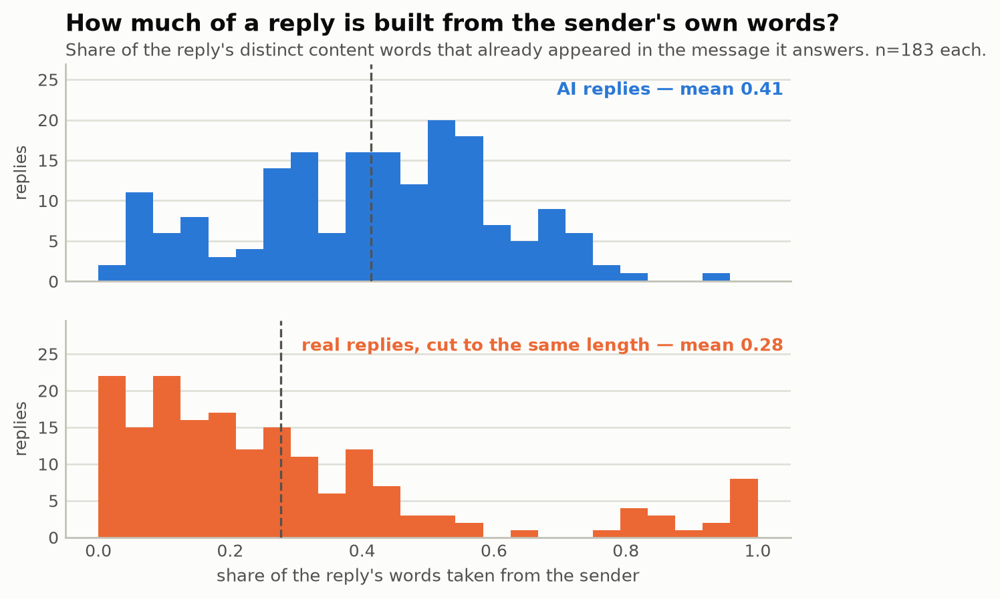
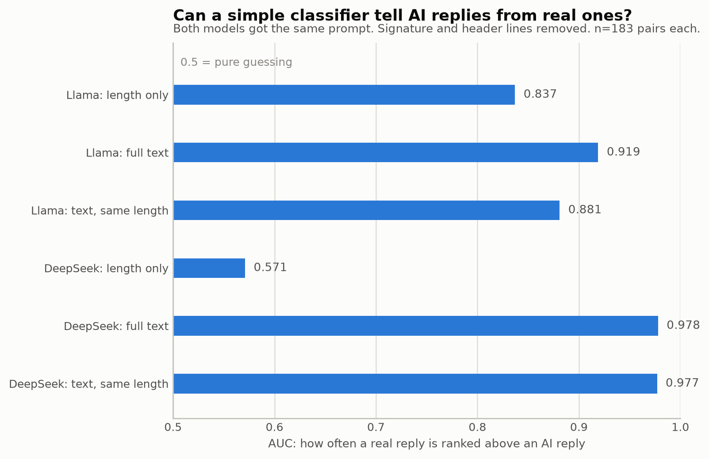
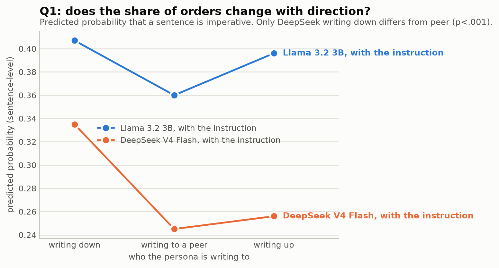
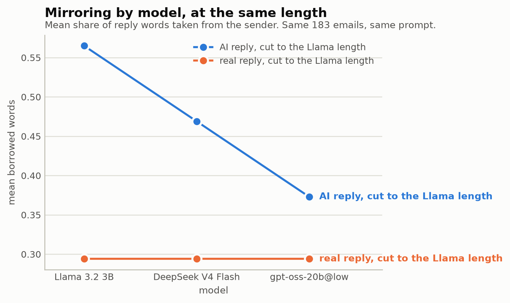
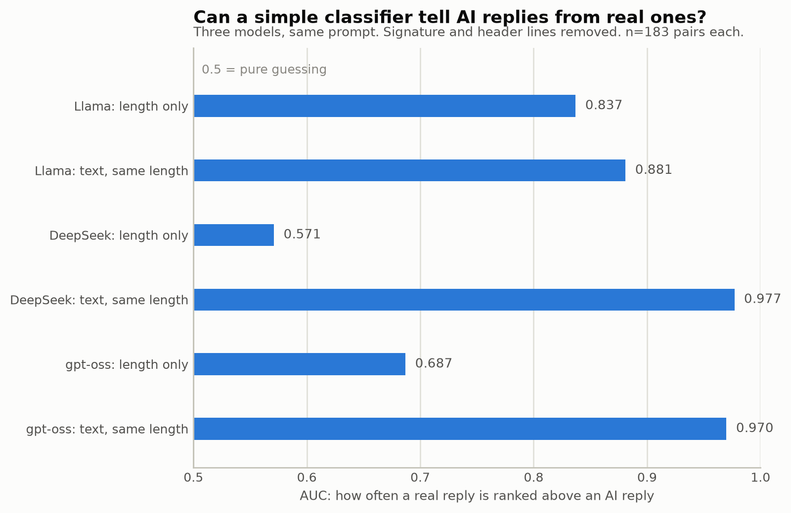
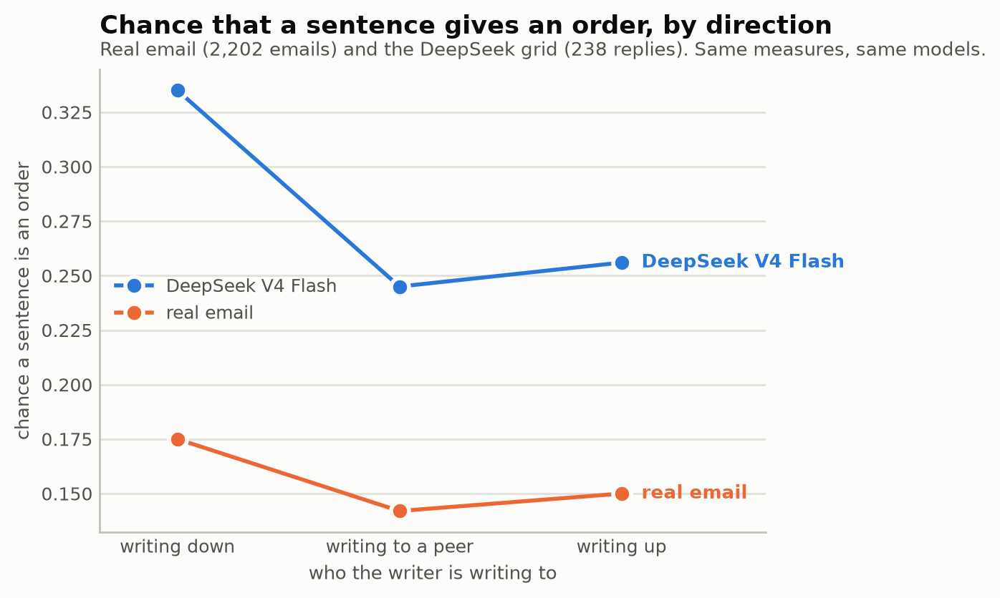
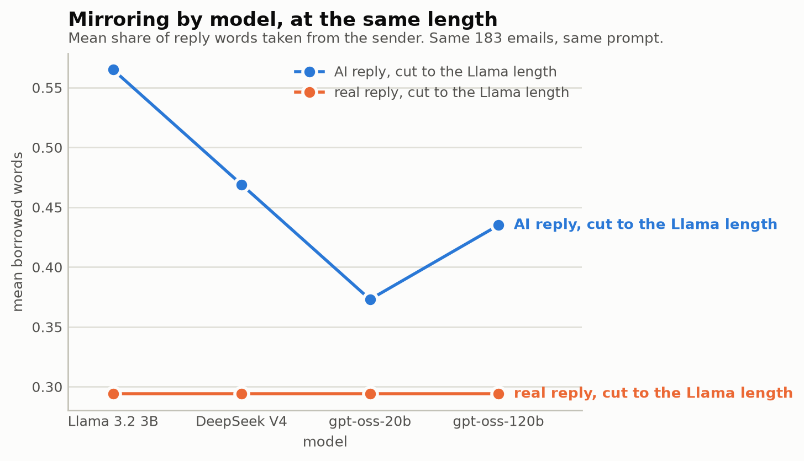
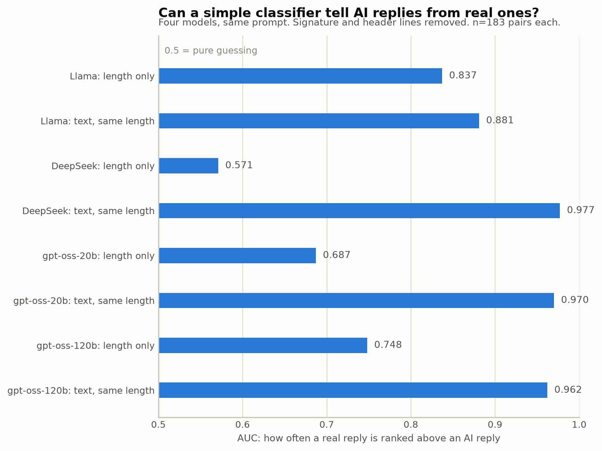

# NVIDIA Free-Tier Progress Log

**For a topic-by-topic comparison of all four models (mirroring, told-apart
from real writing, Q1), read `PROGRESS_llms.md` instead.** This file is the
day-by-day build log: what was tried, in what order, and the exact commit
history. `PROGRESS_llms.md` reorganizes the same numbers by topic and adds
nothing new.

A plain-language record of the work that uses NVIDIA's free hosted models.
It is kept apart from `PROGRESS.md` on purpose. This work is still a trial.
Nothing here replaces a result in `PROGRESS.md` yet.

---

## Status at a glance

| Stage | Status |
|---|---|
| Decide whether the NVIDIA free tier fits the thesis | Done, see section 1 |
| Build a client for the NVIDIA API | Done, see section 2 |
| Find which models work on this account | Done, see section 3 |
| Test run: 10 replies | Done, see section 4 |
| Full run: all 183 reply pairs with DeepSeek | Done, see section 6 |
| Mirroring measure on the DeepSeek replies | Done, see section 8 |
| Can DeepSeek replies be told apart by length or words? | Done, see section 9 |
| Q1 with DeepSeek: does direction change directive language? | Done, see section 10 |
| A third model: OpenAI's gpt-oss-20b on the same 183 pairs | Done, see section 11 |
| DeepSeek against the real-email benchmark | Done, see section 12 |
| A fourth model: gpt-oss-120b through Groq | Done, see section 13 |
| Hand-code a sample of DeepSeek replies | Not started |
| DeepSeek run without the act instruction | Not started |
| Judge study with a second model family | Not started |
| Commit the client code | Done (Sep 13) |
| Back up the reply cache | Not done yet |

---

## A few terms, explained once

- **NVIDIA build (build.nvidia.com)**: a website where NVIDIA runs many
  open-weight models on its own servers. Anyone in the free NVIDIA Developer
  Program can call them through an API key.
- **Client**: the piece of code that sends a prompt to a model service and
  reads the answer back.
- **Timeout**: how long the client waits for an answer before it gives up
  on one try.
- **Retry**: sending the same request again after a failed try.
- **Cache**: the folder `runs/_cache`. It stores every model reply this
  project has received. A later run with the exact same prompt and model
  reads the saved reply instead of calling the model again.
- **Valid JSON**: the reply arrives in the fixed structure the analysis
  expects (subject, body, decision, confidence, short reasoning). An invalid
  reply cannot be used.
- **Median**: the middle value when all values are sorted. Half the values
  are below it and half are above it.

---

## 1. Why try the NVIDIA free tier (Sep 12)

**The problem it solves.** All generated replies so far come from small
local models such as `llama3.2:3b`. This laptop's Linux system has 8 GB of
memory, so about 8B parameters is the upper limit. A 3B model on a laptop
cannot stand in for a named, citable model in a results table. The code
itself says so in `ollama_client.py`.

**Why NVIDIA.** The thesis will not pay for any LLM API. This was decided
with the supervisor. NVIDIA's free tier costs nothing and offers much larger
models. So it keeps the budget decision and removes the small-model problem.

**What the free tier offers.**

- It serves 82 models through an API in the same format as OpenAI's.
- The address is `https://integrate.api.nvidia.com/v1`.
- The limit is about 40 requests per minute.

**Limits to keep in mind.**

- NVIDIA's terms allow "testing and evaluation", not "production". NVIDIA's
  forum says research counts as allowed use.
- Each prompt contains Enron text, and it goes to NVIDIA's servers. The
  corpus is public, but the supervisor should know about this.
- NVIDIA can remove a model at any time. The cache protects replies that
  were already received.

---

## 2. Building the client (Sep 12)

**Why this step.** The project had clients for Anthropic and for local
Ollama models only. A new client was needed before any NVIDIA model could
be called.

**What was built.**

- `src/thesis/llm/nvidia_client.py`: the new client. It asks the model for
  valid JSON in the same structure as the other clients.
- `src/thesis/analysis/pairs.py`: a new option, `--nvidia MODEL`. It
  generates the replies with an NVIDIA model.
- `src/thesis/sim/run.py`: NVIDIA replies are never priced. Before this
  change, the run would have crashed on the missing price.
- `src/thesis/llm/base.py`: `"nvidia"` added to the list of providers.
- `.env.example`: a new line for `NVIDIA_API_KEY`. The real key goes in
  `.env`, which git ignores.
- `tests/test_nvidia.py`: 13 new tests. They need no network and no key.

**How NVIDIA replies are marked.** Each reply is saved with the model name
`nim/<model>`, for example `nim/deepseek-ai/deepseek-v4-flash-0731`. This
keeps NVIDIA rows easy to find. The cost ledger records them at $0.

**How the client handles the rate limit and failures.**

| Setting | Value | Reason |
|---|---:|---|
| Gap between calls | 1.5 s | 40 requests per minute is one call every 1.5 s |
| Timeout per try | 120 s | A normal reply takes under 15 s. Changed from 300 s, see section 5 |
| Retries | 5 | So one request gets 6 tries in total |
| Wait before each retry | 2, 4, 8, 16, 32 s | The wait doubles each time |

**Checks.** black, ruff, mypy and the full test suite all pass.

---

## 3. Which models work on this account (Sep 12)

**Why this step.** The public list shows 82 models. Not all of them answer
on a free account. Each candidate got one tiny request.

| Model | Result |
|---|---|
| `nvidia/nemotron-3-super-120b-a12b` | Answers |
| `deepseek-ai/deepseek-v4-flash-0731` | Answers |
| `openai/gpt-oss-20b` | Answers |
| `google/gemma-4-31b-it` | No answer within 120 s |
| `mistralai/mistral-nemotron` | No answer within 120 s |
| `meta/llama-3.2-90b-vision-instruct` | No answer within 120 s |
| `mistralai/mistral-large-2-instruct` | Not served (error 404) |
| `nvidia/llama-3.1-nemotron-70b-instruct` | Not served (error 404) |

**Which of them return valid JSON.** The three working models then got one
made-up email and the real reply schema.

| Model | Valid JSON | Time | Output tokens |
|---|---|---:|---:|
| `deepseek-v4-flash-0731` | Yes | 11.6 s | 213 |
| `nemotron-3-super-120b-a12b` | Yes | not recorded | 548 |
| `gpt-oss-20b` | No | 73.9 s | 2,048 |

`gpt-oss-20b` kept writing past the JSON until it hit the 2,048-token limit.

**Choice.** DeepSeek V4 Flash is used as the reply writer. It is the
fastest, it gives the shortest valid output, and it is a well-known model.
Nemotron is kept as the backup.

---

## 4. Test run: 10 replies (Sep 12)

**Why this step.** One made-up email does not show how the model handles
the real prompts. Ten real pairs are a cheap check before a run of several
hours.

**Command.**

```
python -m thesis.analysis.pairs --nvidia deepseek-ai/deepseek-v4-flash-0731 --limit 10 --out <test file>
```

The test output was written outside the repository.

**Results.**

| | Real reply | DeepSeek | Llama 3.2 3B (local) |
|---|---:|---:|---:|
| Median length (words) | 32.5 | 40.5 | 17 |

- Valid JSON: 10 of 10.
- Decisions: 8 accept, 1 defer, 1 none.
- Placeholders such as `[Manager's Name]`: 0 of 10. The replies use the real
  names from the incoming email.
- The replies read like fluent business email. They often invent details
  that the real replies do not contain.

DeepSeek's length is much closer to the real replies than Llama's.

---

## 5. The free tier stalls often (Sep 12)

**Why this matters.** Speed decides whether a full run is practical.

**What happened.** NVIDIA often holds a request without answering. In the
10-reply test, 6 of the 8 new requests stalled at least once. Every retry
worked in the end.

| Seconds per reply (8 new replies) |
|---|
| 33, 47, 142, 149, 154, 163, 274, 317 |

- Only 2 replies came back on the first try.
- The median is about 150 s per reply.
- The 8 replies took 21 minutes together.

**Fix.** The timeout was cut from 300 s to 120 s. With 300 s and 5 retries,
one stuck request could block a run for up to 30 minutes. The first test
attempt was stuck for 9 minutes this way.

---

## 6. Full run: all 183 reply pairs (Sep 12)

**Why this step.** The test showed valid output. The analyses need the full
set of 183 pairs, the same set used for Llama in `PROGRESS.md`.

**How it was run.** The run takes several hours, so it was started in the
user's own Ubuntu window inside `tmux`, not from a Claude session. See
section 7 for why.

**First attempt.** It started at 17:21. It finished 43 pairs and then
stopped at about 18:40. One request timed out 6 times in a row, so the
client gave up and the run stopped.

**Nothing was lost.** The 43 finished pairs were in the cache. They needed
only 35 distinct replies. Some pairs share the exact same prompt: the same
persona answers the same incoming email, because the thread has two real
replies. Those pairs share one saved reply.

**Restart loop.** The run was restarted inside a loop. When it stops with an
error, the loop waits 60 seconds and starts it again. A restart skips every
saved reply within seconds.

```
cd ~/projects/thesis && set -a && source .env && set +a
for i in $(seq 1 30); do
  .venv/bin/python -m thesis.analysis.pairs --nvidia deepseek-ai/deepseek-v4-flash-0731 \
    --out data/interim/pairs_deepseek.parquet 2>&1 | tee -a runs/nvidia_full.log
  [ "${PIPESTATUS[0]}" -eq 0 ] && break
  echo "restart $i"; sleep 60
done
```

**Result.** The run finished at 23:49. It stopped 3 times in total, the
first attempt included.

| | Value |
|---|---:|
| Pairs written | 183 of 183 |
| Empty replies | 0 |
| Decisions | 92 accept, 61 none, 30 defer |
| Median length, real replies (words) | 44 |
| Median length, DeepSeek replies (words) | 38 |
| Cost | $0 |

**Where the output is.**

- `data/interim/pairs_deepseek.parquet`: the 183 pairs. Git ignores it.
- `runs/nvidia_full.log`: the run log. Git ignores it.
- The Llama pairs file `data/interim/real_vs_generated_pairs.parquet` was
  not touched.

---

## 7. Running long jobs safely (Sep 12)

**Why this step.** A run of several hours can die for reasons unrelated to
the code. Two risks were checked.

- **The laptop goes to sleep.** Windows was set to sleep after 30 minutes
  without use, even on the charger. Sleep stops every run. It was set to
  "Never" while plugged in.
- **WSL shuts down.** A run started from a Claude session is attached to
  that session. If the session or VS Code closes, WSL may shut down and
  kill the run. So long runs are started in the user's own Ubuntu window,
  inside `tmux`, with the window left open.

A test with a detached process showed that WSL stayed up while the user's
Ubuntu window was open. It does not show what happens with no window open.

**The safety net.** Every finished reply is saved to the cache at once. If a
run is killed for any reason, the same command continues where it stopped.
Only time is lost.

---

## 8. Mirroring measure on the DeepSeek replies (Sep 13)

**Result first.** With the same prompt, DeepSeek mirrors less than Llama,
even when both replies have the same length. Length explains about one third
of the gap. DeepSeek still takes more of the sender's words than real people
do. Claude read its highest-scoring replies, and none of them hands the
request back. No person has checked this yet.

**Correction.** The first version of this section compared DeepSeek with the
wrong Llama replies. Since section 43 of `PROGRESS.md` (Sep 5), the persona
prompt tells the persona to act on a request, not hand it back. This "act"
instruction is part of the default prompt, so the DeepSeek run used it. The
first version compared DeepSeek with Llama replies made before the
instruction existed. That comparison changed two things at once: the model
and the prompt. This version compares DeepSeek with the Llama replies made
with the same instruction (`real_vs_generated_pairs_act.parquet`). The
conclusion did not change. The numbers changed a little.

**Why this step.** Mirroring was the main failure of the local Llama model
(`PROGRESS.md` section 42). A reply mirrors when it is built mostly from the
sender's own words, often handing the request back to the sender. The
question is whether DeepSeek does it too. If not, mirroring is a weakness of
the small model. If yes, it is a general LLM behaviour. The measure only
reads the saved replies, so it needs no new generation.

**How mirroring is measured.**

- **Borrowed words**: the share of a reply's distinct content words that
  already appear in the incoming email. 0 means none of them, 1 means all
  of them.
- **Flagged**: a reply with borrowed words of 0.80 or more. Section 42 chose
  this cut-off by looking at 100 coded Llama replies. Those codes are
  Claude's first pass from section 35, not a person's.

**A code fix first.** `compare_runs` in `mirroring.py` compares two runs
reply by reply: the same persona answering the same email. It matched the
runs on the full `cell_id`. That id begins with the role label, which is
`sim_local` for Llama and `sim_nvidia` for DeepSeek. So Llama and DeepSeek
matched 0 pairs. It now ignores the role label, and all 183 pairs match. A
new test covers this. This code change is not committed yet.

**Same inputs.** In all 183 matched pairs, the incoming email, the real
reply, the persona and the direction are identical. Both runs used the same
prompt, including the act instruction. Only the model differs.

**First result.**

| | Mean borrowed words | Flagged | Mean length |
|---|---:|---:|---:|
| Llama 3.2 3B, with the instruction | 0.565 | 19.1% | 22.7 words |
| DeepSeek V4 Flash, with the instruction | 0.413 | 1.1% | 40.1 words |
| Real replies, cut to DeepSeek's length | 0.277 | 9.8% | |



The top panel is DeepSeek ("AI replies" in the figure). The bottom panel is
the real replies, each cut to the length of its DeepSeek partner. Almost no
DeepSeek reply reaches 0.80.

**Length check.** DeepSeek's replies are almost twice as long as Llama's.
Borrowed words is a share of a reply's distinct words. A longer reply has
more room for words the sender never used, so it scores lower even if it
copies just as much. So each DeepSeek reply was cut to the length of its
Llama partner and scored again.

| | Mean borrowed words | Flagged | Mean length |
|---|---:|---:|---:|
| Llama 3.2 3B, with the instruction | 0.565 | 19.1% | 22.7 words |
| DeepSeek, full reply | 0.413 | 1.1% | 40.1 words |
| DeepSeek, cut to Llama's length | 0.469 | 8.2% | 22.3 words |
| Real replies, cut to Llama's length | 0.294 | 9.8% | 21.4 words |

Two paired tests compare each DeepSeek reply with the Llama reply to the
same email:

- **The score test** (Wilcoxon signed-rank) asks whether the scores moved.
  At full length, DeepSeek scores 0.151 lower on average. At the same
  length, it scores 0.095 lower. Both p < 0.0001.
- **The flag test** (McNemar) counts only the replies whose flag changed. At
  the same length, 32 replies stop being flagged and 12 become flagged.
  p = 0.004.

What the table shows:

- **The gap is not only length.** The full gap is 0.151. After the cut,
  0.095 remains. So length explains about one third of it.
- **The flagged rate depends mostly on length.** At full length, 1.1% of
  DeepSeek replies are flagged. At Llama's length it is 8.2%, close to the
  9.8% for real replies.
- **DeepSeek still borrows more than people do.** At the same length its
  mean is 0.469, against 0.294 for real replies.

`compare_runs` in `mirroring.py` computes these same-length numbers. The
manifest `outputs/manifests/mirroring_deepseek.json` saves them under
`same_length`. They first came from a one-off script. The code gives the
same numbers.

**Reading the top replies.** Claude read the 5 highest-scoring DeepSeek
replies. No person has checked them yet. None of them hands the request back. The top one (0.93) gives
a clear instruction, using the sender's names for the deal. Others make the
confirmation the sender asked for, or acknowledge the message and say what
happens next. They score high because they reuse the sender's topic words,
such as names, deals and forms. This is one reader, an AI, and 5 replies.
The measure was checked against codes of Llama replies only, and those codes
are Claude's first pass from section 35, not a person's. So for
DeepSeek, a high score may mean "stays on topic" rather than "mirrors".

**By direction.** Only 2 DeepSeek replies are flagged, both writing down to
a junior. A split by direction says nothing with 2 replies, so its figure is
left out.

**What this means.** Mirroring looks mainly like a weakness of the small
model, not a general LLM behaviour. Two checks are still missing:

- **Hand-coding a sample of DeepSeek replies by a person.** Section 35 coded
  100 Llama replies, but Claude did that first pass. No person has coded any
  reply yet. Codes from a person would show whether the measure means the
  same thing for both models.
- **A DeepSeek run without the act instruction.** Section 43 found that the
  instruction barely changed Llama's mirroring. It left open whether a
  larger model follows it better. There is no DeepSeek run without the
  instruction, so this section cannot say how much the instruction helps
  DeepSeek.

**Command.**

```
python -m thesis.analysis.mirroring --pairs data/interim/pairs_deepseek.parquet \
  --out outputs/tables/mirroring_scores_deepseek.csv \
  --figure-prefix mirroring_deepseek_ \
  --manifest outputs/manifests/mirroring_deepseek.json \
  --compare-to data/interim/real_vs_generated_pairs_act.parquet
```

The Llama results and figures were not touched.

---

## 9. Can DeepSeek replies be told apart from real ones? (Sep 13)

**Result first.** Length alone no longer gives DeepSeek away. A classifier
that sees only word counts separates DeepSeek from real replies at 0.57,
close to guessing. For Llama with the same prompt it is 0.84. But DeepSeek's
words give it away almost perfectly, at 0.98. This does not come from
leftover signature lines in the real emails. It comes from DeepSeek's own
stock phrases. For example, it writes "I'll" in 74% of its replies, against
6% of real replies.

**Why this step.** `PROGRESS.md` found that Llama replies are easy to tell
from real ones, and that length explains most of it. DeepSeek writes much
closer to real length: 38 words against 44 at the median. So the question
was whether length still separates them, and if not, whether anything else
does.

**How separation is measured.**

- **AUC**: shown one real and one AI reply, how often the classifier ranks
  the real one as more likely real. 0.5 means pure guessing. 1 means always
  right.
- **Length-only classifier**: sees only each reply's word count.
- **Text classifier**: sees which words a reply uses. It is the model-free
  classifier from `fidelity.py` (TF-IDF word features with logistic
  regression).
- **Cross-validated**: each classifier is trained on part of the pairs and
  scored on pairs it has not seen, in 5 rounds.
- **Same length**: each real reply is cut to the length of its AI partner.
  Whatever separation remains cannot be length.

The length-only result for Llama without the instruction is 0.910. That
matches the 0.908 in `PROGRESS.md`, so the method is the same.

**Leftover lines in the real replies.** In the first text run, many words
pointing to "real" were not writing at all: Enron, Corp, North America,
Houston, 1400, Smith, ECT. They come from signature blocks ("Enron North
America Corp.", "1400 Smith Street", "Houston, Texas 77002") and from copied
email headers ("To: Kim Ward/HOU/ECT@ECT"). The corpus cleaner does not
remove these lines.

So a one-off rule removed them. It removes a line when the line:

- starts with To:, cc:, bcc:, Subject:, Sent by: or From:
- contains an Enron routing address, such as /HOU/ or @ECT
- holds only an Enron company name
- contains the street address or the Houston city line
- is a phone or fax line
- consists mostly of email addresses

The rule was applied to real and AI replies alike. It changed 59 of the 183
real replies and removed 280 lines. Mean real length fell from 65.0 to 58.9
words. No reply became empty. It changed 1 AI reply in total. Sentences that
mention Enron were kept, such as a note about "Enron's Domestic Affiliates".

**Results.** Cross-validated AUC, before and after removing the lines.

| Run | Length only | Full text | Text, same length |
|---|---|---|---|
| Llama, no instruction | 0.910 → 0.879 | 0.912 → 0.903 | 0.840 → 0.841 |
| Llama, instruction | 0.879 → 0.837 | 0.928 → 0.919 | 0.883 → 0.881 |
| DeepSeek, instruction | 0.603 → 0.571 | 0.981 → 0.978 | 0.978 → 0.977 |



What the table shows:

- **Length no longer gives DeepSeek away.** After cleaning, the length-only
  AUC is 0.571 for DeepSeek, against 0.837 for Llama with the same prompt.
- **DeepSeek's words give it away almost perfectly.** The text AUC is 0.978,
  and 0.977 at the same length.
- **Removing the leftover lines changed almost nothing.** DeepSeek's text
  AUC moved from 0.981 to 0.978. The idea that these lines drove the result
  was wrong.
- **DeepSeek is easier to spot by its words than Llama.** At the same
  length, 0.977 against 0.881.

**Which words give DeepSeek away.** After cleaning, with real replies cut to
the same length:

| Word | DeepSeek replies containing it | Real replies containing it |
|---|---:|---:|
| "I'll" | 74% | 6% |
| "let" | 45% | 10% |
| "know" | 42% | 12% |
| "review" | 29% | 3% |
| "confirm" | 19% | 1% |
| "today" | 14% | 3% |
| "flag" | 11% | 0% |

These come from stock phrases such as "I'll review ...", "Let me know ..."
and "I'll flag ...". Llama writes "I'll" in 29% of its replies. The words
that now point to real replies are sign-off names (Kim, Sara, Perlingiere,
Shackleton) and words like "attached", "department" and "office". Real people
sign with their name and refer to attachments. DeepSeek rarely does.

**Limits.**

- The line-removal rule is a one-off script. The corpus cleaner does not use
  it yet.
- The text classifier splits its rounds by pair, not by thread, as in the
  original `fidelity.py`. The length classifier splits by thread.
- One number is unexplained. The full-text AUC for Llama without the
  instruction is 0.912 here, while `PROGRESS.md` reports 0.927. The
  length-only numbers match. The uncleaned real text also gives 0.912.

**What this means.** "Real and AI replies are separable, mostly by length"
was true for Llama. It is not true for DeepSeek. DeepSeek writes at a
realistic length and is still easy to spot, by its stock phrases. So the
stronger model does not make the replies harder to tell apart. It moves the
giveaway from length to word choice.

---

## 10. Q1 with DeepSeek: does direction change directive language? (Sep 14)

**Result first.** With DeepSeek, direction matters in one way. Writing down
to someone more junior gives more imperative sentences than writing to a
peer: 33.5% against 24.5%. Both measures agree, and both stay significant
after a correction for four tests. Writing up looks the same as writing to a
peer. Llama with the same prompt shows no reliable effect in any direction.

**Why this step.** Q1 asks whether a persona's place in the hierarchy
changes how directive its replies are. Every Llama run so far found no clear
effect (`PROGRESS.md` sections 33 to 39). Section 39 found one borderline
result: writing up, at p = .046. The open question was whether a larger
model shows a pattern that the 3B model does not.

**How Q1 is measured.**

- **The Q1 grid**: 10 personas × 3 directions × 4 incoming tones × 2 task
  types = 240 replies, one each. This is the design of `PROGRESS.md`
  section 39.
- **Imperative sentence**: a sentence that tells the reader to do
  something, such as "Send me the numbers by Friday."
- **Reply level**: the share of a reply's sentences that are imperative. A
  linear mixed model compares writing down and writing up with writing to a
  peer. It allows for each persona's own habits.
- **Sentence level**: each sentence is imperative or not. A logistic mixed
  model makes the same comparison. Its coefficients are also turned into
  the probability that a sentence is imperative.
- **Coefficient**: the difference from writing to a peer. Positive means
  more imperative.

**The fair comparison.** Since Sep 5 the prompt carries the act instruction
(section 8). Section 39's Llama grid is from Sep 4, before it. So Llama was
run again with today's prompt: 240 new local replies. DeepSeek got the same
prompt: 240 replies, overnight on the free tier. One script computed all
numbers for all three grids. For the Sep 4 grid it gives exactly the numbers
of section 39, so the method is the same.

**Results.**

| Grid | Reply level, down | Reply level, up | Sentence level, down | Sentence level, up |
|---|---|---|---|---|
| Llama, no instruction (section 39) | +0.027 (p = .672) | +0.083 (p = .192) | +0.163 (p = .401) | +0.395 (p = .046) |
| Llama, instruction | +0.056 (p = .412) | +0.029 (p = .670) | +0.197 (p = .298) | +0.151 (p = .437) |
| DeepSeek, instruction | **+0.099 (p = .003)** | +0.015 (p = .647) | **+0.438 (p < .001)** | +0.059 (p = .654) |

The probability that a sentence is imperative, from the sentence-level
model:

| Grid | Writing down | Writing to a peer | Writing up |
|---|---:|---:|---:|
| Llama, no instruction (section 39) | 31.7% | 28.3% | 36.9% |
| Llama, instruction | 40.7% | 36.0% | 39.6% |
| DeepSeek, instruction | 33.5% | 24.5% | 25.6% |



The figure shows the two runs with today's prompt. The section 39 line is in
that section's own figure.

What the tables show:

- **DeepSeek gives more orders downward.** The "down" contrast is
  significant on both measures. With four tests, a Bonferroni correction
  needs p below 0.0125. Both p-values pass: 0.003 and 0.0004.
- **For DeepSeek, writing up looks like writing to a peer.** The "up"
  contrasts are +0.015 and +0.059, both far from significant.
- **Llama shows no reliable effect with today's prompt.** All four contrasts
  are null.
- **Section 39's borderline result did not hold.** With the act instruction,
  Llama's "up" contrast fell from +0.395 (p = .046) to +0.151 (p = .437).
  This supports reading the section 39 result as noise.

**DeepSeek writes more sentences.**

| Grid | Sentences | Sentences per reply | One-sentence replies |
|---|---:|---:|---:|
| Llama, instruction | 343 | 1.43 | 59.2% |
| DeepSeek, instruction | 882 | 3.71 | 0% |

`PROGRESS.md` section 34 warned that one-sentence replies make the
reply-level measure crude, because the share is then 0 or 1. DeepSeek has no
one-sentence replies. So its measures rest on far more sentences than
Llama's.

**Two other results.**

- **The decision depends on direction** for both models: Llama p = .023,
  DeepSeek p = .002. DeepSeek declines more often when writing down (33 of
  79 replies) than when writing up (13 of 79). This plain chi-square test
  ignores that replies from one persona are alike. So it is only a hint, as
  in section 39.
- **Hedging.** Writing down has fewer hedges for both models: Llama
  p = .034, DeepSeek p = .035. But DeepSeek almost never hedges. Its mean
  hedge rate is at most 0.014 in any direction, against 0.08 to 0.19 for
  Llama. So DeepSeek's result rests on very few hedges.

**Limits.**

- One reply per cell and 10 personas.
- 2 DeepSeek replies are missing, one writing up and one writing down. Both
  came back without valid JSON. So the DeepSeek grid has 238 replies.
- In the reply-level model, the persona variance is 0 for both runs. The
  model then works like a plain regression. The fit warned that it sits at
  the edge of its range.
- The sentence-level p-values are approximate (a Wald test from a
  variational Bayes fit), as section 39 noted.
- This shows that DeepSeek's replies change with direction. It does not yet
  compare this with how real employees write when they write down.

**Commands.**

```
python -m thesis.analysis.q1 --nvidia deepseek-ai/deepseek-v4-flash-0731 \
  --out data/interim/q1_direction_grid_deepseek.parquet
python -m thesis.analysis.q1 --local llama3.2:3b --ollama-host http://172.20.144.1:11435 \
  --out data/interim/q1_direction_grid_llama_act.parquet
```

The `--nvidia` option is new in `q1.py`. The DeepSeek run stopped twice on
stalls, and the restart loop from section 6 started it again. The Llama run
reached Ollama on Windows through a temporary second Ollama server, because
WSL cannot see Windows' localhost. That server was stopped after the run.
The Sep 4 grid was not touched.

---

## 11. A third model: OpenAI's gpt-oss-20b (Sep 14)

**Result first.** OpenAI's open model gpt-oss-20b runs on the same free
NVIDIA tier. It writes valid replies once it is asked to think less. It
generated all 183 pairs in about 6 minutes, against about 6.5 hours for
DeepSeek. It mirrors the least of the three models. But its words still give
it away almost as easily as DeepSeek's.

**Why this step.** The simulator had two models: Llama 3B (Meta, local) and
DeepSeek (through NVIDIA). A model from a third family shows whether the
patterns of sections 8 and 9 hold beyond two models. OpenAI's paid API is
ruled out, because the thesis does not pay for APIs. gpt-oss-20b is OpenAI's
open-weight model, and it is free on NVIDIA.

**Making it work.** In section 3, gpt-oss-20b failed the JSON check. A
closer test showed why. Sometimes it does not close a text field and keeps
writing until the 2,048-token limit. Its reasoning comes back in a separate
field, so the reasoning is not the problem. Asking for low reasoning effort
fixed it. With that setting, all 12 tries were valid, on a made-up email and
on real prompts. Without it, 2 of 6 tries on the made-up email ran away.

**Code change.** In `nvidia_client.py`, a model name can now end in `@low`,
`@medium` or `@high`, for example `openai/gpt-oss-20b@low`. The client sends
the plain name to NVIDIA and adds the reasoning effort to the request. The
full name stays on every saved reply and in the cache key, so replies made
with different settings never mix. An unknown setting is refused. Three new
tests cover this.

**Same prompt for all three models.** Before the run, today's code rebuilt
all 139 distinct DeepSeek prompts. Every one matched a DeepSeek reply saved on
Sep 12. So all three models got the same prompt, including the act
instruction.

**The run.**

| | Value |
|---|---:|
| Pairs written | 183 of 183 |
| Distinct replies | 139 (129 new, 10 from the test) |
| Time | 376 seconds |
| Empty replies | 0 |
| Replies with a placeholder such as `[Name]` | 3 |
| Decisions | 136 accept, 33 defer, 9 decline, 5 none |
| Median length | 30 words (real replies: 44) |
| Cost | $0 |

**Mirroring.** The same measure and tests as section 8, compared with Llama
under the same prompt.

| | Mean borrowed words | Flagged | Mean length |
|---|---:|---:|---:|
| Llama 3.2 3B | 0.565 | 19.1% | 22.7 words |
| DeepSeek V4 Flash | 0.413 | 1.1% | 40.1 words |
| gpt-oss-20b@low | 0.322 | 1.1% | 32.8 words |
| Real replies, cut to the gpt-oss length | 0.282 | 8.7% | |

With every reply cut to the length of its Llama partner:

| | Mean borrowed words | Flagged |
|---|---:|---:|
| Llama 3.2 3B | 0.565 | 19.1% |
| DeepSeek, cut to the Llama length | 0.469 | 8.2% |
| gpt-oss, cut to the Llama length | 0.373 | 4.9% |
| Real replies, cut to the Llama length | 0.294 | 9.8% |



- **gpt-oss mirrors the least.** At the same length it scores 0.191 below
  Llama (signed-rank test, p < 0.0001). 33 replies stop being flagged and 7
  become flagged (McNemar, p < 0.0001).
- **It is close to the real replies.** At full length it scores 0.322,
  against 0.282 for real replies cut to its length.
- **The same caveat as section 8 applies.** The measure was checked only
  against Claude's first-pass codes of Llama replies.

**Can it be told apart from real replies?** The same method as section 9,
after removing signature and header lines.

| Run | Length only | Full text | Text, same length |
|---|---:|---:|---:|
| Llama, instruction | 0.837 | 0.919 | 0.881 |
| DeepSeek, instruction | 0.571 | 0.978 | 0.977 |
| gpt-oss@low, instruction | 0.687 | 0.974 | 0.970 |



- **Length gives gpt-oss away a little more than DeepSeek,** 0.687 against
  0.571, because its replies are shorter than real ones.
- **Its words give it away almost as easily as DeepSeek's:** 0.970 at the
  same length.
- **It uses the same stock phrases.** "I'll" appears in 59% of gpt-oss
  replies, against 6% of real replies. "let" is in 53% (real: 9%) and "know"
  in 50% (real: 13%). "team" and "compliance" are each in 14% of gpt-oss
  replies and in no real reply.

**A counting slip in the section 9 script.** It reported that its cleaning
rule "changed" 65 gpt-oss replies. A line-by-line check found that the rule
removed no line from any gpt-oss reply. The script rebuilds each reply from
its lines, which changes only trailing spaces and line breaks. No words were
removed, so the numbers above are not affected.

**What this means.** Three models from three families (Meta, DeepSeek,
OpenAI) now answer the same 183 emails with the same prompt. Both larger
models mirror much less than Llama 3B, and gpt-oss mirrors the least. Both
larger models are easy to spot by their stock phrases. So the patterns of
sections 8 and 9 hold for a third model family.

**Limits.**

- gpt-oss-20b ran with low reasoning effort only. Other settings may write
  differently.
- It is a 20B model, smaller than DeepSeek.
- The separation numbers come from the one-off script of section 9.
- The Q1 grid has not been run with gpt-oss yet.

**Commands.**

```
python -m thesis.analysis.pairs --nvidia openai/gpt-oss-20b@low \
  --out data/interim/pairs_gpt_oss.parquet
python -m thesis.analysis.mirroring --pairs data/interim/pairs_gpt_oss.parquet \
  --out outputs/tables/mirroring_scores_gpt_oss.csv \
  --figure-prefix mirroring_gpt_oss_ \
  --manifest outputs/manifests/mirroring_gpt_oss.json \
  --compare-to data/interim/real_vs_generated_pairs_act.parquet
```

---

## 12. DeepSeek against the real-email benchmark (Sep 16)

**Result first.** DeepSeek gets the shape of the real pattern right. In real
email and in DeepSeek, writing down gives the most orders, and writing up
looks like writing to a peer. DeepSeek's swing is about two and a half times
the real one, but that gap is not significant. No contrast differs
significantly between DeepSeek and real email.

**Why this step.** `PROGRESS.md` section 48 measured what direction does in
real Enron email. It compared the result only with the Llama grid of section
39, which found nothing. Section 10 of this log found a clear writing-down
effect in DeepSeek. So the open question was how close DeepSeek comes to the
real pattern.

**How the comparison works.** Both sides measure the same three things with
the same code:

- **Orders per email**: the share of an email's sentences that give an order,
  such as "Send me the file."
- **Orders per sentence**: each sentence counts once, as an order or not.
- **Hedges per email**: the share of sentences with a softener, such as
  "maybe" or "I think".

Every number is the change from writing to a peer. The difference between the
two sides is tested with a rough z-test. Rough because both standard errors
are backed out of a coefficient and a p-value, as section 48 explains.

**New code, not a one-off script.** `q1.py` has two new options. `--grid
PATH` analyses a grid file that already exists, without calling any model.
`--compare-real` prints each contrast next to real email. `implied_se` in
`q1_real.py` is now public, so both modules use the same formula. Five new
tests cover the comparison, including a grid that equals real email exactly,
where the difference must be zero.

**Results.**

| Contrast | DeepSeek | Real email | Difference | p |
|---|---:|---:|---:|---:|
| Orders per email, down | +0.098 (p=.003) | +0.043 (p=.002) | +0.056 | .125 |
| Orders per email, up | +0.016 (p=.640) | +0.018 (p=.133) | -0.002 | .955 |
| Orders per sentence, down | +0.439 (p<.001) | +0.253 (p<.001) | +0.185 | .169 |
| Orders per sentence, up | +0.059 (p=.654) | +0.070 (p=.096) | -0.011 | .936 |
| Hedges per email, down | -0.013 (p=.040) | -0.005 (p=.526) | -0.009 | .362 |
| Hedges per email, up | -0.007 (p=.274) | -0.005 (p=.429) | -0.002 | .809 |

The same thing as a probability:

| Chance a sentence is an order | Writing down | To a peer | Writing up |
|---|---:|---:|---:|
| Real email | 17.5% | 14.2% | 15.0% |
| DeepSeek | 33.5% | 24.5% | 25.6% |



What this shows:

- **The same shape.** Writing down is highest on both lines. Writing up sits
  close to writing to a peer on both: +0.8 points in real email, +1.1 points
  in DeepSeek.
- **A bigger swing.** Down minus peer is +3.3 points in real email and +9.0
  points in DeepSeek. On the model scale the difference is +0.185, p = .169.
  So DeepSeek looks stronger than real email, but the gap is not proven.
- **Different levels.** DeepSeek gives an order in 25% to 34% of sentences.
  Real email does in 14% to 18%.
- **Llama with the instruction is not far off either, but detects nothing.**
  Its down effect is +0.198 against the real +0.253, and its p-value is .298.
  This repeats section 48's point: 240 short replies are too few to detect an
  effect of this size. DeepSeek finds it because its replies carry 882
  sentences against Llama's 343.
- **One difference is significant, and it is Llama's.** Llama hedges much
  less when writing down than real writers do: -0.113 against -0.005,
  p = .044. With 12 tests across the two grids, one result below .05 is
  expected by chance.

**Limits.**

- The z-test is rough, as in section 48.
- The two sides are not the same kind of sample. 238 simulator replies from
  10 personas, one reply per cell, against 2,202 real emails from 107
  senders.
- Real email has no decision field, so decisions cannot be compared.
- The personas are not the real senders, and the simulator writes shorter
  texts.

**Command.**

```
python -m thesis.analysis.q1 --grid data/interim/q1_direction_grid_deepseek.parquet \
  --compare-real
```

---

## 13. A fourth model: gpt-oss-120b through Groq (Sep 18)

**Result first.** The larger OpenAI open model now answers the same 183
emails. It mirrors far less than Llama and about as little as the 20B model.
Its words still give it away almost perfectly. Being six times bigger did not
make it harder to tell from a real person.

**Why this step.** Section 11 added gpt-oss-20b. The 120B model is the bigger
version of the same family. It tests whether size changes the two findings of
sections 8 and 9: much less mirroring than the small local model, but easy to
spot by stock phrases.

**Why a new provider.** NVIDIA's catalog does not serve the 120B model, and
this laptop cannot run it. It needs about 60 GB of memory, and the laptop has
16 GB plus 1 GB of graphics memory. Groq serves it on a free tier, so the
no-payment rule still holds.

**The client.** NVIDIA and Groq speak the same API format, so the shared parts
moved into one module, `openai_compatible.py`. `NvidiaClient` and `GroqClient`
are thin subclasses of it. The NVIDIA tests pass unchanged, which is what
makes the move safe. Two things are specific to Groq:

- **The schema goes in strict mode.** Groq then constrains the reply to the
  schema. On NVIDIA the model sometimes ran past the JSON until the token
  limit (section 11), and only `@low` avoided it.
- **The reasoning is not requested.** gpt-oss returns its thinking in a
  separate field, which this project never reads.

Replies are marked `groq/` and priced at zero. Commits `74add35`, `3d1a891`.

**Pacing.** Groq's free tier allows 30 requests and 8,000 tokens per minute,
1,000 requests and 200,000 tokens per day. A reply of this project costs
about 1,930 tokens, so only about 4 fit in a minute. A first 10-reply run at
2 seconds per call drew two 429 errors. The client now waits 15 seconds
between calls.

**The run.**

| | Value |
|---|---:|
| Pairs written | 183 of 183 |
| New replies | 129 (10 came from the test) |
| Time | 34 minutes |
| Empty replies | 0 |
| Replies with a placeholder such as `[Name]` | 7 |
| Decisions | 102 accept, 53 defer, 24 none, 4 decline |
| Median length | 27 words (real replies: 44) |
| Cost | $0 |

The daily token cap never bit. 129 replies at about 1,930 tokens is roughly
249,000 tokens, above the stated 200,000 per day, so the cap is either looser
than documented or counted differently.

**Mirroring, at full length.** Each reply as the model actually wrote it, no
length cut. This is the raw measure before section 8's length correction.

| Model | Mean borrowed words | Flagged | Mean length |
|---|---:|---:|---:|
| Llama 3.2 3B, no instruction | 0.579 | 25.7% | 19.8 words |
| Llama 3.2 3B, with instruction | 0.565 | 19.1% | 22.7 words |
| DeepSeek V4 Flash | 0.413 | 1.1% | 40.1 words |
| gpt-oss-20b@low | 0.322 | 1.1% | 32.8 words |
| gpt-oss-120b@low | 0.405 | 2.2% | 28.6 words |
| Real replies | 0.301 | | 65.0 words |

At full length, gpt-oss-20b sits closest to real replies, 0.322 against
0.301. But this ranking mixes two things: how much a model copies, and how
long it writes. Borrowed words is a share of a reply's own distinct words, so
a longer reply scores lower for length alone. All three large models write
longer than Llama, and all four write shorter than real people. The
same-length table below removes that length effect.

**Mirroring, at the same length.** Same measure and tests as section 8, with
every reply cut to the length of its Llama partner.

| | Mean borrowed words | Flagged |
|---|---:|---:|
| Llama 3.2 3B | 0.565 | 19.1% |
| DeepSeek V4 Flash | 0.469 | 8.2% |
| gpt-oss-20b | 0.373 | 4.9% |
| gpt-oss-120b | 0.435 | 4.4% |
| Real replies | 0.294 | 9.8% |



- **The 120B model mirrors far less than Llama.** At the same length it scores
  0.129 lower (signed-rank test, p < 0.0001). 30 replies stop being flagged
  and 3 become flagged (McNemar, p < 0.0001).
- **Size did not help here.** It borrows more of the sender's words than the
  20B model, 0.435 against 0.373, though it is flagged slightly less often.
- **All four models still borrow more than real writers do**, 0.294.

**Can it be told apart from real replies?** Same method as section 9, after
removing signature and header lines.

| Run | Length only | Full text | Text, same length |
|---|---:|---:|---:|
| Llama, instruction | 0.837 | 0.919 | 0.881 |
| DeepSeek, instruction | 0.571 | 0.978 | 0.977 |
| gpt-oss-20b@low | 0.687 | 0.974 | 0.970 |
| gpt-oss-120b@low | 0.748 | 0.969 | 0.962 |



- **Length gives the 120B model away more than DeepSeek,** 0.748 against
  0.571, because its replies are short: 27 words at the median against 44 for
  real replies.
- **Its words give it away almost perfectly,** 0.962 at the same length.
- **It uses the same stock phrases.** "I'll" appears in 61% of its replies,
  against 5% of real replies. "let" is in 38%, "review" in 23%, "got" in 22%,
  "forward" in 19%, and "team" in 12% against no real reply.

**What this means.** Four models from three families, all answering the same
183 emails with the same prompt, behave the same way in the two respects this
log measures. All of them mirror much less than the 3B local model, and all
of them are easy to spot by their stock phrases. Model size moved neither
result: the 120B model is no less detectable than the 20B one.

**Limits.**

- Only one reasoning setting was used, `@low`.
- Only Groq serves this model here. If Groq changes its free tier, a re-run
  is impossible, though the cache keeps the replies already generated.
- The separation numbers come from the one-off script of section 9.

**Commands.**

```
python -m thesis.analysis.pairs --groq openai/gpt-oss-120b@low \
  --out data/interim/pairs_gpt_oss_120b.parquet
python -m thesis.analysis.mirroring --pairs data/interim/pairs_gpt_oss_120b.parquet \
  --out outputs/tables/mirroring_scores_gpt_oss_120b.csv \
  --figure-prefix mirroring_gpt_oss_120b_ \
  --manifest outputs/manifests/mirroring_gpt_oss_120b.json \
  --compare-to data/interim/real_vs_generated_pairs_act.parquet
```

---

## 14. Next steps

Most valuable first.

1. **Run the Q1 grid with gpt-oss@low.** Section 10 found a writing-down
   effect for DeepSeek and none for Llama. A third model would show which
   pattern is the usual one. At gpt-oss speed the 240 replies take minutes,
   not hours. It can then be held against the real-email benchmark with one
   command, as section 12 did for DeepSeek.
2. **Hand-code a sample of replies.** A person reads each reply and picks a
   label from the section 35 codebook. No person has coded any reply yet, so
   the mirroring measure rests on Claude's first-pass codes of Llama replies
   only. The coding page is built: 50 emails, two replies each, from two
   models, in random order, with the model hidden. It is waiting for a coder.
   The codebook fix is written but not committed: the first pass used a
   label, `wrong_register`, that the codebook did not define.
3. **A run without the act instruction.** This answers the question section
   43 left open: does a larger model follow the instruction better? Since
   Sep 14 the code has a `--prompt-variant` option with two variants,
   `default` and `decide_first`. A third variant without the act instruction
   would fit the same mechanism. The 183 pairs take minutes with gpt-oss and
   hours with DeepSeek.
4. **Embedding map and review pack on DeepSeek and gpt-oss.** These only
   read the saved replies, so they need no new generation.
5. **Judge study (Q3).** Three model families are now available: Llama,
   DeepSeek and gpt-oss. One model can write and another can judge, and then
   the roles can be swapped. This needs new model calls.
6. **Move the line removal into the corpus cleaner.** Section 9 removed
   signature, address and header lines with a one-off script. If the cleaner
   in `thesis.data.rfc822` did this, every analysis would use the same clean
   text. Earlier results that use the real replies would then need a re-run.
7. **Rename one summary key.** `mirroring.py` saves the comparison under
   `compared_with_previous_prompt`. For a comparison between models, that
   name is wrong.
8. **Back up `runs/_cache`.** It is 59 MB and holds every model reply this
   project has received. It exists only on this laptop. It must not go into
   git, because the prompts contain Enron text.
9. **Commit the rest of the code.** Still uncommitted: the blind coding
   module with its tests, and the codebook fix in `review_pack.py`.

**Done since this list was written.**

- **Commit the client code.** Sep 13, in three commits: the NVIDIA client
  and its tests (`57035ab`), the `compare_runs` fix (`ec0829e`), and the
  cost ledger with the DeepSeek mirroring manifest (`cac4688`).
- **Save the length check in code.** Sep 14, commit `193117c`.
  `compare_runs` now repeats both paired tests with each reply cut to its
  partner's length, and the manifest saves the result. It reproduces the
  numbers of section 8.
- **Q1 with DeepSeek.** Sep 14, section 10 and commit `a2c9973`.
- **A third model, gpt-oss-20b.** Sep 14, section 11 and commit `cfd74f7`.
- **The NVIDIA option for the Q1 grid.** Sep 16, commit `75f9e19`. `q1.py`
  now takes `--local MODEL` or `--nvidia MODEL`.
- **Compare DeepSeek with the real-email benchmark.** Sep 16, section 12.
  `q1.py` gained `--grid` and `--compare-real`, so any grid can be held
  against real email with one command.
- **A fourth model, gpt-oss-120b through Groq.** Sep 18, section 13 and
  commits `74add35`, `3d1a891`. NVIDIA does not serve it and this laptop
  cannot run it, so the free Groq tier was added on a shared client body.
